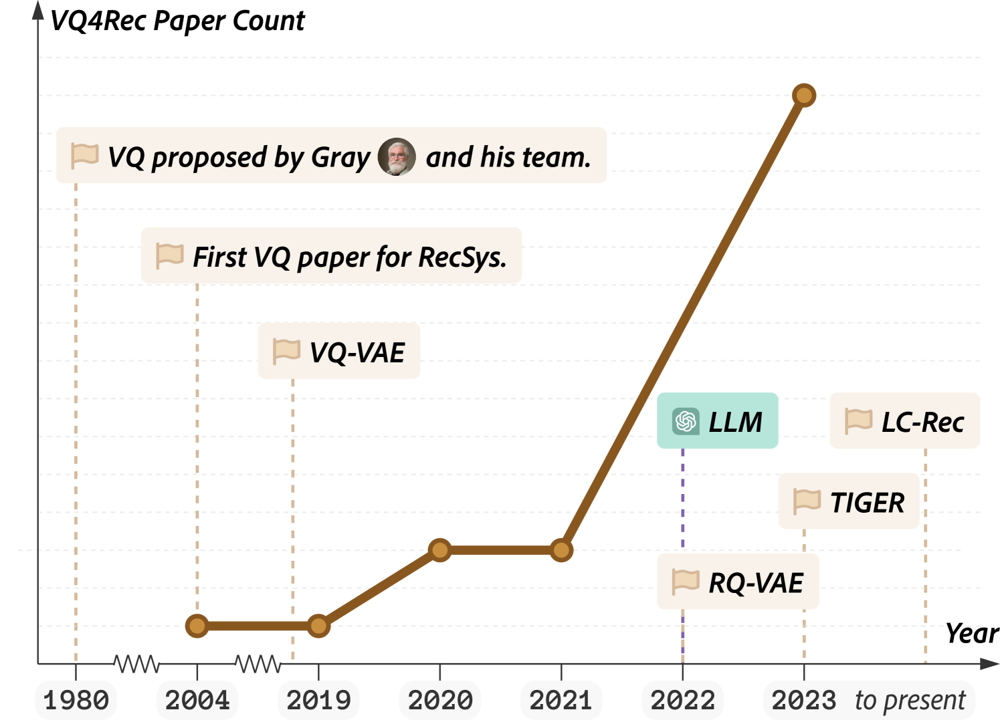
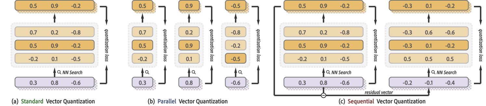
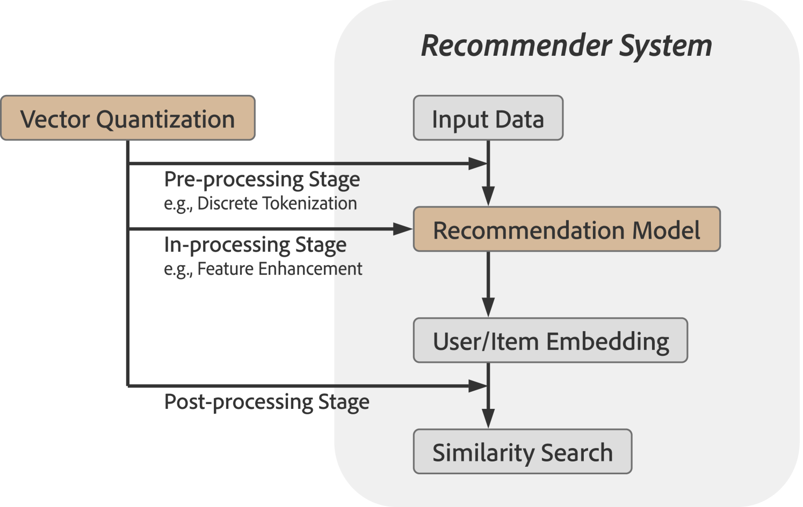
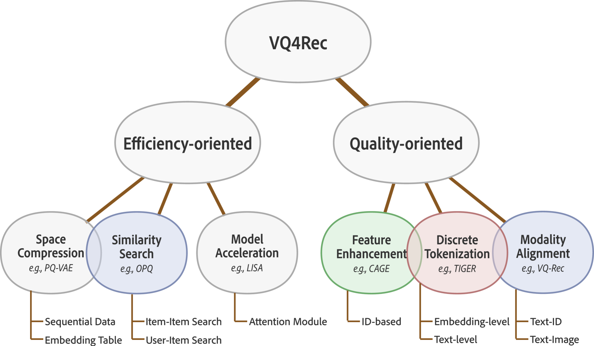

# 向量量化技术在推荐系统领域的应用：回顾与前瞻。

发布时间：2024年05月05日

`LLM应用` `推荐系统` `机器学习`

> Vector Quantization for Recommender Systems: A Review and Outlook

# 摘要

> 向量量化以其卓越的特征压缩性能而著称，数十年来一直是信号处理和机器学习领域的热门话题，并持续在当今得到广泛应用。随着大型模型和生成性人工智能的兴起，向量量化在推荐系统中的应用日益广泛，成为首选技术。本文首先对向量量化技术进行了全面的梳理，接着深入探讨了推荐系统中向量量化方法的系统分类（VQ4Rec），并从多个视角审视了它们的实际应用。文章还详细介绍了在多样化推荐场景下的研究进展，包括注重效率和质量的不同方法。最后，本调查分析了VQ4Rec面临的挑战，并展望了未来的发展趋势，涉及向量量化训练的难题、大型语言模型带来的机遇，以及多模态推荐系统中的新趋势。我们期望本调查能够为推荐领域的未来研究者指引方向，加快他们在这一充满希望的领域的研究步伐。

> Vector quantization, renowned for its unparalleled feature compression capabilities, has been a prominent topic in signal processing and machine learning research for several decades and remains widely utilized today. With the emergence of large models and generative AI, vector quantization has gained popularity in recommender systems, establishing itself as a preferred solution. This paper starts with a comprehensive review of vector quantization techniques. It then explores systematic taxonomies of vector quantization methods for recommender systems (VQ4Rec), examining their applications from multiple perspectives. Further, it provides a thorough introduction to research efforts in diverse recommendation scenarios, including efficiency-oriented approaches and quality-oriented approaches. Finally, the survey analyzes the remaining challenges and anticipates future trends in VQ4Rec, including the challenges associated with the training of vector quantization, the opportunities presented by large language models, and emerging trends in multimodal recommender systems. We hope this survey can pave the way for future researchers in the recommendation community and accelerate their exploration in this promising field.

[Arxiv](https://arxiv.org/abs/2405.03110)