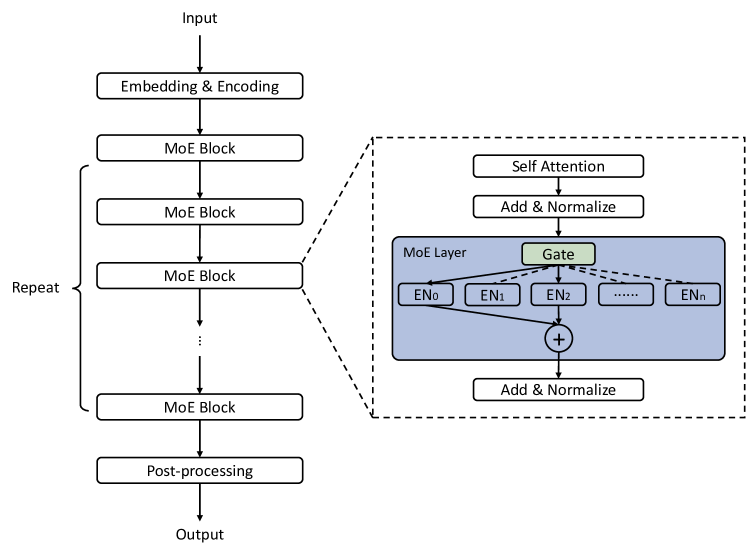
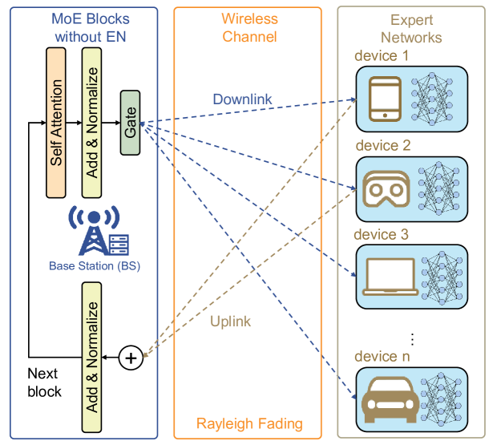
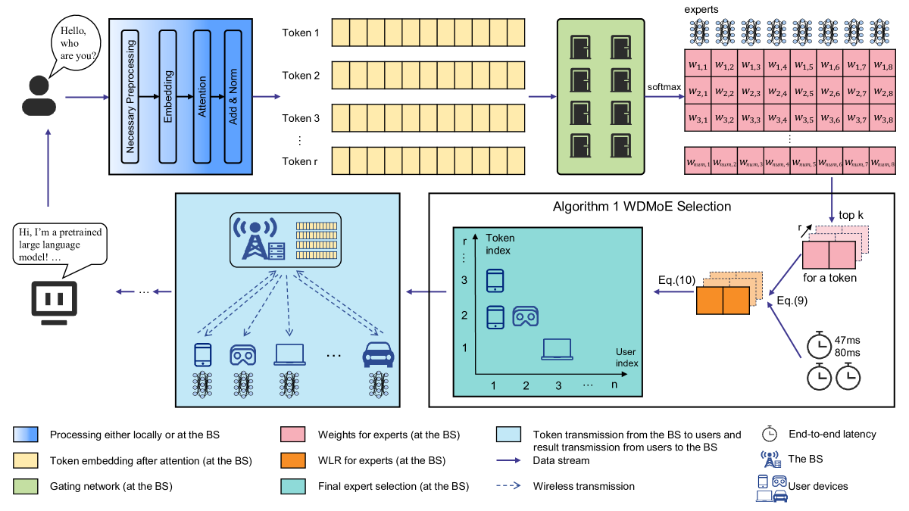
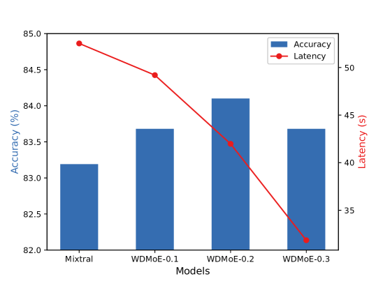
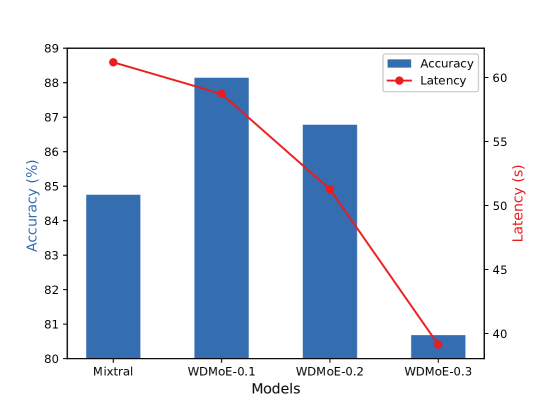
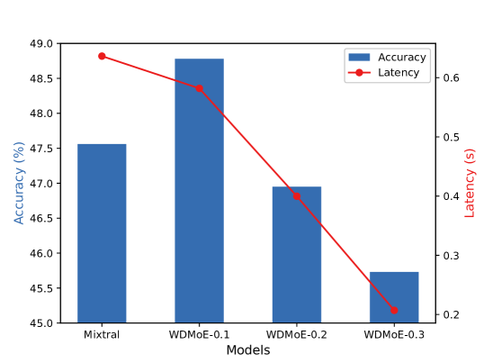
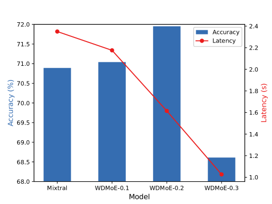

# WDMoE：无线分布式大型语言模型，采用专家混合技术

发布时间：2024年05月05日

`分类：LLM应用

这篇论文讨论了如何将大型语言模型（LLMs）与无线通信技术结合，提出了一种新颖的无线分布式LLMs架构——WDMoE。这个架构利用专家混合（MoE）模型，将LLMs部署在无线通信系统中的基站边缘服务器和移动设备上，以发挥分布式设备上专家网络的并行处理优势。论文还设计了一种专家选择策略，以应对无线通信的不稳定性。这项工作主要关注LLMs在实际应用中的部署和性能优化，因此可以归类为LLM应用。` `无线通信`

> WDMoE: Wireless Distributed Large Language Models with Mixture of Experts

# 摘要

> 大型语言模型（LLMs）在自然语言处理领域取得了巨大成就，但无线通信技术如何助力LLMs尚未深入探讨。本文提出了一种新颖的无线分布式LLMs架构——WDMoE，它利用专家混合（MoE）模型，将LLMs协作部署在无线通信系统中的基站边缘服务器和移动设备上。我们特别将MoE层的门控网络和前续神经网络层部署在基站，而将专家网络分散至各个设备，以此发挥分布式设备上专家网络的并行处理优势。为了应对无线通信的不稳定性，我们还设计了一种综合考虑模型性能和端到端延迟（包括传输和推理延迟）的专家选择策略。通过在多种LLMs和数据集上的测试，WDMoE展现出超越现有模型的性能，例如拥有700亿参数的Llama 2，同时显著缩短了端到端的延迟。

> Large Language Models (LLMs) have achieved significant success in various natural language processing tasks, but how wireless communications can support LLMs has not been extensively studied. In this paper, we propose a wireless distributed LLMs paradigm based on Mixture of Experts (MoE), named WDMoE, deploying LLMs collaboratively across edge servers of base station (BS) and mobile devices in the wireless communications system. Specifically, we decompose the MoE layer in LLMs by deploying the gating network and the preceding neural network layer at BS, while distributing the expert networks across the devices. This arrangement leverages the parallel capabilities of expert networks on distributed devices. Moreover, to overcome the instability of wireless communications, we design an expert selection policy by taking into account both the performance of the model and the end-to-end latency, which includes both transmission delay and inference delay. Evaluations conducted across various LLMs and multiple datasets demonstrate that WDMoE not only outperforms existing models, such as Llama 2 with 70 billion parameters, but also significantly reduces end-to-end latency.

[Arxiv](https://arxiv.org/abs/2405.03131)