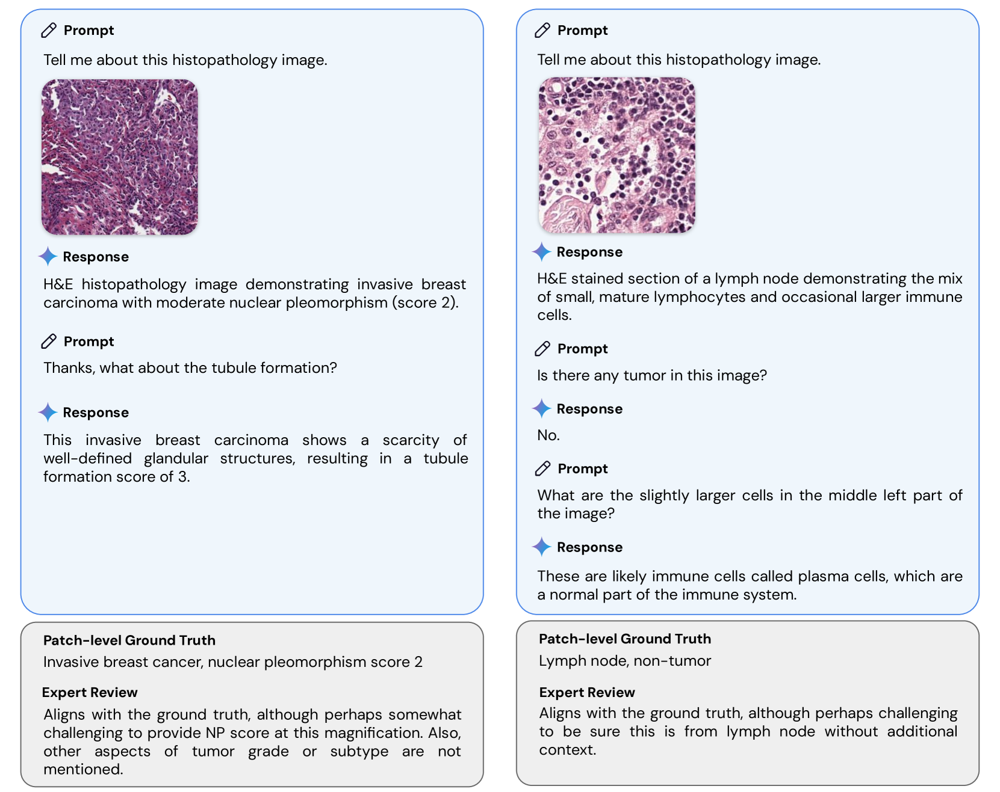
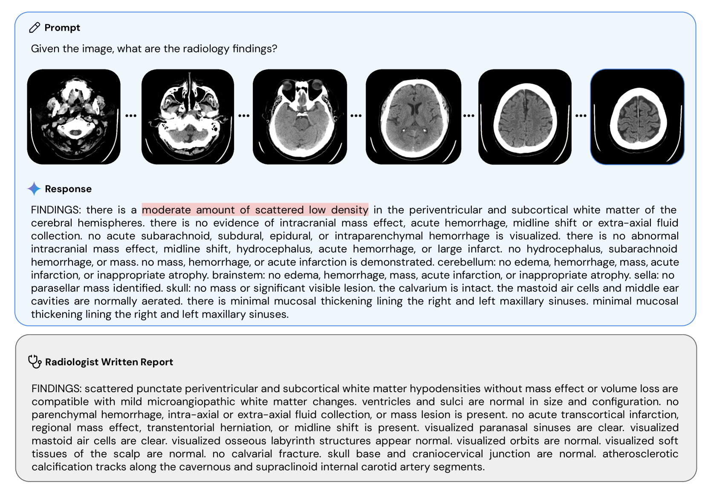

# 提升双子座在多模态医疗领域的技术进步

发布时间：2024年05月06日

`分类：LLM应用

这篇论文讨论了大型多模态模型在医疗领域的应用，特别是针对医学影像和基因组学数据的优化。Med-Gemini 系列模型在多个医疗任务中取得了显著的成果，包括胸部 X 射线报告生成、3D 计算机断层扫描体积报告生成、组织病理学、眼科学和皮肤科图像分类，以及疾病风险预测。这些成果展示了大型语言模型在医疗领域的应用潜力，因此这篇论文应归类为 LLM应用。` `人工智能`

> Advancing Multimodal Medical Capabilities of Gemini

# 摘要

> 众多临床工作需洞悉如医学影像与基因组学这类专业数据，此类信息在常规的大型多模态模型中并不常见。基于 Gemini 多模态模型，我们研发了 Med-Gemini 系列新模型，这些模型不仅继承了 Gemini 的核心功能，还通过针对 2D 与 3D 放射影像、组织病理学、眼科、皮肤科和基因组数据的精细调整，专为医疗场景优化。Med-Gemini-2D 在 AI 驱动的胸部 X 射线（CXR）报告生成方面树立了新的标杆，根据专家评审，其在两个独立数据集上的成绩分别比之前的最佳结果提升了 1% 和 12%，在正常和异常病例的 AI 报告中，分别有 57%、96% 和 43%、65% 的报告被认为“达到或超过”放射科医师的原始报告水平。我们还首次展示了利用 Med-Gemini-3D 基于大型多模态模型生成的 3D 计算机断层扫描（CT）体积报告，其中 53% 的 AI 报告被认为临床上是可接受的，尽管要达到放射科专家的报告质量还需进一步研究。Med-Gemini-2D 不仅在报告生成上有所突破，在 CXR 视觉问答（VQA）中也刷新了最佳成绩，并在 CXR 分类及放射学 VQA 中表现出色，20 项任务中有 17 项超越了当前最佳水平或基线水平。在组织病理学、眼科学和皮肤科图像分类方面，Med-Gemini-2D 在 20 项任务中的 18 项上超越了基线，并接近特定任务模型的性能。Med-Gemini-Polygenic 在疾病风险预测方面超越了传统的线性多基因风险评分方法，并能泛化至基因相关的疾病预测，即便这些疾病未曾在训练中出现。尽管在至关重要的医疗领域仍需进一步的开发与评估，但我们的成果已经突显了 Med-Gemini 在众多医疗任务中的广阔前景。

> Many clinical tasks require an understanding of specialized data, such as medical images and genomics, which is not typically found in general-purpose large multimodal models. Building upon Gemini's multimodal models, we develop several models within the new Med-Gemini family that inherit core capabilities of Gemini and are optimized for medical use via fine-tuning with 2D and 3D radiology, histopathology, ophthalmology, dermatology and genomic data. Med-Gemini-2D sets a new standard for AI-based chest X-ray (CXR) report generation based on expert evaluation, exceeding previous best results across two separate datasets by an absolute margin of 1% and 12%, where 57% and 96% of AI reports on normal cases, and 43% and 65% on abnormal cases, are evaluated as "equivalent or better" than the original radiologists' reports. We demonstrate the first ever large multimodal model-based report generation for 3D computed tomography (CT) volumes using Med-Gemini-3D, with 53% of AI reports considered clinically acceptable, although additional research is needed to meet expert radiologist reporting quality. Beyond report generation, Med-Gemini-2D surpasses the previous best performance in CXR visual question answering (VQA) and performs well in CXR classification and radiology VQA, exceeding SoTA or baselines on 17 of 20 tasks. In histopathology, ophthalmology, and dermatology image classification, Med-Gemini-2D surpasses baselines across 18 out of 20 tasks and approaches task-specific model performance. Beyond imaging, Med-Gemini-Polygenic outperforms the standard linear polygenic risk score-based approach for disease risk prediction and generalizes to genetically correlated diseases for which it has never been trained. Although further development and evaluation are necessary in the safety-critical medical domain, our results highlight the potential of Med-Gemini across a wide range of medical tasks.

[Arxiv](https://arxiv.org/abs/2405.03162)