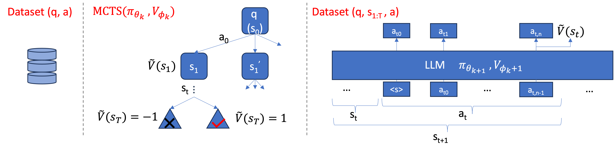
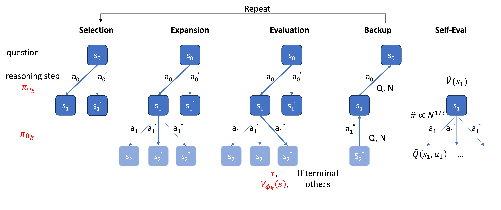
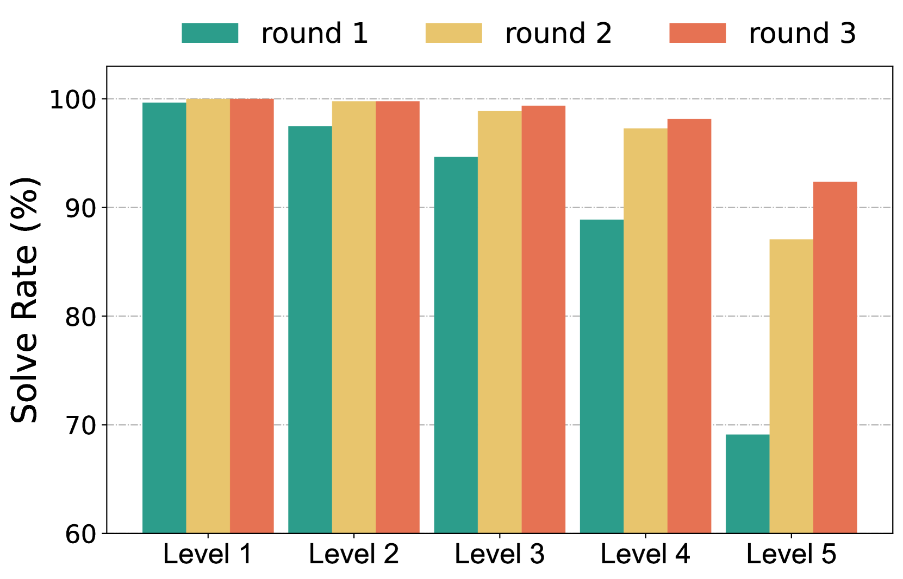
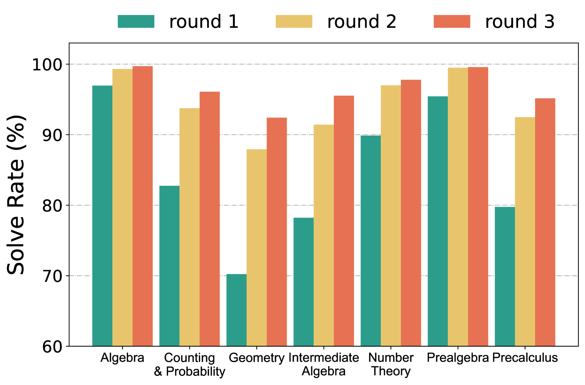
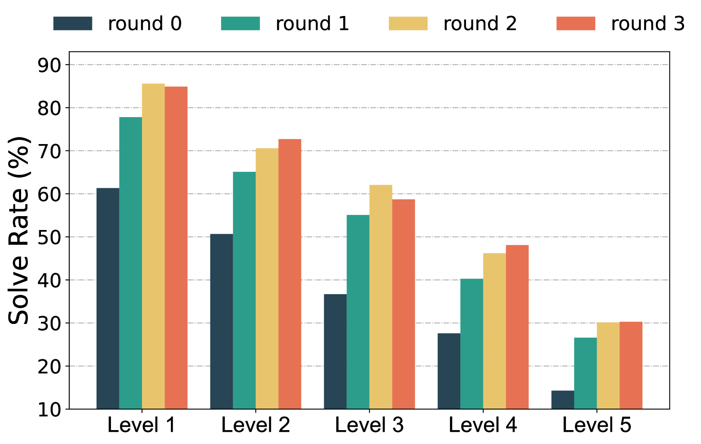
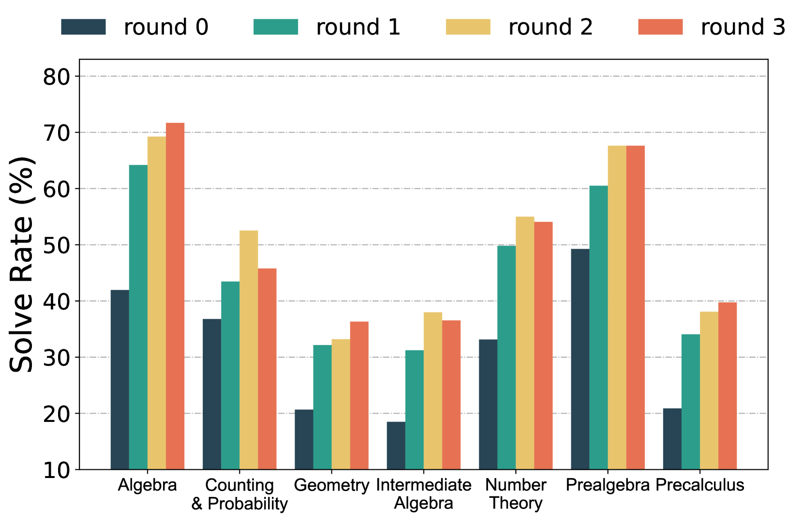
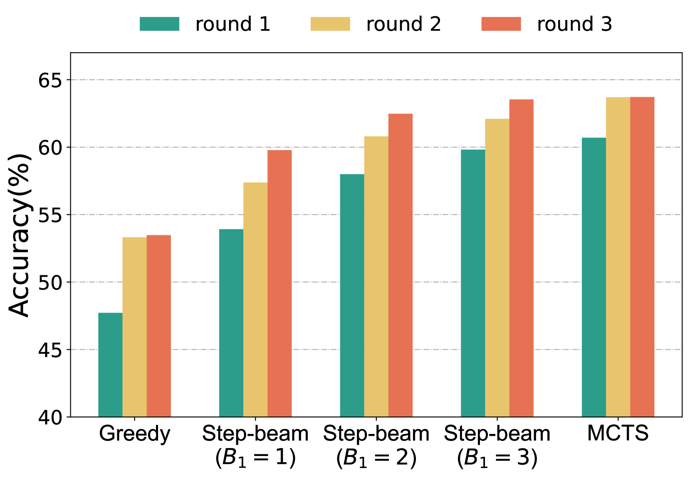
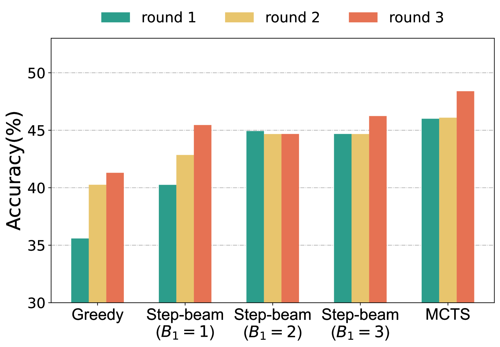
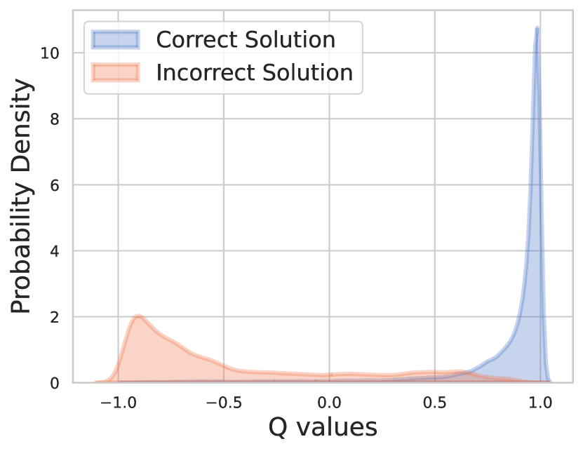

# AlphaMath 近乎零差错：实现无需过程的进程监控

发布时间：2024年05月06日

`LLM应用` `自动化推理`

> AlphaMath Almost Zero: process Supervision without process

# 摘要

> 最新进展使大型语言模型的数学推理能力显著提升。但面对需多步推理的难题，这些模型仍易出错，且逻辑错误的识别尤为棘手。尽管可通过集成代码解释器减少数值错误，但手动标注训练步骤既昂贵又需专业知识。本研究提出了一种创新方法，运用蒙特卡洛树搜索框架自动产生监督和评估信号，免去了手动标注的繁琐。简而言之，预训练良好的大型语言模型仅需数学问题及其答案即可生成训练数据，无需完整解答过程。我们进一步训练了一个步骤级价值模型，以优化模型在数学领域的推理过程。实验结果表明，利用经 MCTS 增强的 LLM 自动生成的解答，显著提升了模型解决复杂数学问题的能力。

> Recent advancements in large language models (LLMs) have substantially enhanced their mathematical reasoning abilities. However, these models still struggle with complex problems that require multiple reasoning steps, frequently leading to logical or numerical errors. While numerical mistakes can largely be addressed by integrating a code interpreter, identifying logical errors within intermediate steps is more challenging. Moreover, manually annotating these steps for training is not only expensive but also demands specialized expertise. In this study, we introduce an innovative approach that eliminates the need for manual annotation by leveraging the Monte Carlo Tree Search (MCTS) framework to generate both the process supervision and evaluation signals automatically. Essentially, when a LLM is well pre-trained, only the mathematical questions and their final answers are required to generate our training data, without requiring the solutions. We proceed to train a step-level value model designed to improve the LLM's inference process in mathematical domains. Our experiments indicate that using automatically generated solutions by LLMs enhanced with MCTS significantly improves the model's proficiency in dealing with intricate mathematical reasoning tasks.

[Arxiv](https://arxiv.org/abs/2405.03553)