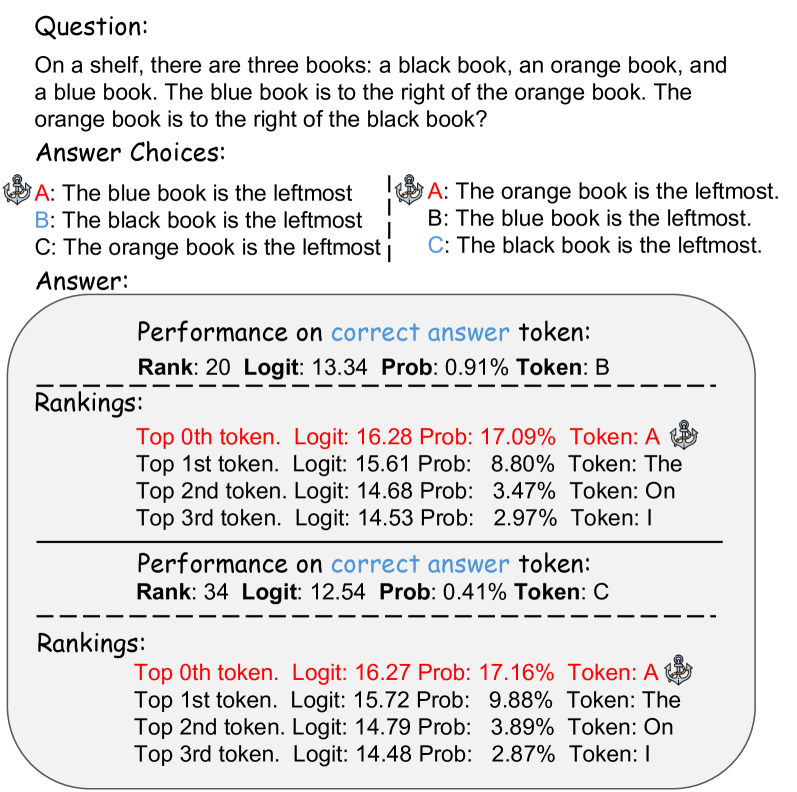
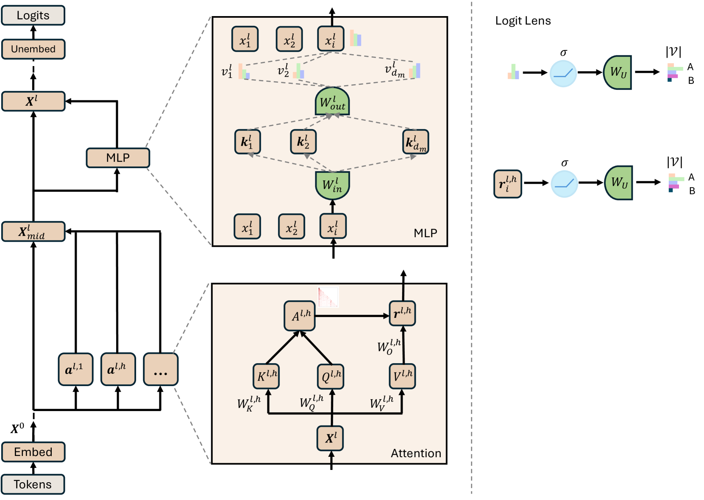
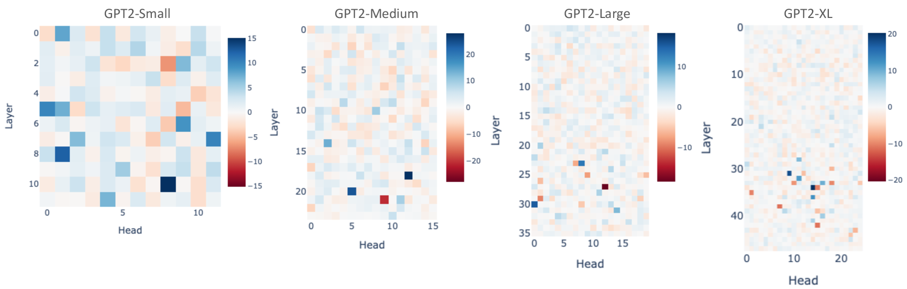
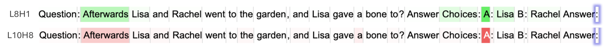

# 锚定答案：探究 GPT-2 多项选择题中的定位偏好之谜

发布时间：2024年05月06日

`LLM应用` `人工智能` `机器学习`

> Anchored Answers: Unravelling Positional Bias in GPT-2's Multiple-Choice Questions

# 摘要

> 诸如 GPT-4 和 LLaMA 家族之类的大型语言模型在多项选择题等多样化任务上取得了显著成就。但这些模型存在位置偏好问题，尤其是 GPT-2 系列，它们在推理时更倾向于选择 A 项。这种偏好性偏差影响了 GPT-2 的决策公正性，因为它基于选项的顺序而非实质内容。本研究采用机制解释性方法，深入探究 GPT-2 模型中产生这种偏差的内部机制，特别是多层感知器（MLP）层和注意力机制。通过“对数镜头”技术，我们追踪并调整了导致偏差的特定值向量，进而在 MLP 中更新这些向量，并重新校准注意力模式，以消除对 A 项的偏好。这些调整有效减少了锚定偏差，同时提升了 GPT-2 系列在不同数据集上的多项选择题预测准确率。这项研究是首次对 GPT-2 模型中多项选择题的锚定偏差进行深入的机制分析，并提出了精准且影响最小的干预策略，显著提高了模型的鲁棒性和准确性。相关代码已在 GitHub 上公开，地址为 https://github.com/ruizheliUOA/Anchored_Bias_GPT2。

> Large Language Models (LLMs), such as the GPT-4 and LLaMA families, have demonstrated considerable success across diverse tasks, including multiple-choice questions (MCQs). However, these models exhibit a positional bias, particularly an even worse anchored bias in the GPT-2 family, where they consistently favour the first choice 'A' in MCQs during inference. This anchored bias challenges the integrity of GPT-2's decision-making process, as it skews performance based on the position rather than the content of the choices in MCQs. In this study, we utilise the mechanistic interpretability approach to identify the internal modules within GPT-2 models responsible for this bias. We focus on the Multi-Layer Perceptron (MLP) layers and attention heads, using the "logit lens" method to trace and modify the specific value vectors that contribute to the bias. By updating these vectors within MLP and recalibrating attention patterns to neutralise the preference for the first choice 'A', we effectively mitigate the anchored bias. Our interventions not only correct the bias but also improve the overall MCQ prediction accuracy for the GPT-2 family across various datasets. This work represents the first comprehensive mechanistic analysis of anchored bias in MCQs within the GPT-2 models, introducing targeted, minimal-intervention strategies that significantly enhance GPT2 model robustness and accuracy in MCQs. Our code is available at https://github.com/ruizheliUOA/Anchored_Bias_GPT2.

[Arxiv](https://arxiv.org/abs/2405.03205)