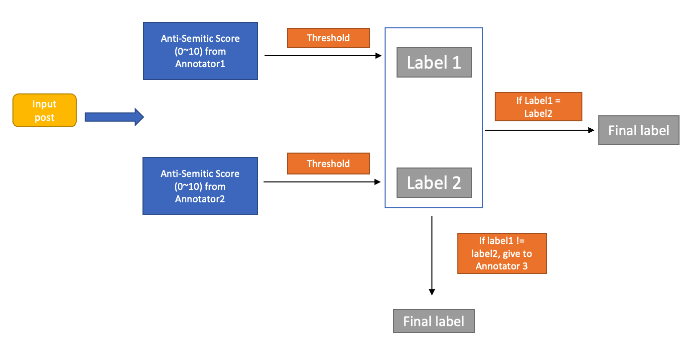
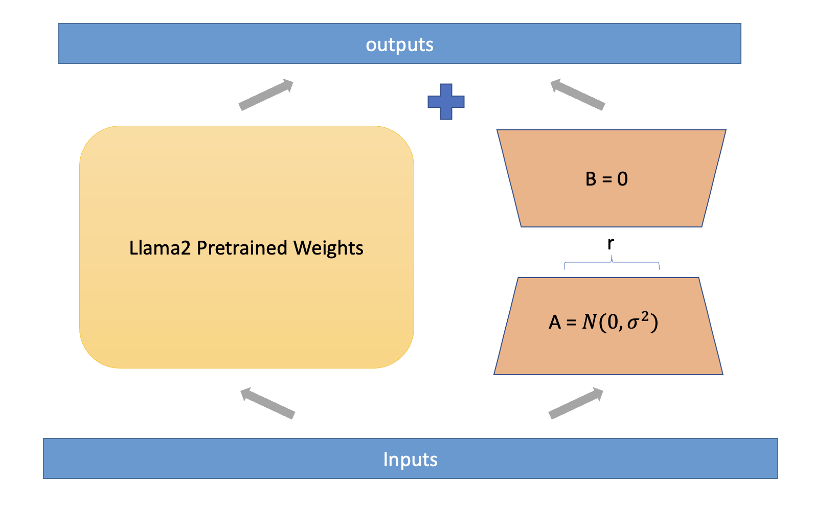

# 运用Transformer架构的大型语言模型，精准识别反犹太仇恨言论，本研究深入探讨了该模型在敏感话题识别上的应用与挑战。

发布时间：2024年05月06日

`Agent

这篇论文探讨了在社交媒体和学术界中识别仇恨言论的挑战，并提出了一种基于变压器和生成式AI的新型数据标注技术。它特别关注了反犹太仇恨言论，并使用了多种变压器模型和微调策略来构建概念验证。虽然这项工作涉及大型语言模型（如LLaMA-2）的应用，但其核心在于开发和评估一种特定的Agent（即数据标注技术），用于在敏感领域中检测仇恨言论。因此，它更符合Agent分类，而不是RAG、LLM应用或LLM理论分类。` `社交媒体` `仇恨言论检测`

> Detecting Anti-Semitic Hate Speech using Transformer-based Large Language Models

# 摘要

> 学术界与社交媒体在识别仇恨言论方面遭遇重重困难，主要源于数据的海量与仇恨言论的变幻莫测。鉴于ChatGPT等大型预测模型在处理敏感议题时的伦理与实践限制，自2019年起，我们便开始探索基于变压器和生成式AI的高级替代技术。我们独创了一种新型数据标注技术，并针对反犹太仇恨言论构建了概念验证，运用了BERT、DistillBERT、RoBERTa和LLaMA-2等多种变压器模型，并结合LoRA微调策略。本文对比评估了这些前沿技术在仇恨言论检测中的效能，强调了在敏感领域中，人工智能应用需负责任且审慎管理的重要性。

> Academic researchers and social media entities grappling with the identification of hate speech face significant challenges, primarily due to the vast scale of data and the dynamic nature of hate speech. Given the ethical and practical limitations of large predictive models like ChatGPT in directly addressing such sensitive issues, our research has explored alternative advanced transformer-based and generative AI technologies since 2019. Specifically, we developed a new data labeling technique and established a proof of concept targeting anti-Semitic hate speech, utilizing a variety of transformer models such as BERT (arXiv:1810.04805), DistillBERT (arXiv:1910.01108), RoBERTa (arXiv:1907.11692), and LLaMA-2 (arXiv:2307.09288), complemented by the LoRA fine-tuning approach (arXiv:2106.09685). This paper delineates and evaluates the comparative efficacy of these cutting-edge methods in tackling the intricacies of hate speech detection, highlighting the need for responsible and carefully managed AI applications within sensitive contexts.

[Arxiv](https://arxiv.org/abs/2405.03794)