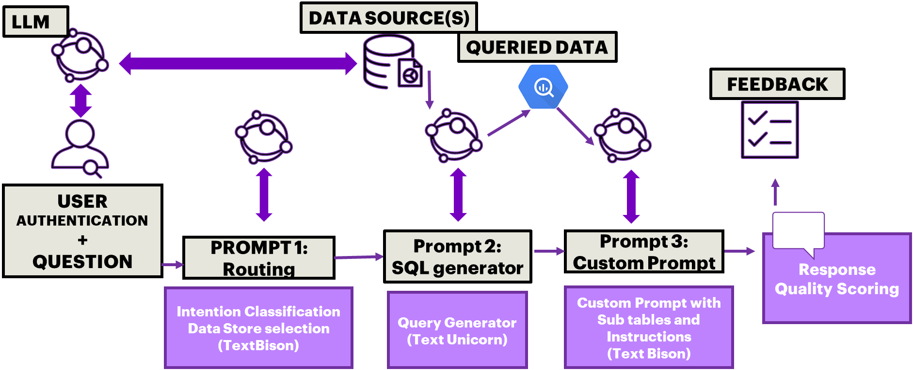
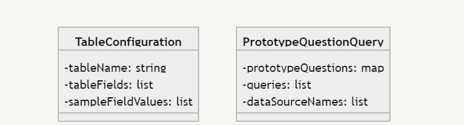
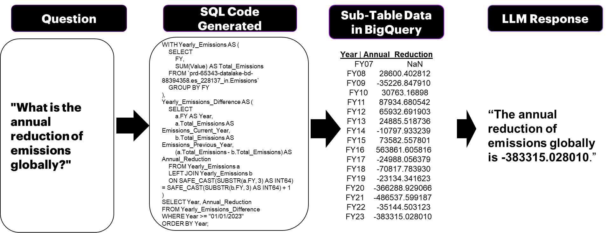
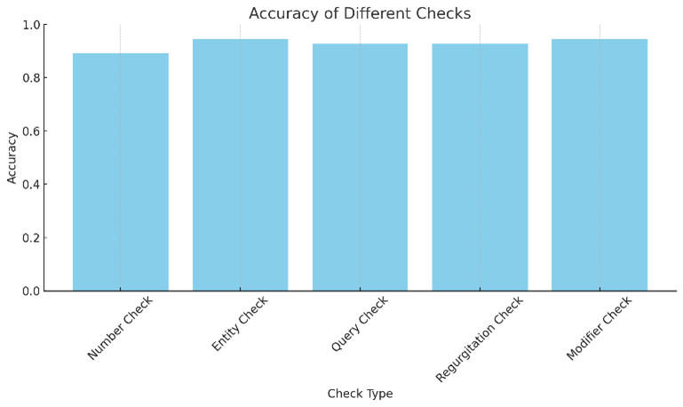
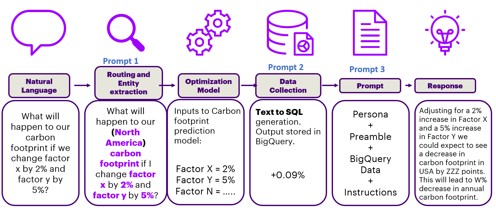

# ERATTA：大型语言模型在表格至答案生成中的极致检索增强技术在这项研究中，我们提出了ERATTA，一种新颖的方法，它利用大型语言模型的强大能力，通过极端的检索增强生成（RAG）技术，从结构化数据中提取信息并生成准确的答案。这种方法特别适用于处理复杂的表格数据，能够有效地捕捉数据间的细微关联，并据此生成连贯且信息丰富的回答。

发布时间：2024年05月06日

`Agent

这篇论文介绍了一种创新的LLM系统，该系统能够调用多个LLMs，实现数据验证、查询分发、数据检索以及针对大型且多样化的数据表的定制问答。这种系统可以被视为一个智能代理（Agent），因为它能够处理复杂的任务，如用户认证、数据路由、数据获取和自然语言响应生成，并且能够在实时环境中提供信息。此外，该系统还包含了一个用于检测LLM输出中幻觉的评分系统，这表明它具有一定的自我监控和质量控制能力。因此，这篇论文的内容更符合Agent的分类，而不是RAG、LLM应用或LLM理论。` `企业数据管理`

> ERATTA: Extreme RAG for Table To Answers with Large Language Models

# 摘要

> RAG与LLMs结合的解决方案在生成式AI领域表现卓越，但它们的使用案例要么过于通用，要么过于特定，这引发了对其可扩展性和泛化能力的质疑。我们提出了一种创新的LLM系统，该系统能够调用多个LLMs，实现数据验证、查询分发、数据检索以及针对大型且多样化的数据表的定制问答。该系统专为企业级数据设计，能在10秒内提供实时信息。用户认证、数据路由、数据获取和自然语言响应生成均通过一系列提示实现。此外，我们还开发了一个五指标评分系统，用于检测LLM输出中的幻觉，并在多个领域中实现了超过90%的准确率。这一系统的扩展潜力巨大，未来可用于异构数据源的查询。

> Large language models (LLMs) with residual augmented-generation (RAG) have been the optimal choice for scalable generative AI solutions in the recent past. However, the choice of use-cases that incorporate RAG with LLMs have been either generic or extremely domain specific, thereby questioning the scalability and generalizability of RAG-LLM approaches. In this work, we propose a unique LLM-based system where multiple LLMs can be invoked to enable data authentication, user query routing, data retrieval and custom prompting for question answering capabilities from data tables that are highly varying and large in size. Our system is tuned to extract information from Enterprise-level data products and furnish real time responses under 10 seconds. One prompt manages user-to-data authentication followed by three prompts to route, fetch data and generate a customizable prompt natural language responses. Additionally, we propose a five metric scoring module that detects and reports hallucinations in the LLM responses. Our proposed system and scoring metrics achieve >90% confidence scores across hundreds of user queries in the sustainability, financial health and social media domains. Extensions to the proposed extreme RAG architectures can enable heterogeneous source querying using LLMs.

[Arxiv](https://arxiv.org/abs/2405.03963)