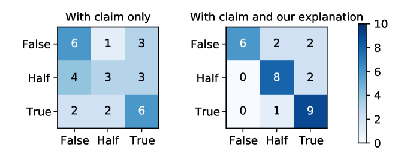

# 利用大型语言模型，通过对抗竞争智慧中的策略，实现假新闻的可解释性检测。

发布时间：2024年05月06日

`LLM应用` `新闻媒体` `信息安全`

> Explainable Fake News Detection With Large Language Model via Defense Among Competing Wisdom

# 摘要

> 当前的假新闻识别技术多依赖于神经网络构建的潜在特征表示，导致在缺乏解释的情况下对新闻进行分类，如同一个黑箱。尽管现有的可解释系统尝试从深入调查的新闻报道中提炼出真实性的证据，但它们常因辟谣的滞后和低效而受限。一些新近研究简单地将证据等同于群体智慧中的主流观点，但这些观点可能包含不准确或有偏见的信息，因为群体智慧未经筛选。为了在繁杂多变的叙事海洋中甄别假新闻，本文提出了一种创新的基于防御机制的可解释假新闻检测框架。我们首先设计了一个证据提取模块，将群体智慧划分为两个对立的阵营，并分别搜寻关键证据。接着，为了从证据中提炼出简洁的洞见，我们开发了一个基于提示的模块，该模块使用大型语言模型通过推断两种可能的真实性倾向来生成解释。最终，我们引入了一个基于防御的推理模块，通过模拟这些解释之间的辩论来判定新闻的真实性。在两个现实世界的数据集上的广泛测试显示，我们的方法在假新闻识别的准确性和提供高质量解释方面均超越了现有的顶尖方法。

> Most fake news detection methods learn latent feature representations based on neural networks, which makes them black boxes to classify a piece of news without giving any justification. Existing explainable systems generate veracity justifications from investigative journalism, which suffer from debunking delayed and low efficiency. Recent studies simply assume that the justification is equivalent to the majority opinions expressed in the wisdom of crowds. However, the opinions typically contain some inaccurate or biased information since the wisdom of crowds is uncensored. To detect fake news from a sea of diverse, crowded and even competing narratives, in this paper, we propose a novel defense-based explainable fake news detection framework. Specifically, we first propose an evidence extraction module to split the wisdom of crowds into two competing parties and respectively detect salient evidences. To gain concise insights from evidences, we then design a prompt-based module that utilizes a large language model to generate justifications by inferring reasons towards two possible veracities. Finally, we propose a defense-based inference module to determine veracity via modeling the defense among these justifications. Extensive experiments conducted on two real-world benchmarks demonstrate that our proposed method outperforms state-of-the-art baselines in terms of fake news detection and provides high-quality justifications.

[Arxiv](https://arxiv.org/abs/2405.03371)