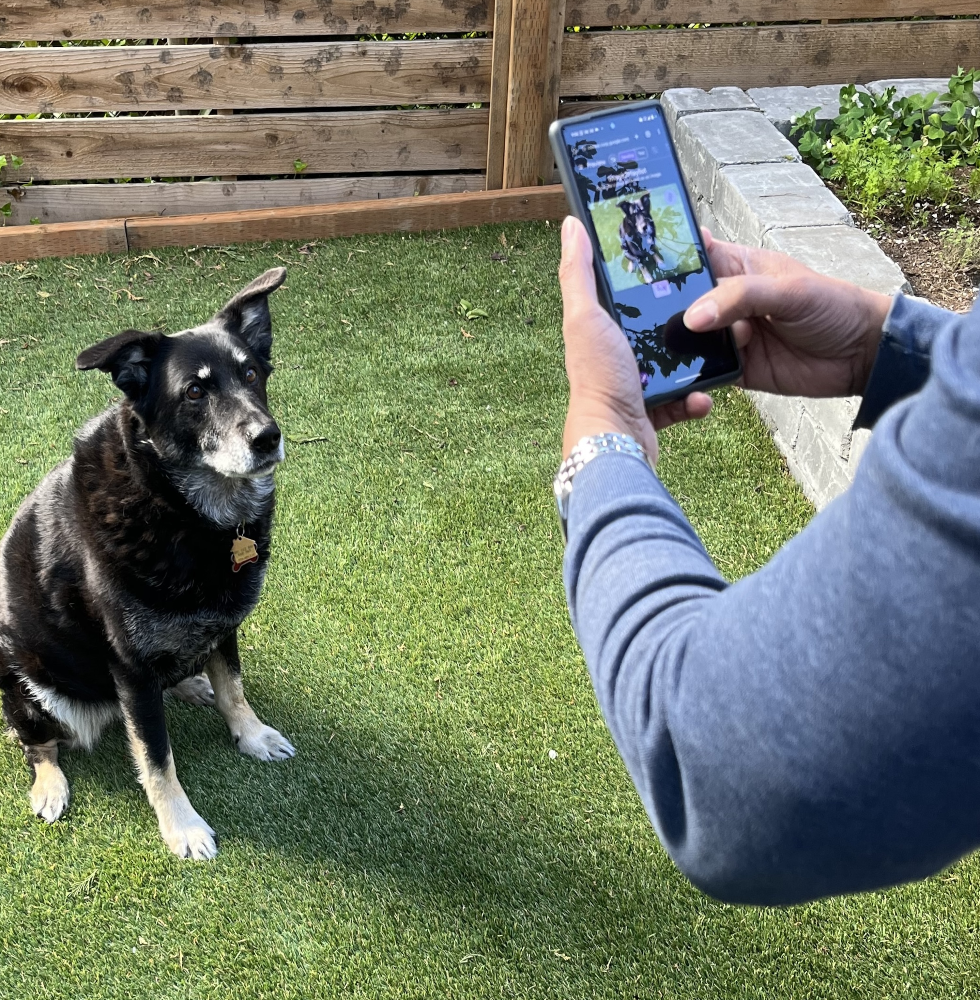
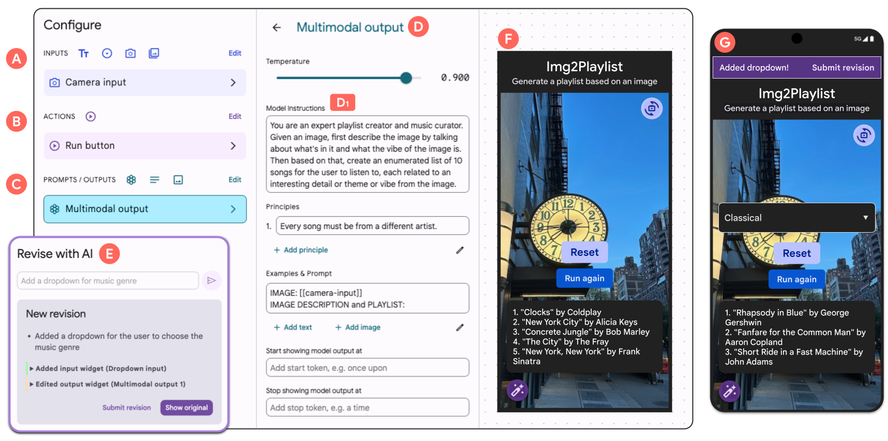
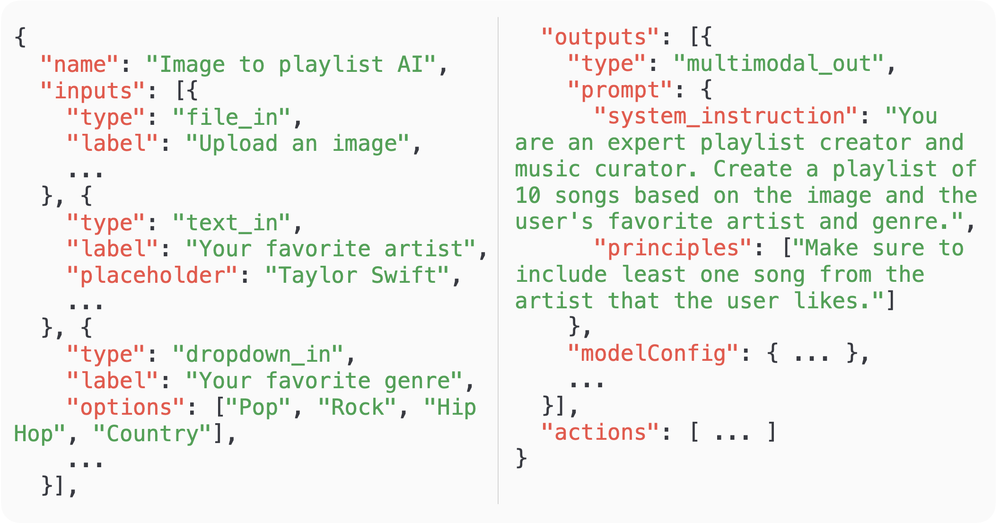
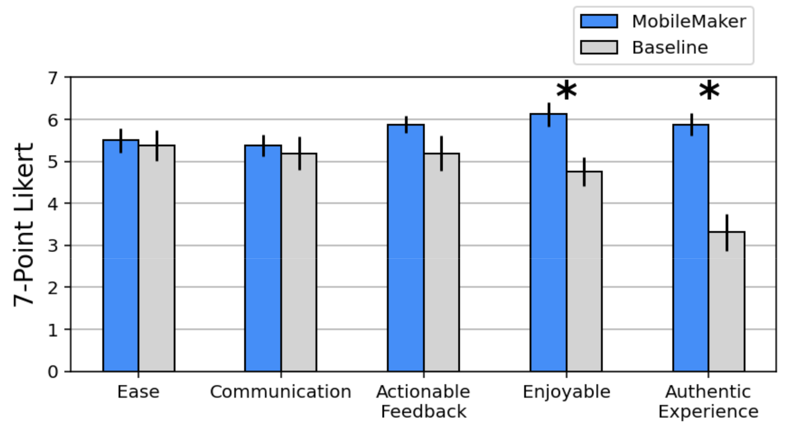
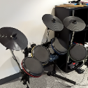
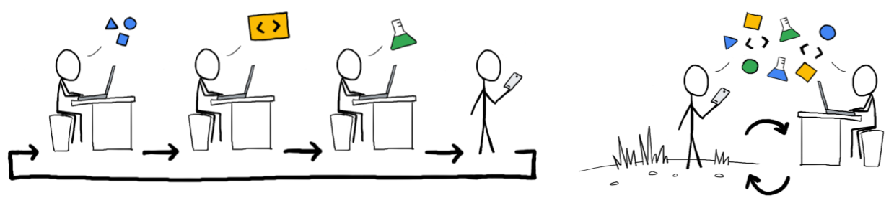

# 现场AI原型创新：借助MobileMaker，将多模态提示巧妙融入移动场景，开启智能移动新篇章。

发布时间：2024年05月06日

`LLM应用

这篇论文探讨了多模态大型语言模型（LLMs）在移动设备上的应用，特别是在AI原型设计和测试方面的应用。它介绍了一个名为MobileMaker的工具，该工具允许设计师快速创建可在移动设备上测试的AI原型，并允许测试人员通过自然语言在设备上进行现场修改。论文通过一项探索性研究，比较了使用MobileMaker创建的原型与现有原型工具的用户反馈，并讨论了现场修改能力的优势和局限性。因此，这篇论文属于LLM应用类别，因为它关注的是LLMs在实际应用中的使用和用户反馈的收集。` `移动应用开发` `人工智能原型设计`

> In Situ AI Prototyping: Infusing Multimodal Prompts into Mobile Settings with MobileMaker

# 摘要

> 多模态大型语言模型（LLMs）的最新进展降低了通过提示快速原型化AI功能，特别是在面向移动设备的使用场景中的门槛。尽管用户反馈的价值，但在AI原型中寻求早期、移动设备上的用户反馈仍然具有挑战性。LLMs的广泛范围和灵活性意味着，对于给定的用例特定原型，了解用户可能提供的广泛野生输入以及他们对AI行为的上下文期望至关重要。为了探索现场AI原型设计和测试的概念，我们创建了MobileMaker：一个AI原型工具，使设计师能够快速创建可在设备上测试的移动AI原型，并允许测试人员通过自然语言在设备上、现场修改原型。在16名用户的探索性研究中，我们探讨了使用MobileMaker创建的原型与现有原型工具（如Figma，提示编辑器）的用户反馈相比。我们发现，MobileMaker原型能够更偶然地发现：模型输入的边缘情况，AI和用户在上下文中对任务的解释差异，以及AI错过的上下文信号。此外，我们了解到，尽管在现场进行修改的能力使用户感觉更满意，作为设计过程中的积极参与者，但它也可能限制他们的反馈，只限于原型工具认为更可行或可实施的更改子集。

> Recent advances in multimodal large language models (LLMs) have lowered the barriers to rapidly prototyping AI-powered features via prompting, especially for mobile-intended use cases. Despite the value of situated user feedback, the process of soliciting early, mobile-situated user feedback on AI prototypes remains challenging. The broad scope and flexibility of LLMs means that, for a given use-case-specific prototype, there is a crucial need to understand the wide range of in-the-wild input likely to be provided by the user, as well as their in-context expectations of the AI's behavior. To explore the concept of in situ AI prototyping and testing, we created MobileMaker: an AI prototyping tool that enables designers to rapidly create mobile AI prototypes that can be tested on-device, and enables testers to make on-device, in-the-field revisions of the prototype through natural language. In an exploratory study with 16 users, we explored how user feedback on prototypes created with MobileMaker compares to that of existing prototyping tools (e.g., Figma, prompt editors). We found that MobileMaker prototypes enabled more serendipitous discovery of: model input edge cases, discrepancies between AI's and user's in-context interpretation of the task, and contextual signals missed by the AI. Furthermore, we learned that while the ability to make in-the-wild revisions led users to feel more fulfilled as active participants in the design process, it might also constrain their feedback to the subset of changes perceived as more actionable or implementable by the prototyping tool.

[Arxiv](https://arxiv.org/abs/2405.03806)