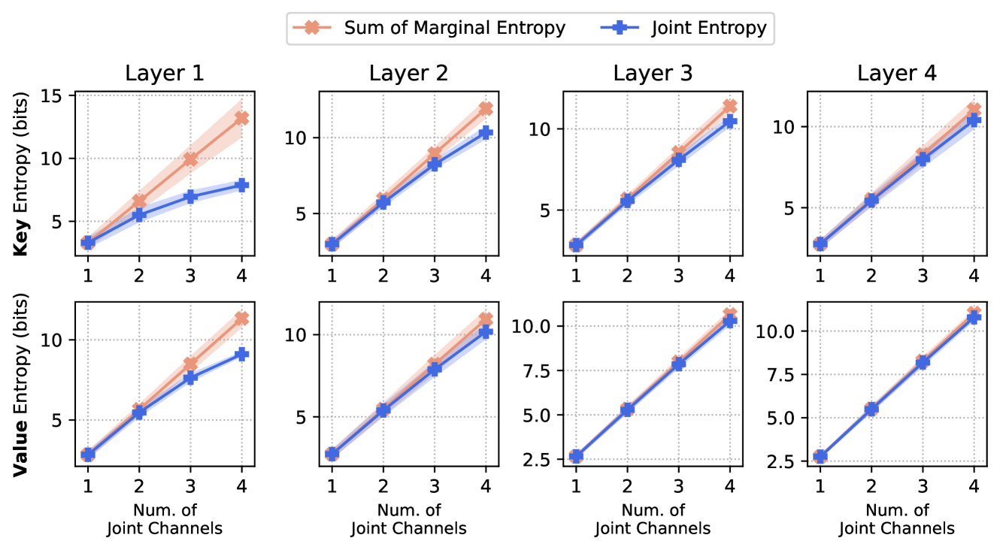
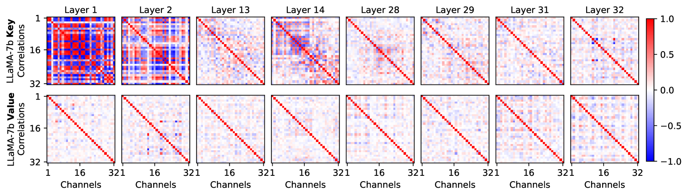
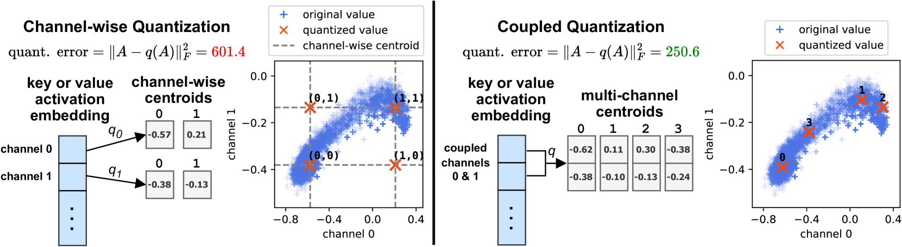
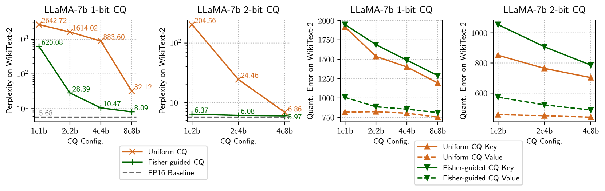
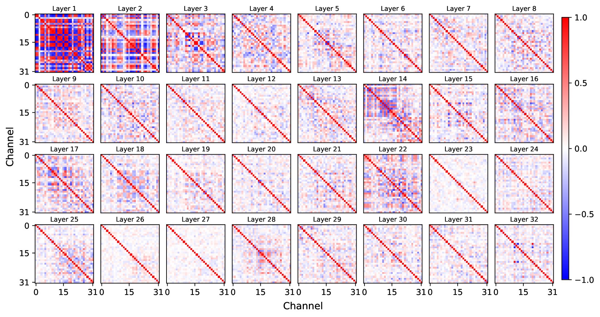
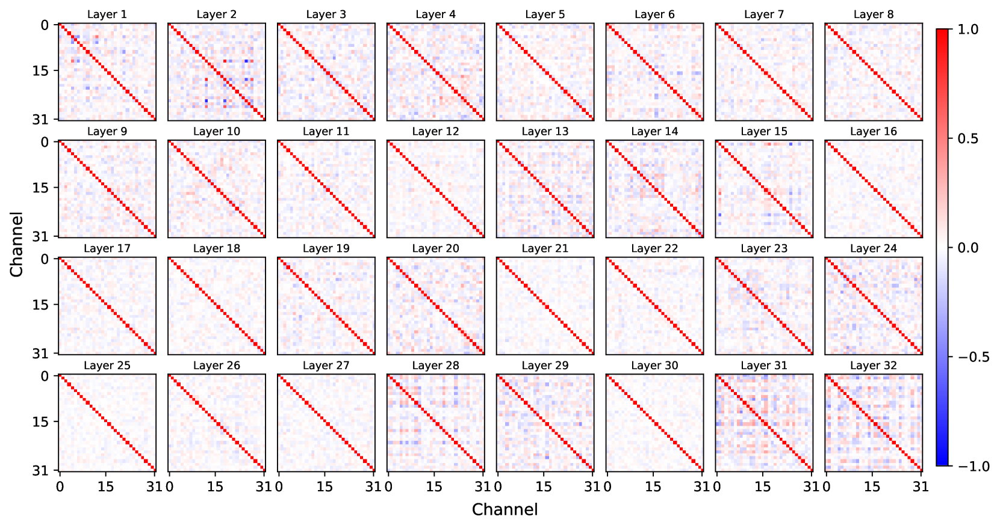
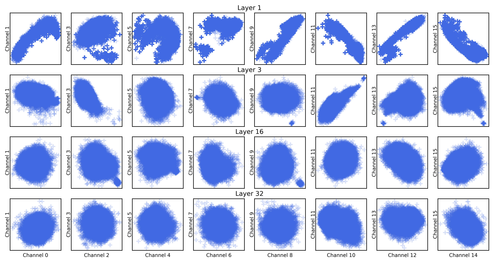
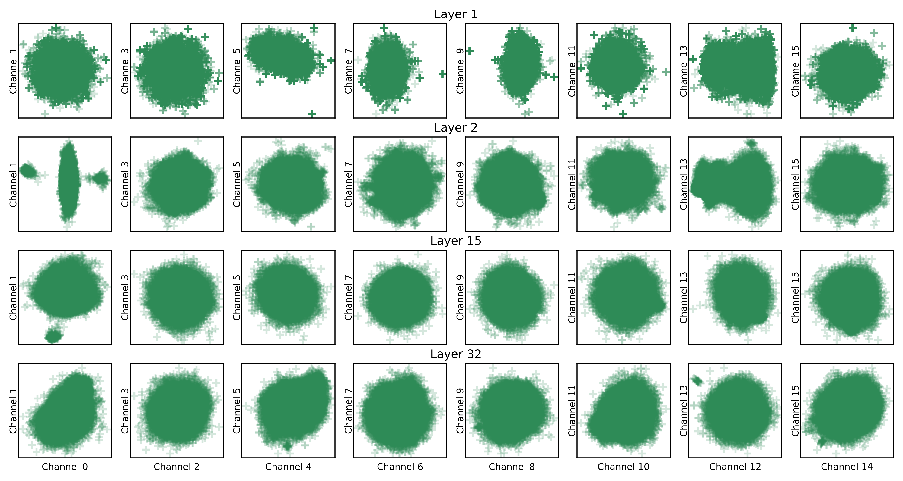

# KV Cache 采用每通道1位的耦合量化策略，为大型语言模型推理提供了高效途径，实现了计算资源的优化利用。

发布时间：2024年05月06日

`LLM理论

这篇论文探讨了大型语言模型（LLM）在部署时的效率问题，特别是关于KV缓存大小对GPU内存和推理速度的影响。它提出了一种新的量化技术——耦合量化（CQ），以更高效地编码激活信息，从而减少KV缓存的大小。这个研究关注的是LLM的内部机制和优化技术，属于理论层面的探讨，因此归类为LLM理论。` `机器学习优化`

> KV Cache is 1 Bit Per Channel: Efficient Large Language Model Inference with Coupled Quantization

# 摘要

> 在部署大型语言模型时，为了提高效率，我们需将多个请求打包处理。然而，随着批量、上下文长度或模型规模的增大，KV缓存的大小成为GPU内存的吞噬者和推理速度的瓶颈。量化技术虽能压缩KV缓存，但在极低比特率下仍显乏力。我们发现，键值激活的各个通道间存在紧密联系，其联合熵的增长，并不如各通道边际熵之和那般迅猛。鉴于此，我们提出了耦合量化（CQ），通过将多个通道紧密结合，利用它们之间的相互依赖，以更高效的方式编码激活信息。实验证明，CQ在保持模型质量方面表现出色，甚至能将KV缓存量化至仅1比特，而模型质量依旧坚挺。

> Efficient deployment of Large Language Models (LLMs) requires batching multiple requests together to improve throughput. As the batch size, context length, or model size increases, the size of the key and value (KV) cache can quickly become the main contributor to GPU memory usage and the bottleneck of inference latency. Quantization has emerged as an effective technique for KV cache compression, but existing methods still fail at very low bit widths. We observe that distinct channels of a key/value activation embedding are highly inter-dependent, and the joint entropy of multiple channels grows at a slower rate than the sum of their marginal entropies. Based on this insight, we propose Coupled Quantization (CQ), which couples multiple key/value channels together to exploit their inter-dependency and encode the activations in a more information-efficient manner. Extensive experiments reveal that CQ outperforms or is competitive with existing baselines in preserving model quality. Furthermore, we demonstrate that CQ can preserve model quality with KV cache quantized down to 1-bit.

[Arxiv](https://arxiv.org/abs/2405.03917)