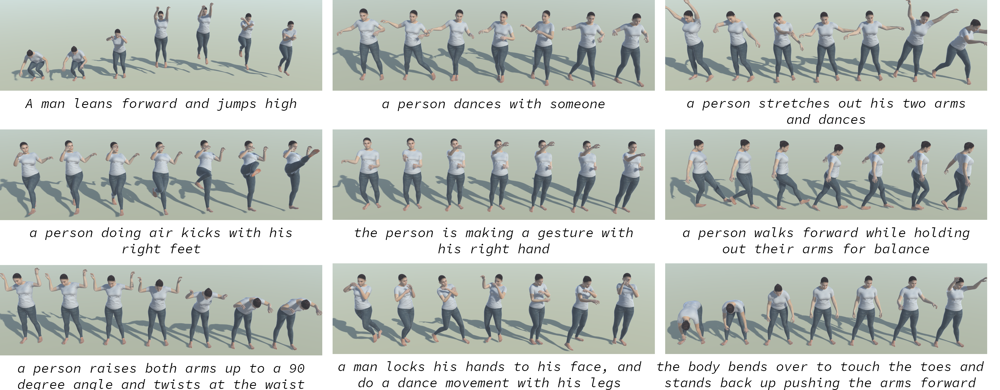

# LGTM：一种由文本驱动的人体运动扩散模型，实现了从局部细节到全局动作的全面覆盖。

发布时间：2024年05月06日

`LLM应用` `计算机动画`

> LGTM: Local-to-Global Text-Driven Human Motion Diffusion Model

# 摘要

> 本文提出了 LGTM，一种创新的文本到动作生成的局部至全局处理流程。该流程采用扩散模型架构，致力于精确地将文本描述转换为计算机动画中的连贯人体动作。传统方法在语义一致性上存在挑战，尤其是在将特定动作与身体部位正确对应时。为此，我们设计了一个分两步的流程：首先，利用大型语言模型（LLM）将整体动作描述细化为部分特定的叙述；然后，通过独立的身体部位动作编码器进行处理，确保局部语义的精确对齐。最终，一个基于注意力机制的全身优化器对动作生成结果进行优化，确保整体的连贯性。实验结果证明，LGTM 在生成精确且语义一致的人体动作方面取得了显著提升，这在文本到动作的应用领域是一个重要的进步。相关代码和数据已在 https://github.com/L-Sun/LGTM 上公开。

> In this paper, we introduce LGTM, a novel Local-to-Global pipeline for Text-to-Motion generation. LGTM utilizes a diffusion-based architecture and aims to address the challenge of accurately translating textual descriptions into semantically coherent human motion in computer animation. Specifically, traditional methods often struggle with semantic discrepancies, particularly in aligning specific motions to the correct body parts. To address this issue, we propose a two-stage pipeline to overcome this challenge: it first employs large language models (LLMs) to decompose global motion descriptions into part-specific narratives, which are then processed by independent body-part motion encoders to ensure precise local semantic alignment. Finally, an attention-based full-body optimizer refines the motion generation results and guarantees the overall coherence. Our experiments demonstrate that LGTM gains significant improvements in generating locally accurate, semantically-aligned human motion, marking a notable advancement in text-to-motion applications. Code and data for this paper are available at https://github.com/L-Sun/LGTM

[Arxiv](https://arxiv.org/abs/2405.03485)