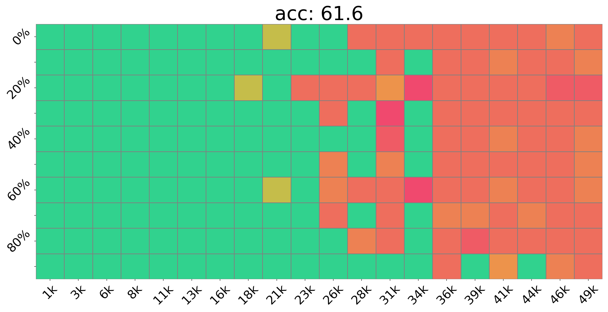

# 短指令与合成位置下的长上下文对齐策略

发布时间：2024年05月06日

`LLM理论

这篇论文探讨了大型语言模型（LLMs）在处理长上下文指令时的挑战，并提出了一种名为Step-Skipping Alignment（SkipAlign）的新技术来解决这一问题。该技术旨在提升LLMs在调整阶段的长上下文处理能力，而不需要额外的资源。这种方法基于对长距离依赖的理解，并通过在指令样本中插入跳过的位置索引来合成长距离依赖。论文通过实验证明了SkipAlign在多种长上下文任务中的有效性。由于这项工作主要关注LLMs的理论改进和性能提升，因此它属于LLM理论分类。` `机器学习`

> Long Context Alignment with Short Instructions and Synthesized Positions

# 摘要

> 大型语言模型（LLMs）在处理极长上下文指令时面临挑战，这通常需要高质量的长数据和大量计算资源。本文提出了一种名为Step-Skipping Alignment（SkipAlign）的新技术，旨在无需额外资源，仅通过原始数据长度训练，就能提升LLMs在调整阶段的长上下文处理能力。SkipAlign基于长距离依赖是提升LLM长上下文能力的关键这一理念。它不仅扩展输入样本长度，还通过在指令样本中巧妙插入跳过的位置索引，合成长距离依赖，从而有效扩展上下文。实验证明，SkipAlign在多种长上下文任务中表现出色，尤其是在精心挑选的基础模型和数据集下，仅6B参数的SkipAlign就能达到最佳性能，与GPT-3.5-Turbo-16K等强基准相当。

> Effectively handling instructions with extremely long context remains a challenge for Large Language Models (LLMs), typically necessitating high-quality long data and substantial computational resources. This paper introduces Step-Skipping Alignment (SkipAlign), a new technique designed to enhance the long-context capabilities of LLMs in the phase of alignment without the need for additional efforts beyond training with original data length. SkipAlign is developed on the premise that long-range dependencies are fundamental to enhancing an LLM's capacity of long context. Departing from merely expanding the length of input samples, SkipAlign synthesizes long-range dependencies from the aspect of positions indices. This is achieved by the strategic insertion of skipped positions within instruction-following samples, which utilizes the semantic structure of the data to effectively expand the context. Through extensive experiments on base models with a variety of context window sizes, SkipAlign demonstrates its effectiveness across a spectrum of long-context tasks. Particularly noteworthy is that with a careful selection of the base model and alignment datasets, SkipAlign with only 6B parameters achieves it's best performance and comparable with strong baselines like GPT-3.5-Turbo-16K on LongBench.

[Arxiv](https://arxiv.org/abs/2405.03939)