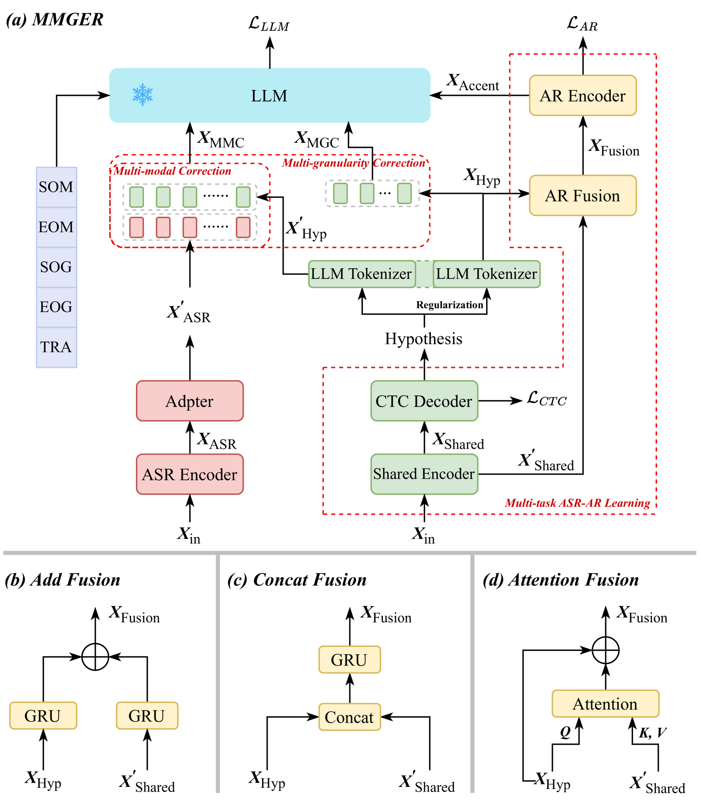

# MMGER是一种创新技术，它结合了大型语言模型（LLM），以多模态和多粒度的方式进行生成性错误校正，旨在同步提升口音识别和语音识别的准确性。

发布时间：2024年05月06日

`LLM应用` `语音识别` `自动语音校正`

> MMGER: Multi-modal and Multi-granularity Generative Error Correction with LLM for Joint Accent and Speech Recognition

# 摘要

> 尽管自动语音识别技术取得了突破性进展，但在恶劣环境下其性能仍会下降。本文介绍了一种名为 MMGER 的新型生成式错误纠正方法，该方法依托于大型语言模型的卓越文本理解力，针对自动语音识别中的错误进行校正，尤其在多口音环境中表现出色。传统的 N 最佳假设方法存在局限性，如假设固定不变、声学信息使用不足以及对口音多样性的适应性差。我们提出的 MMGER 模型采用多任务学习框架，同步进行语音识别和口音识别，以应对多口音挑战。该模型通过多模态和多粒度校正技术，不仅动态生成最佳假设和口音嵌入，还能在帧级别进行精细校正，并通过全局语言信息辅助实现话语级别的粗粒度校正。在多口音普通话 KeSpeech 数据集上的实验结果表明，MMGER 在口音识别准确度上提升了 26.72%，在 ASR 字符错误率上降低了 27.55%，均优于现有标准基线。

> Despite notable advancements in automatic speech recognition (ASR), performance tends to degrade when faced with adverse conditions. Generative error correction (GER) leverages the exceptional text comprehension capabilities of large language models (LLM), delivering impressive performance in ASR error correction, where N-best hypotheses provide valuable information for transcription prediction. However, GER encounters challenges such as fixed N-best hypotheses, insufficient utilization of acoustic information, and limited specificity to multi-accent scenarios. In this paper, we explore the application of GER in multi-accent scenarios. Accents represent deviations from standard pronunciation norms, and the multi-task learning framework for simultaneous ASR and accent recognition (AR) has effectively addressed the multi-accent scenarios, making it a prominent solution. In this work, we propose a unified ASR-AR GER model, named MMGER, leveraging multi-modal correction, and multi-granularity correction. Multi-task ASR-AR learning is employed to provide dynamic 1-best hypotheses and accent embeddings. Multi-modal correction accomplishes fine-grained frame-level correction by force-aligning the acoustic features of speech with the corresponding character-level 1-best hypothesis sequence. Multi-granularity correction supplements the global linguistic information by incorporating regular 1-best hypotheses atop fine-grained multi-modal correction to achieve coarse-grained utterance-level correction. MMGER effectively mitigates the limitations of GER and tailors LLM-based ASR error correction for the multi-accent scenarios. Experiments conducted on the multi-accent Mandarin KeSpeech dataset demonstrate the efficacy of MMGER, achieving a 26.72% relative improvement in AR accuracy and a 27.55% relative reduction in ASR character error rate, compared to a well-established standard baseline.

[Arxiv](https://arxiv.org/abs/2405.03152)