# 全方位行动：借助大型语言模型，预测现实世界多模态感官输入引发的数字行动。

发布时间：2024年05月06日

`Agent

这篇论文探讨了在增强现实环境中，如何通过智能代理（Agent）来处理和响应多模态信息，以降低用户的操作难度。论文通过日记研究收集数据，构建了一个数字后续操作设计空间，并开发了OmniActions系统，该系统利用大型语言模型（LLM）来处理感官输入并预测后续操作。研究对比了不同的LLM技术，并创建了一个交互原型来收集用户反馈。因此，这篇论文更符合Agent分类，因为它关注的是如何构建一个智能系统来辅助用户处理多模态信息。` `增强现实` `人机交互`

> OmniActions: Predicting Digital Actions in Response to Real-World Multimodal Sensory Inputs with LLMs

# 摘要

> 我们正迈向一个“无处不在的增强现实”时代，那时多模态信息触手可及。然而，在日常生活中，人们往往忙于各种事务，这使得他们难以迅速响应所遇到的多模态信息。为了降低这种响应的难度，未来的交互界面需要智能地根据用户情境提供便捷的数字操作。为此，我们开展了一项日记研究，参与者需记录并分享他们希望操作的媒体（如图像或音频），以及他们的操作意图和其他相关信息。基于这些数据，我们构建了一个全面的数字后续操作设计空间，以应对各种多模态感官输入。我们进一步开发了OmniActions系统，它利用大型语言模型处理感官输入，并预测基于设计空间的后续操作。通过日记研究的数据，我们对比了三种LLM技术（意图分类、上下文学习和微调），并找出了最适合我们任务的技术。此外，我们还创建了一个交互原型，并收集了用户对于操作预测及其错误的初步反馈。

> The progression to "Pervasive Augmented Reality" envisions easy access to multimodal information continuously. However, in many everyday scenarios, users are occupied physically, cognitively or socially. This may increase the friction to act upon the multimodal information that users encounter in the world. To reduce such friction, future interactive interfaces should intelligently provide quick access to digital actions based on users' context. To explore the range of possible digital actions, we conducted a diary study that required participants to capture and share the media that they intended to perform actions on (e.g., images or audio), along with their desired actions and other contextual information. Using this data, we generated a holistic design space of digital follow-up actions that could be performed in response to different types of multimodal sensory inputs. We then designed OmniActions, a pipeline powered by large language models (LLMs) that processes multimodal sensory inputs and predicts follow-up actions on the target information grounded in the derived design space. Using the empirical data collected in the diary study, we performed quantitative evaluations on three variations of LLM techniques (intent classification, in-context learning and finetuning) and identified the most effective technique for our task. Additionally, as an instantiation of the pipeline, we developed an interactive prototype and reported preliminary user feedback about how people perceive and react to the action predictions and its errors.

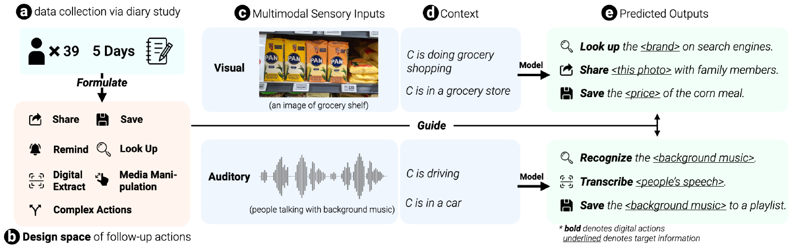

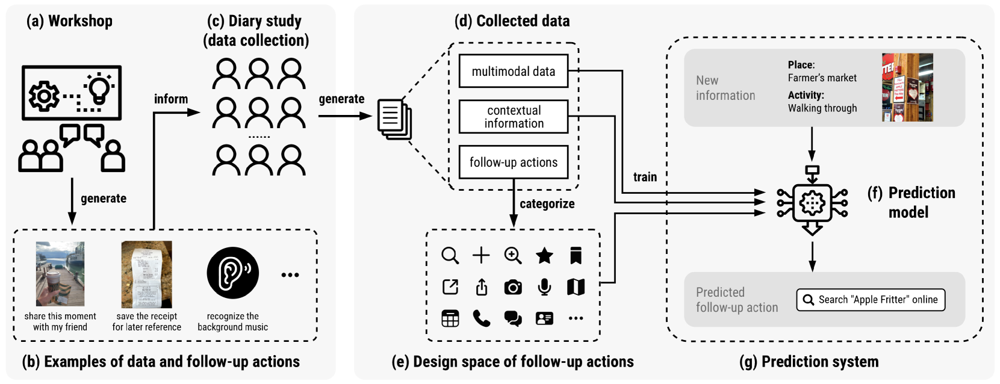

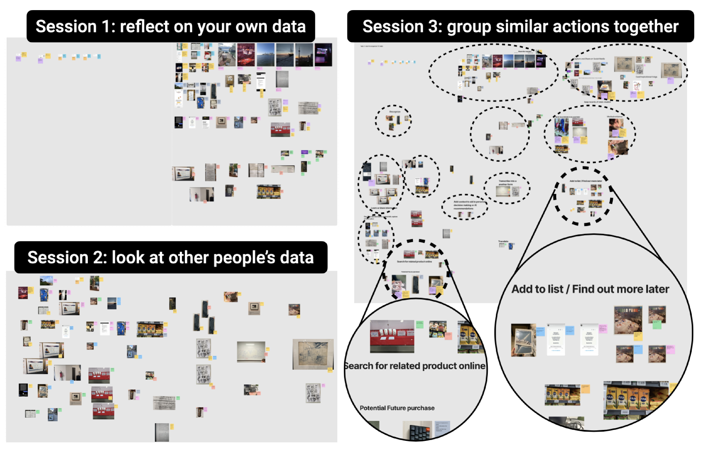

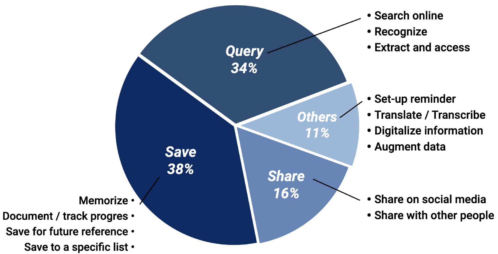

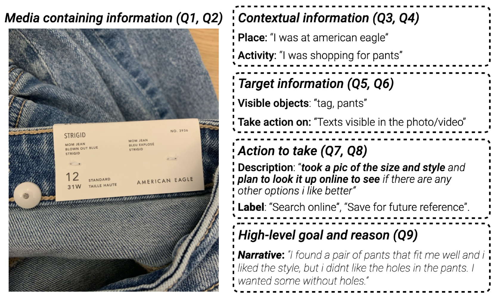

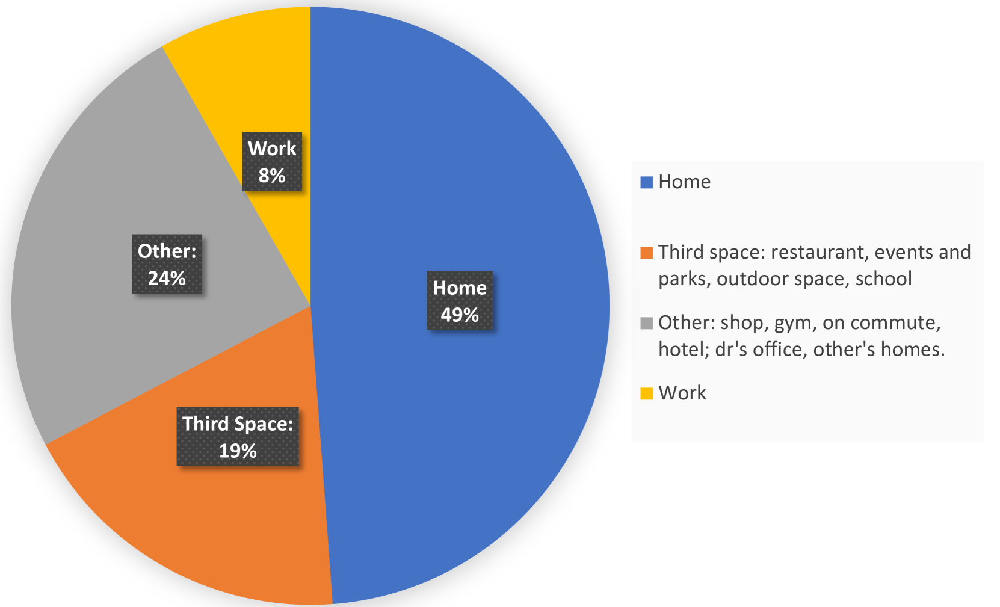

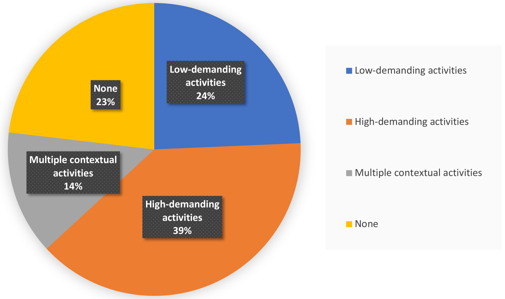

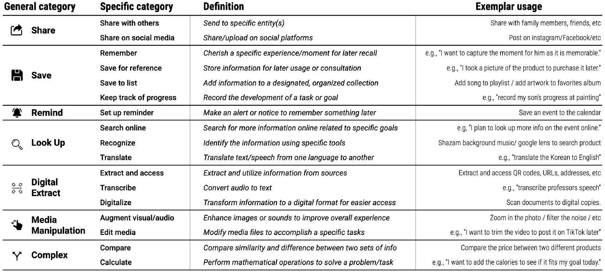

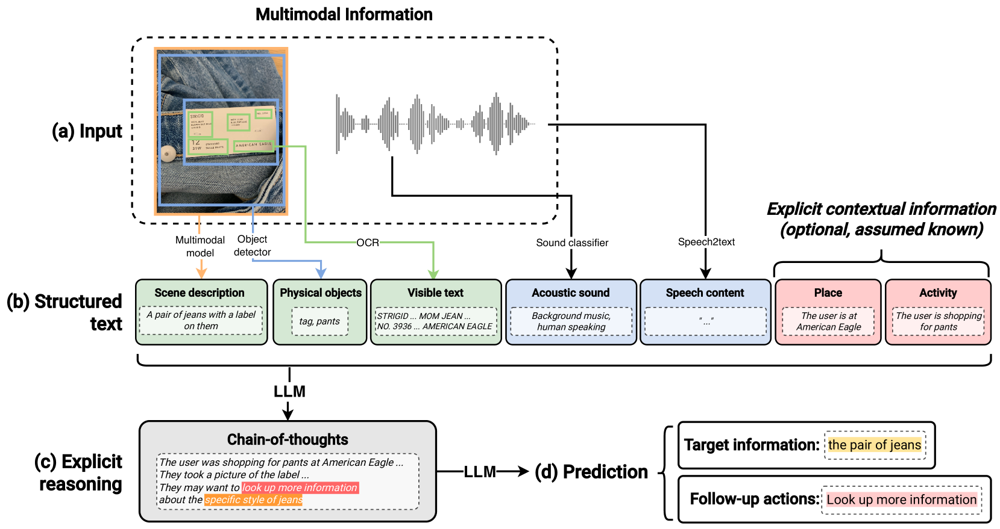

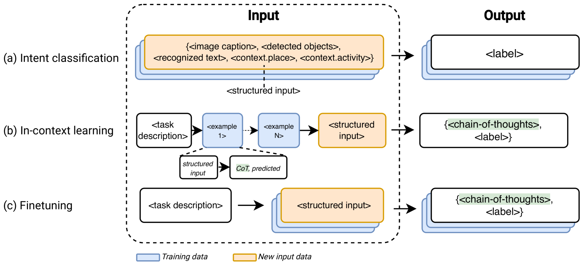

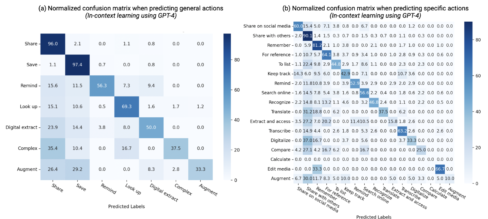

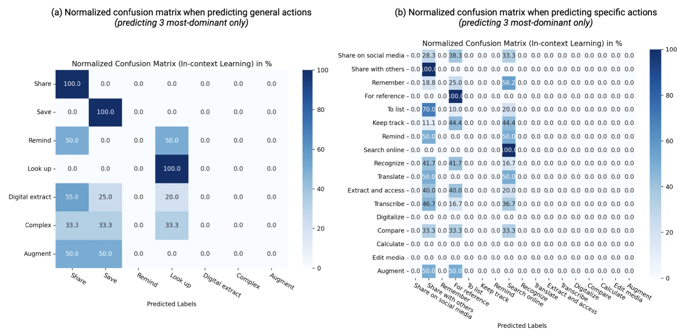

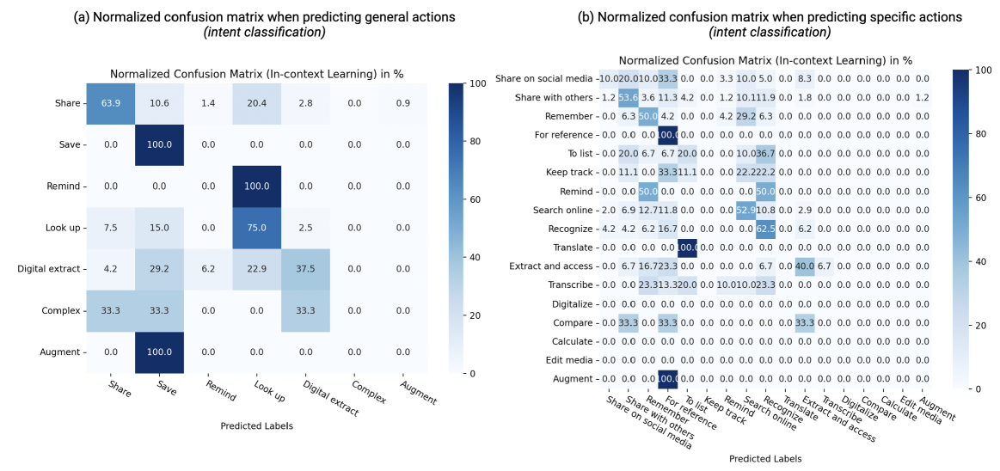

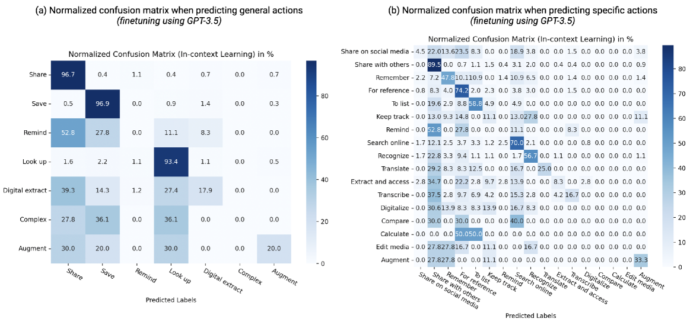

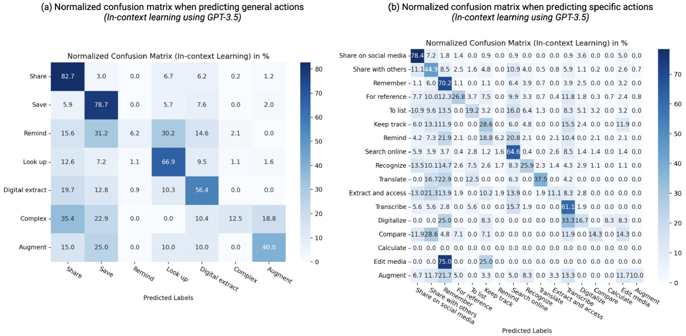

[Arxiv](https://arxiv.org/abs/2405.03901)