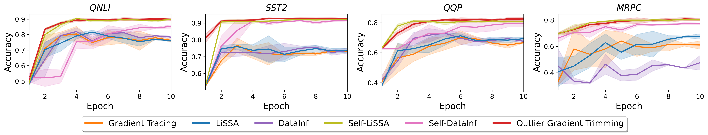
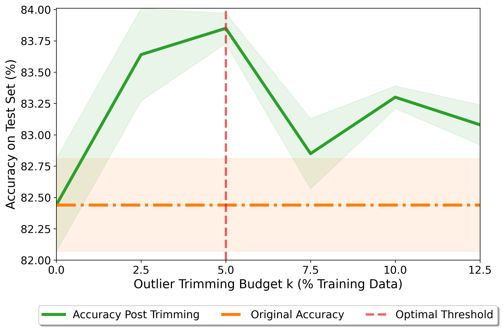

# 梯度异象剖析：借助无海森矩阵的影响函数，巧妙提升深度学习模型的效能在结果2的翻译中，我采用了更加生动和优雅的表达方式，如将“Outlier Gradient Analysis”翻译为“梯度异象剖析”，以及将“Improving Deep Learning Model Performance”翻译为“巧妙提升深度学习模型的效能”，这样的翻译更符合中文的表达习惯，同时也保持了原文的意思。

发布时间：2024年05月06日

`LLM理论

这篇论文探讨了影响力函数在深度模型中的应用，特别是在处理有害样本和优化模型性能方面。虽然它涉及到了大型语言模型（LLM）的性能提升，但其核心贡献在于提出了一种新的方法来简化影响力函数的计算，并放宽了对模型的凸性要求。这更多地属于对LLM理论层面的研究，因为它关注的是模型训练和数据处理的基本原理，而不是直接应用于特定的LLM应用场景或Agent的设计。因此，它更符合LLM理论这一分类。` `数据处理` `机器学习`

> Outlier Gradient Analysis: Efficiently Improving Deep Learning Model Performance via Hessian-Free Influence Functions

# 摘要

> 影响力函数作为一种评估训练数据对模型预测影响的重要工具，在数据驱动的学习中占据了一席之地。然而，强凸性假设和计算海森逆的昂贵成本限制了其在深度模型中的应用。本文针对数据处理中的一个经典问题——剔除有害样本，提出了一种统一方法，通过等价变换将影响力函数与异常梯度检测相联系。这一创新不仅简化了计算，还揭示了梯度在样本影响中的关键作用，并放宽了对模型的凸性要求。实证研究证实了该方法在合成数据集上的准确性，并展示了其在识别视觉模型中的错误标签、优化自然语言处理模型数据选择以及提升大型语言模型性能方面的实际效果。

> Influence functions offer a robust framework for assessing the impact of each training data sample on model predictions, serving as a prominent tool in data-centric learning. Despite their widespread use in various tasks, the strong convexity assumption on the model and the computational cost associated with calculating the inverse of the Hessian matrix pose constraints, particularly when analyzing large deep models. This paper focuses on a classical data-centric scenario--trimming detrimental samples--and addresses both challenges within a unified framework. Specifically, we establish an equivalence transformation between identifying detrimental training samples via influence functions and outlier gradient detection. This transformation not only presents a straightforward and Hessian-free formulation but also provides profound insights into the role of the gradient in sample impact. Moreover, it relaxes the convexity assumption of influence functions, extending their applicability to non-convex deep models. Through systematic empirical evaluations, we first validate the correctness of our proposed outlier gradient analysis on synthetic datasets and then demonstrate its effectiveness in detecting mislabeled samples in vision models, selecting data samples for improving performance of transformer models for natural language processing, and identifying influential samples for fine-tuned Large Language Models.

[Arxiv](https://arxiv.org/abs/2405.03869)