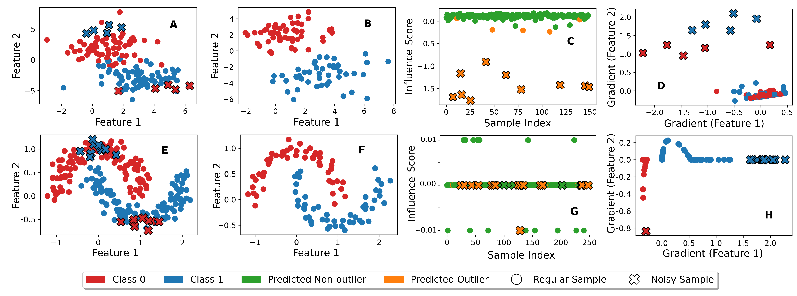

# 梯度异常分析：借助无黑塞矩阵的影响函数，我们能够精妙地提升深度学习模型的性能，如同巧匠雕琢宝石，使其光芒四射。

发布时间：2024年05月06日

`LLM理论

这篇论文探讨了影响力函数在大型深度模型中的应用，特别是在数据修剪场景中。它提出了一种新的方法，通过等价变换将影响力函数与异常梯度检测联系起来，简化了计算过程，并放宽了对模型的凸性要求。虽然论文中提到了大型语言模型（LLM），但其核心贡献在于理论方法的创新，即如何评估训练数据对模型预测的影响，以及如何优化模型。因此，这篇论文更符合“LLM理论”分类，因为它提供了一种理论上的方法来理解和改进大型语言模型的性能。` `机器学习` `数据分析`

> Outlier Gradient Analysis: Efficiently Improving Deep Learning Model Performance via Hessian-Free Influence Functions

# 摘要

> 影响力函数作为数据中心学习的关键工具，能够评估训练数据对模型预测的影响。然而，强凸性假设和计算海森逆的昂贵成本限制了其在大型深度模型中的应用。本文针对数据修剪这一经典场景，提出了一种统一方法，通过等价变换将影响力函数与异常梯度检测相联系。这一创新不仅简化了计算，还揭示了梯度在样本影响中的作用，并放宽了对模型的凸性要求。实证研究验证了该方法在合成数据集上的准确性，并展示了其在识别视觉模型错误标签、优化自然语言处理模型数据选择以及微调大型语言模型中关键样本方面的实际效果。

> Influence functions offer a robust framework for assessing the impact of each training data sample on model predictions, serving as a prominent tool in data-centric learning. Despite their widespread use in various tasks, the strong convexity assumption on the model and the computational cost associated with calculating the inverse of the Hessian matrix pose constraints, particularly when analyzing large deep models. This paper focuses on a classical data-centric scenario--trimming detrimental samples--and addresses both challenges within a unified framework. Specifically, we establish an equivalence transformation between identifying detrimental training samples via influence functions and outlier gradient detection. This transformation not only presents a straightforward and Hessian-free formulation but also provides profound insights into the role of the gradient in sample impact. Moreover, it relaxes the convexity assumption of influence functions, extending their applicability to non-convex deep models. Through systematic empirical evaluations, we first validate the correctness of our proposed outlier gradient analysis on synthetic datasets and then demonstrate its effectiveness in detecting mislabeled samples in vision models, selecting data samples for improving performance of transformer models for natural language processing, and identifying influential samples for fine-tuned Large Language Models.

[Arxiv](https://arxiv.org/abs/2405.03869)