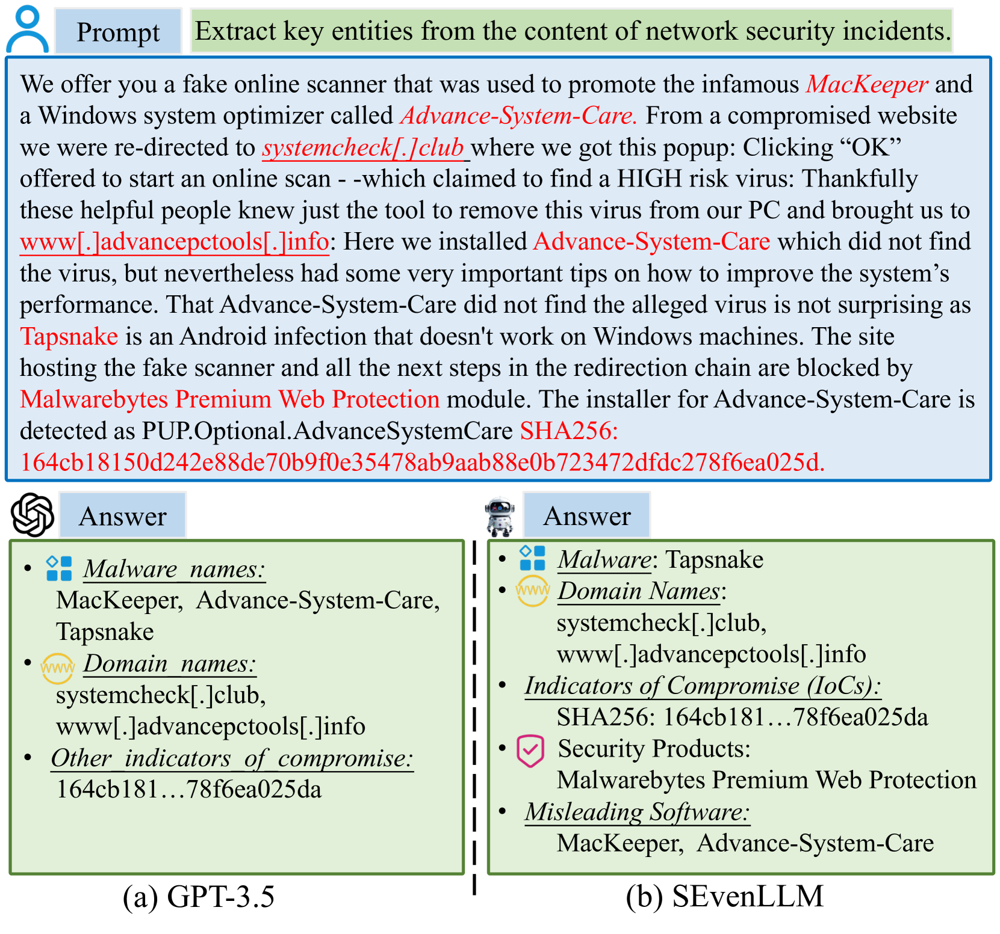
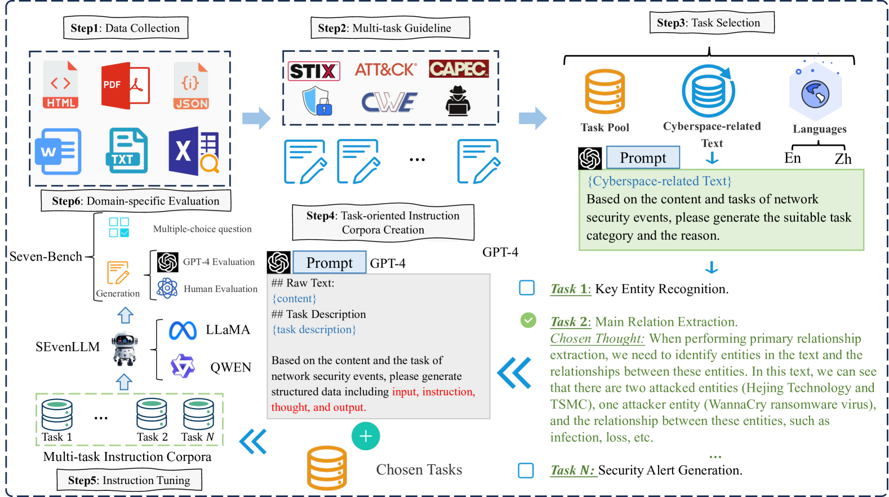
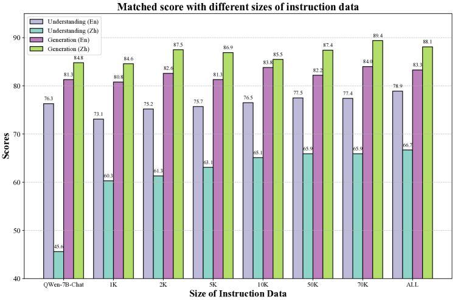
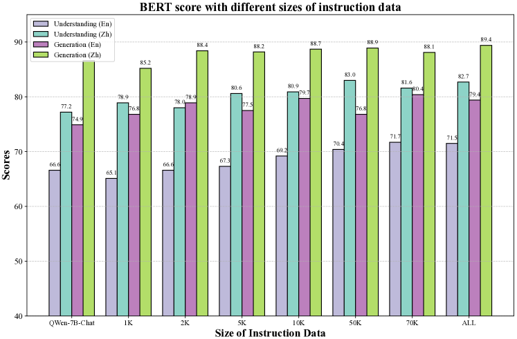
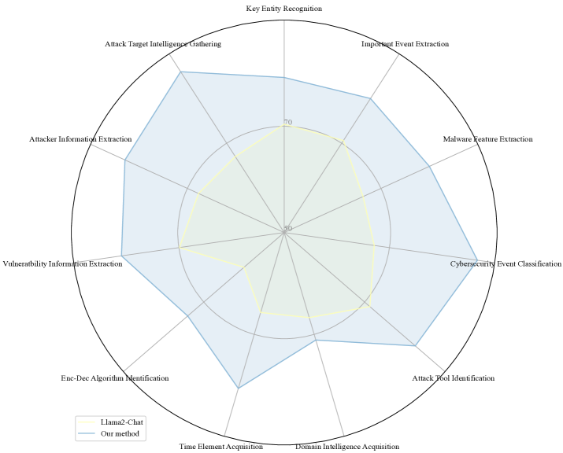
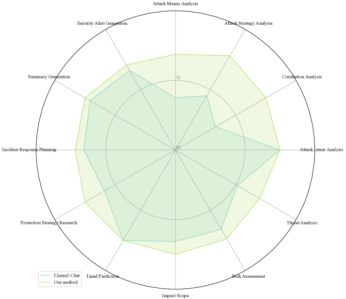

# SEvenLLM：在网络威胁情报领域，对大型语言模型进行基准测试、能力挖掘与提升。

发布时间：2024年05月06日

`LLM应用` `网络安全` `人工智能`

> SEvenLLM: Benchmarking, Eliciting, and Enhancing Abilities of Large Language Models in Cyber Threat Intelligence

# 摘要

> 面对网络安全威胁报告所强调的日益增长的网络安全事件复杂性和频发性，以及超过千亿次的安全威胁实例，网络威胁情报（CTI）在现代网络安全领域扮演着关键角色，提供必要的洞察力以理解和对抗不断演变的网络威胁。本文受到大型语言模型（LLMs）处理复杂任务的强大能力的启发，提出了一个用于评估、引导和提升LLMs在安全事件分析和响应方面能力的新框架——SEvenLLM。我们通过爬取网络安全网站的原始文本，构建了一个高质量的双语指令语料库，以解决信息提取有效数据的不足。接着，我们设计了一个流程，自动从任务池中筛选任务，并将原始文本转化为包含问题和答案的监督语料。SEvenLLM-Instruct指令数据集被用于训练网络安全LLMs，采用多任务学习目标（共27项精心设计的任务），以增强对网络安全事件的分析能力。在我们定制的基准测试（SEvenLLM-bench）中进行的广泛实验证明，SEvenLLM能够执行更为精细的威胁分析，并强化了对网络威胁不断变化的防御措施。

> To address the increasing complexity and frequency of cybersecurity incidents emphasized by the recent cybersecurity threat reports with over 10 billion instances, cyber threat intelligence (CTI) plays a critical role in the modern cybersecurity landscape by offering the insights required to understand and combat the constantly evolving nature of cyber threats. Inspired by the powerful capability of large language models (LLMs) in handling complex tasks, in this paper, we introduce a framework to benchmark, elicit, and improve cybersecurity incident analysis and response abilities in LLMs for Security Events (SEvenLLM). Specifically, we create a high-quality bilingual instruction corpus by crawling cybersecurity raw text from cybersecurity websites to overcome the lack of effective data for information extraction. Then, we design a pipeline to auto-select tasks from the tasks pool and convert the raw text into supervised corpora comprised of question and response. The instruction dataset SEvenLLM-Instruct is used to train cybersecurity LLMs with the multi-task learning objective (27 well-designed tasks) for augmenting the analysis of cybersecurity events. Extensive experiments in our curated benchmark (SEvenLLM-bench) demonstrate that SEvenLLM performs more sophisticated threat analysis and fortifies defenses against the evolving landscape of cyber threats.

[Arxiv](https://arxiv.org/abs/2405.03446)