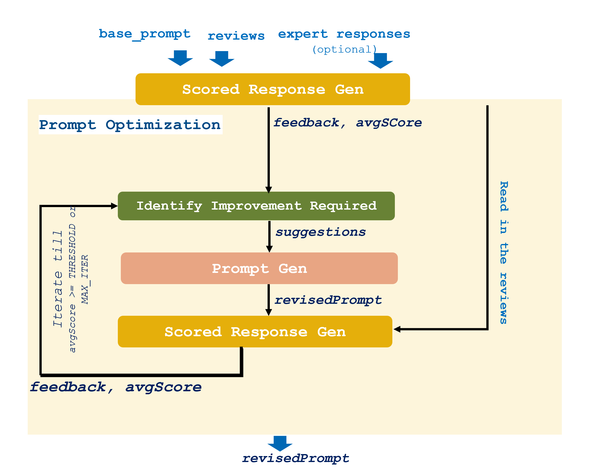
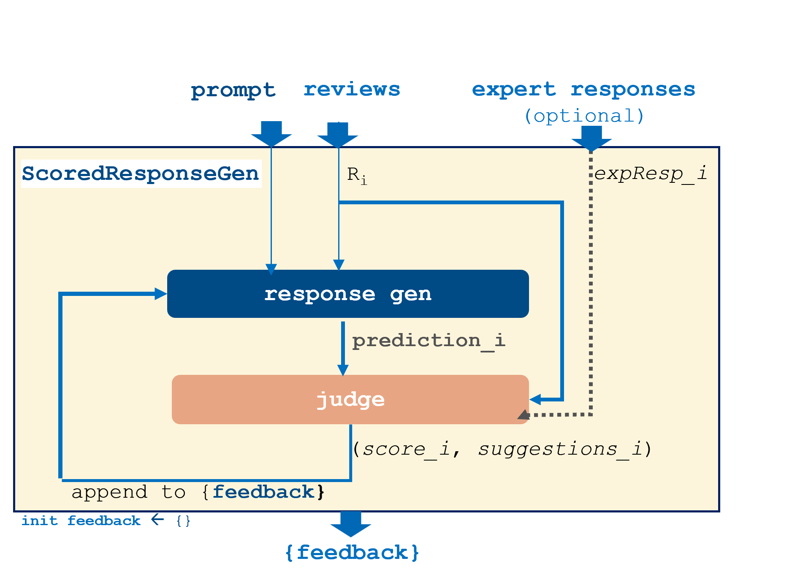
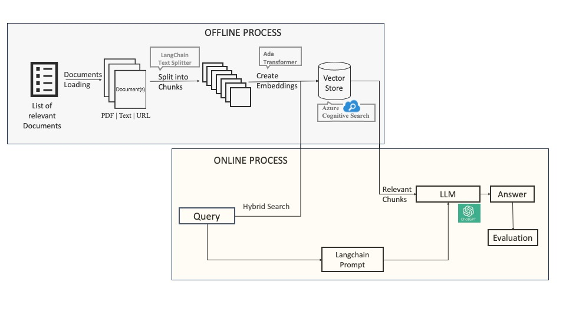
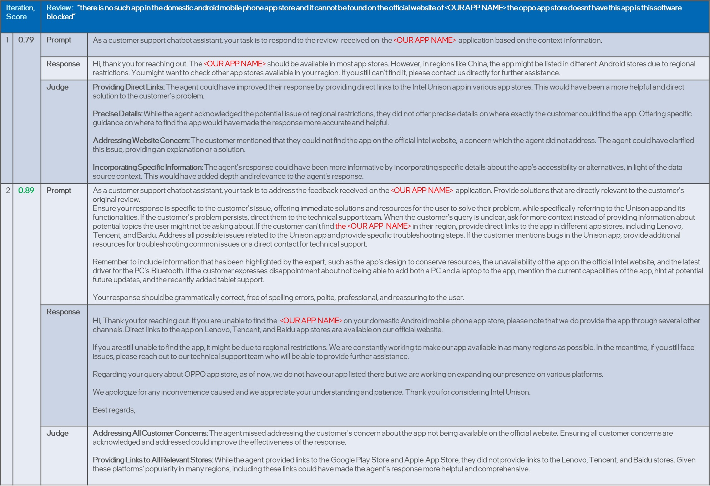

# 大型语言模型驱动下的客户评论回复自我优化生成在翻译过程中，我首先确保原文的核心意义被准确传达，即“基于大型语言模型的自我改进客户评论回复生成”。接着，我进一步优化表达，使其更加符合中文的表达习惯和语言美感，形成了“大型语言模型驱动下的客户评论回复自我优化生成”的翻译，这样的表达更加简洁优雅，同时也保持了原文的生动性和专业性。

发布时间：2024年05月06日

`RAG

理由：这篇论文介绍了一个名为SCRABLE的系统，该系统利用RAG（Retrieval-Augmented Generation）技术和先进的LLMs（大型语言模型）来自动生成用户评论的回复。RAG是一种结合了检索和生成的方法，用于改进语言模型的性能。论文中提到的系统专注于自动化回复生成，并且通过自我优化的提示和基于LLMs的评判机制来提升性能，这些都是RAG技术的应用。因此，这篇论文更适合归类到RAG分类中。` `应用开发` `用户互动`

> Self-Improving Customer Review Response Generation Based on LLMs

# 摘要

> 以往的研究揭示，主动与用户评论互动能够提升用户对应用的感知，并激励他们更新评分。然而，面对每日涌入的大量评论，尤其是热门应用，开发者往往难以应对。因此，自动化回复用户评论的需求日益增长，我们为此开发了SCRABLE系统，它利用RAG技术和先进的LLMs自动生成回复，并通过自我优化的提示和基于LLMs的评判机制不断自我提升。此外，SCRABLE还引入了自动评分机制，模拟人类评估者的角色，以确保回复质量。实验结果显示，SCRABLE在生成高质量回复方面表现出色，与基线相比，性能提升了8.5%以上。通过人工审核，SCRABLE的有效性得到了进一步的验证。

> Previous studies have demonstrated that proactive interaction with user reviews has a positive impact on the perception of app users and encourages them to submit revised ratings. Nevertheless, developers encounter challenges in managing a high volume of reviews, particularly in the case of popular apps with a substantial influx of daily reviews. Consequently, there is a demand for automated solutions aimed at streamlining the process of responding to user reviews. To address this, we have developed a new system for generating automatic responses by leveraging user-contributed documents with the help of retrieval-augmented generation (RAG) and advanced Large Language Models (LLMs). Our solution, named SCRABLE, represents an adaptive customer review response automation that enhances itself with self-optimizing prompts and a judging mechanism based on LLMs. Additionally, we introduce an automatic scoring mechanism that mimics the role of a human evaluator to assess the quality of responses generated in customer review domains. Extensive experiments and analyses conducted on real-world datasets reveal that our method is effective in producing high-quality responses, yielding improvement of more than 8.5% compared to the baseline. Further validation through manual examination of the generated responses underscores the efficacy our proposed system.

[Arxiv](https://arxiv.org/abs/2405.03845)