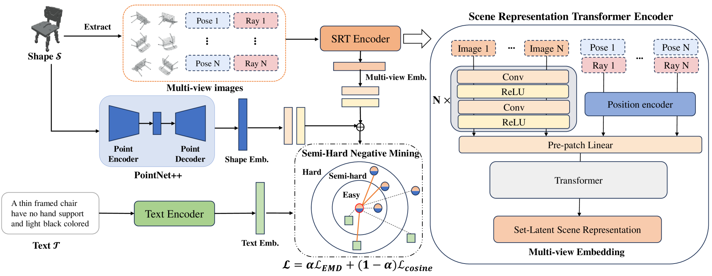
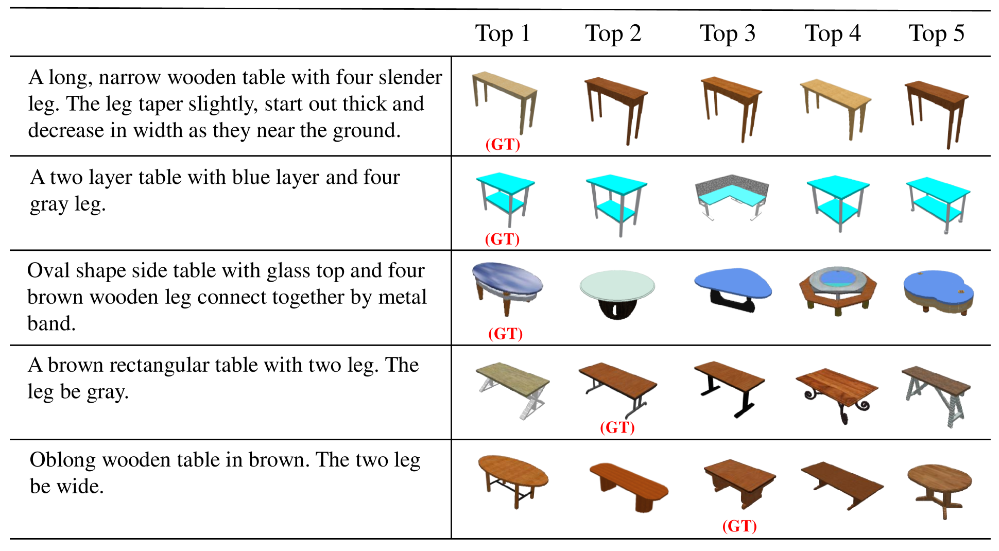
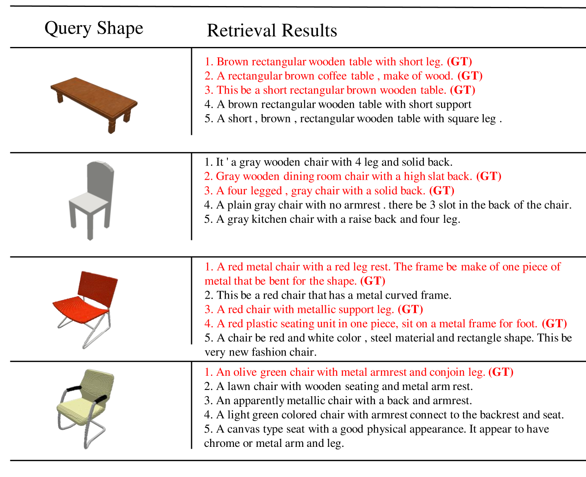

# COM3D：借助跨视图匹配与跨模态挖掘，精进3D检索之艺在这项研究中，我们提出了一种名为COM3D的新颖方法，它巧妙地结合了跨视图对应和跨模态挖掘技术，以提升3D模型的检索效率。通过分析不同视角下的数据对应关系，以及不同模态间的信息互补，COM3D能够更精准地识别和检索3D对象，为3D内容检索领域带来了新的突破。

发布时间：2024年05月07日

`RAG

理由：这篇论文主要探讨了3D形状与文本描述之间的跨模态检索问题，并提出了一种新的方法COM3D来提升检索精度。这种方法涉及跨视角对应和跨模态挖掘，以及使用场景表示变换器来丰富3D特征。虽然这种方法可能涉及到大型语言模型（LLM）的应用，但它的核心贡献在于提出了一个新的跨模态检索框架，这与RAG（Retrieval-Augmented Generation）模型的概念更为接近，后者是一种结合了检索和生成的模型，用于处理跨模态信息。因此，将这篇论文归类为RAG更为合适。` `跨模态检索` `3D建模`

> COM3D: Leveraging Cross-View Correspondence and Cross-Modal Mining for 3D Retrieval

# 摘要

> 本文探讨了3D形状与文本描述间跨模态检索的挑战，指出传统点云编码器可能遗漏深度、空间结构等关键特征。为此，我们创新性地提出COM3D方法，通过跨视角对应和跨模态挖掘提升检索精度。我们采用场景表示变换器丰富3D特征，并优化匹配过程，利用半硬负例挖掘提高学习效率。实验结果显示，COM3D在Text2Shape数据集上取得了领先性能，证明了其有效性。

> In this paper, we investigate an open research task of cross-modal retrieval between 3D shapes and textual descriptions. Previous approaches mainly rely on point cloud encoders for feature extraction, which may ignore key inherent features of 3D shapes, including depth, spatial hierarchy, geometric continuity, etc. To address this issue, we propose COM3D, making the first attempt to exploit the cross-view correspondence and cross-modal mining to enhance the retrieval performance. Notably, we augment the 3D features through a scene representation transformer, to generate cross-view correspondence features of 3D shapes, which enrich the inherent features and enhance their compatibility with text matching. Furthermore, we propose to optimize the cross-modal matching process based on the semi-hard negative example mining method, in an attempt to improve the learning efficiency. Extensive quantitative and qualitative experiments demonstrate the superiority of our proposed COM3D, achieving state-of-the-art results on the Text2Shape dataset.

[Arxiv](https://arxiv.org/abs/2405.04103)