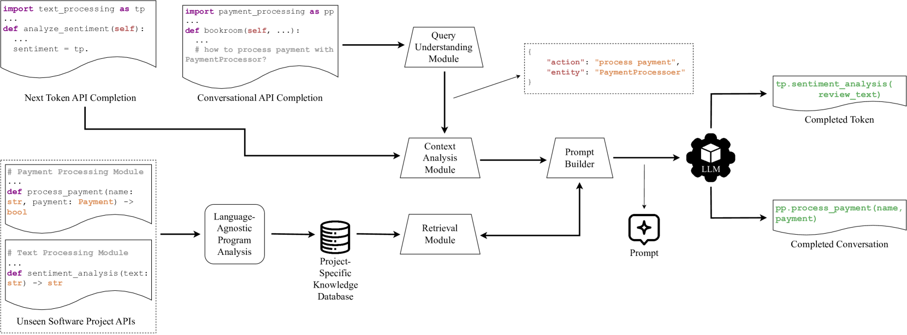

# 借助大型语言模型，我们能够为未曾涉猎的代码库提供精准的上下文API自动补全功能。

发布时间：2024年05月07日

`LLM应用

这篇论文讨论了大型语言模型在代码任务中的应用，特别是在API补全方面的优化。它提出了一种新方法，通过利用代码库中的全局和局部上下文信息来减少幻觉并提高API补全的准确性。这种方法在多语言环境中有效，并且不需要特定语言的训练。论文中提到的工具LANCE在APIEval基准测试中表现出色，证明了其在实际应用中的有效性。因此，这篇论文更符合LLM应用分类，因为它关注的是大型语言模型在特定任务（即代码补全）中的实际应用和改进。` `软件开发` `编程辅助工具`

> Contextual API Completion for Unseen Repositories Using LLMs

# 摘要

> 大型语言模型在代码任务上取得了巨大进步，但因缺乏实际领域信息，如未知软件项目的内部API调用，导致输出不一致，限制了其应用。我们提出了一种新方法，通过代码库中的全局与局部上下文信息，减少幻觉，优化API补全。我们分析导入语句，洞察局部API，同时关联内联变量与模块，为API令牌补全提供最相关的建议。在会话式补全中，我们根据开发者查询检索最相关的API。我们的工具LANCE在APIEval基准中表现出色，涵盖两种编程语言，API令牌补全准确率达82.6%，会话式补全达76.9%，远超Copilot。我们的方法无需特定语言训练，适用于多语言环境，为开发者提供了高效且轻量级的解决方案。

> Large language models have made substantial progress in addressing diverse code-related tasks. However, their adoption is hindered by inconsistencies in generating output due to the lack of real-world, domain-specific information, such as for intra-repository API calls for unseen software projects. We introduce a novel technique to mitigate hallucinations by leveraging global and local contextual information within a code repository for API completion tasks. Our approach is tailored to refine code completion tasks, with a focus on optimizing local API completions. We examine relevant import statements during API completion to derive insights into local APIs, drawing from their method signatures. For API token completion, we analyze the inline variables and correlate them with the appropriate imported modules, thereby allowing our approach to rank the most contextually relevant suggestions from the available local APIs. Further, for conversational API completion, we gather APIs that are most relevant to the developer query with a retrieval-based search across the project. We employ our tool, LANCE, within the framework of our proposed benchmark, APIEval, encompassing two different programming languages. Our evaluation yields an average accuracy of 82.6% for API token completion and 76.9% for conversational API completion tasks. On average, LANCE surpasses Copilot by 143% and 142% for API token completion and conversational API completion, respectively. The implications of our findings are substantial for developers, suggesting that our lightweight context analysis can be applied to multilingual environments without language-specific training or fine-tuning, allowing for efficient implementation with minimal examples and effort.

[Arxiv](https://arxiv.org/abs/2405.04600)