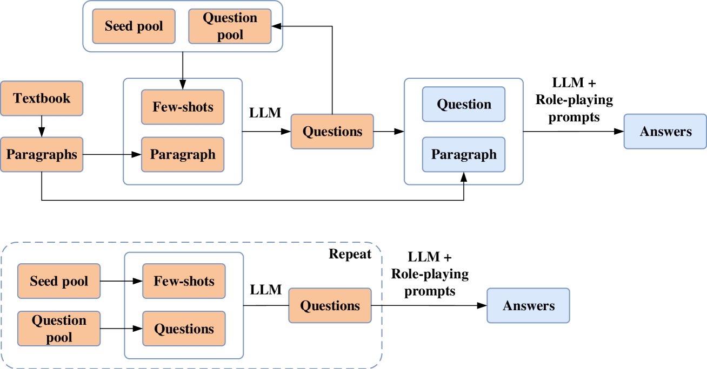

# CourseGPT-zh：融合知识蒸馏与提示优化技术的教育领域大型语言模型，旨在通过精炼的知识传递与优化学习提示，提升教育场景下的语言处理能力。

发布时间：2024年05月07日

`LLM应用

这篇论文介绍了CourseGPT-zh，一个专为教育领域定制的大型语言模型（LLM）。它通过问答语料蒸馏框架和LLM-as-Judge方法进行离散提示优化，以提高回答质量和满足用户需求。这个模型是针对特定应用场景（教育）进行优化的LLM实例，因此属于LLM应用类别。`

> CourseGPT-zh: an Educational Large Language Model Based on Knowledge Distillation Incorporating Prompt Optimization

# 摘要

> 大型语言模型（LLMs）在NLP领域大放异彩，激发了其在专业领域应用的探索。然而，闭源LLMs的访问限制和高质量数据集的收集难题，成为教育领域课程发展的绊脚石。为此，我们推出了CourseGPT-zh，一款专为教育定制的LLM，它灵活且经济。我们精心设计了问答语料蒸馏框架，通过提示优化，深入挖掘教科书知识，丰富其多样性。同时，我们创新性地采用LLM-as-Judge方法进行离散提示优化，确保LLM的回答贴近用户需求，既精准又高效。通过开源LLM的参数高效微调，我们打造了CourseGPT-zh。实验证明，我们的优化框架显著提升了ChatGPT的回答质量，CourseGPT-zh在专业知识问答上表现卓越，远超其他开源模型。

> Large language models (LLMs) have demonstrated astonishing capabilities in natural language processing (NLP) tasks, sparking interest in their application to professional domains with higher specialized requirements. However, restricted access to closed-source LLMs via APIs and the difficulty in collecting massive high-quality datasets pose obstacles to the development of large language models in education fields of various courses. Given these challenges, we propose CourseGPT-zh, a course-oriented education LLM that supports customization and low-cost deployment. To address the comprehensiveness and diversity requirements of course-specific corpora, we design a high-quality question-answering corpus distillation framework incorporating prompt optimization, which effectively mines textbook knowledge and enhances its diversity. Moreover, considering the alignment of LLM responses with user needs, a novel method for discrete prompt optimization based on LLM-as-Judge is introduced. During optimization, this framework leverages the LLM's ability to reflect on and exploit error feedback and patterns, allowing for prompts that meet user needs and preferences while saving response length. Lastly, we obtain CourseGPT-zh based on the open-source LLM using parameter-efficient fine-tuning. Experimental results show that our discrete prompt optimization framework effectively improves the response quality of ChatGPT, and CourseGPT-zh exhibits strong professional capabilities in specialized knowledge question-answering, significantly outperforming comparable open-source models.

[Arxiv](https://arxiv.org/abs/2405.04781)