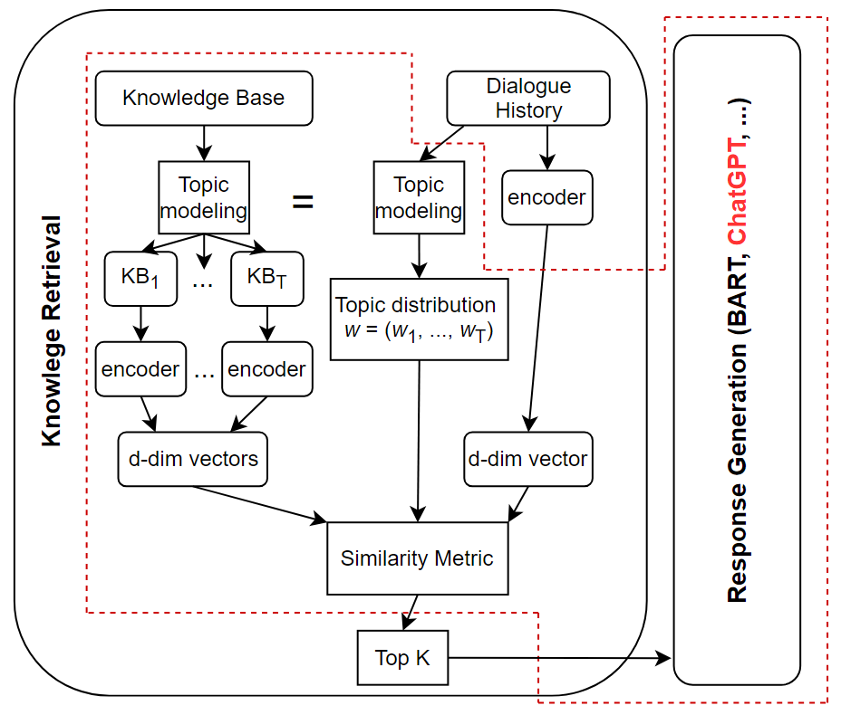
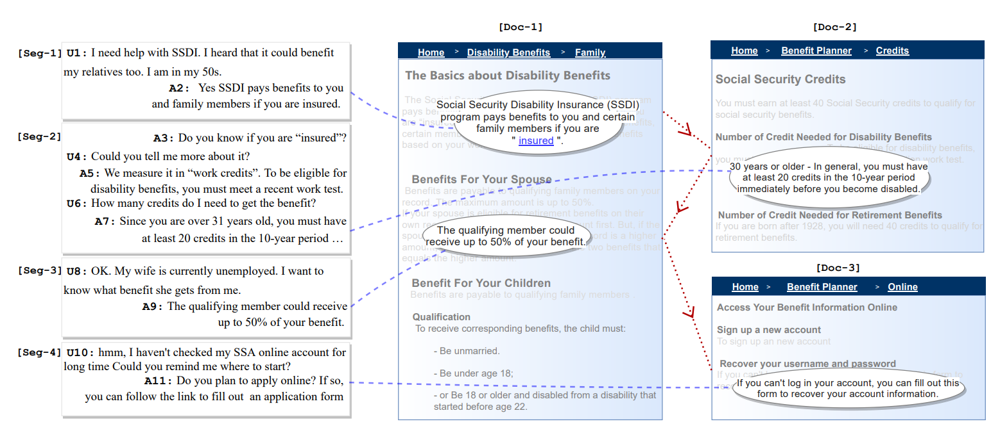
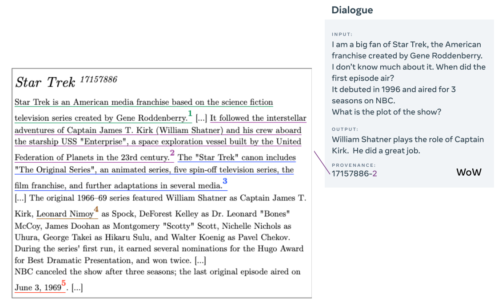

# 利用主题建模提升知识检索，助力基于知识的对话系统更上一层楼。

发布时间：2024年05月07日

`Agent

这篇论文探讨了在构建基于知识的对话系统中，如何通过主题建模和利用大型语言模型（如ChatGPT）来提升知识检索和对话响应生成的性能。这种方法涉及到了智能代理（Agent）的概念，即系统能够根据知识库的内容和用户的输入来生成合适的对话响应。因此，这篇论文更符合Agent分类，因为它关注的是如何构建和优化能够进行知识检索和对话生成的智能系统。` `对话系统` `知识检索`

> Enhancing Knowledge Retrieval with Topic Modeling for Knowledge-Grounded Dialogue

# 摘要

> 在构建基于知识的对话系统时，知识检索是一大难题。我们提出了一种新颖的方法，通过在知识库上应用主题建模，不仅提升了检索的精准度，还优化了对话响应的生成。同时，我们引入了ChatGPT这一大型语言模型，借助其强大的检索能力，进一步增强了生成结果的质量。实验证明，我们的方法在两个数据集上均有效提升了检索与生成性能，并且ChatGPT在提供相关知识的情况下，展现出了作为知识驱动对话系统中优秀响应生成器的潜力。

> Knowledge retrieval is one of the major challenges in building a knowledge-grounded dialogue system. A common method is to use a neural retriever with a distributed approximate nearest-neighbor database to quickly find the relevant knowledge sentences. In this work, we propose an approach that utilizes topic modeling on the knowledge base to further improve retrieval accuracy and as a result, improve response generation. Additionally, we experiment with a large language model, ChatGPT, to take advantage of the improved retrieval performance to further improve the generation results. Experimental results on two datasets show that our approach can increase retrieval and generation performance. The results also indicate that ChatGPT is a better response generator for knowledge-grounded dialogue when relevant knowledge is provided.

[Arxiv](https://arxiv.org/abs/2405.04713)