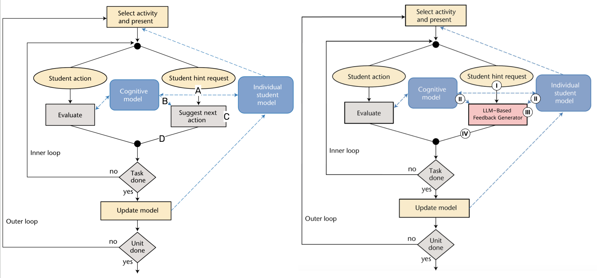

# 提升大型语言模型反馈：智能辅导系统与学习科学的启示

发布时间：2024年05月07日

`LLM应用

这篇论文探讨了大型语言模型（LLMs）在人工智能教育（AIED）领域的应用，特别是在智能辅导系统中的反馈生成。它强调了理论基础的重要性，并呼吁对LLM生成的反馈进行更深入的研究和评估。虽然论文涉及了LLM的理论应用，但其核心关注点在于教育领域的实际应用和效果评估，因此更适合归类于“LLM应用”。` `人工智能教育` `智能辅导系统`

> Enhancing LLM-Based Feedback: Insights from Intelligent Tutoring Systems and the Learning Sciences

# 摘要

> 人工智能教育（AIED）领域致力于融合技术、教育和心理学，强调以同情心和理解力来满足学习者的需求。随着大型语言模型（LLMs）的兴起，教育领域出现了可扩展的解决方案，如智能辅导系统中的多样化反馈生成。然而，这些模型的应用往往缺乏理论基础，且对学习效果的评估不足。本文倡导深入研究，回顾智能辅导系统中反馈生成的理论框架和实证效果，并提出将这些基于证据的原则应用于LLM反馈生成的设计、实验和评估中。本文的主要贡献在于：呼吁在生成AI时代采用更为谨慎、理论基础更坚实的反馈生成方法；并为LLM驱动的智能辅导系统提供基于理论和实证的反馈设计建议。

> The field of Artificial Intelligence in Education (AIED) focuses on the intersection of technology, education, and psychology, placing a strong emphasis on supporting learners' needs with compassion and understanding. The growing prominence of Large Language Models (LLMs) has led to the development of scalable solutions within educational settings, including generating different types of feedback in Intelligent Tutoring Systems. However, the approach to utilizing these models often involves directly formulating prompts to solicit specific information, lacking a solid theoretical foundation for prompt construction and empirical assessments of their impact on learning. This work advocates careful and caring AIED research by going through previous research on feedback generation in ITS, with emphasis on the theoretical frameworks they utilized and the efficacy of the corresponding design in empirical evaluations, and then suggesting opportunities to apply these evidence-based principles to the design, experiment, and evaluation phases of LLM-based feedback generation. The main contributions of this paper include: an avocation of applying more cautious, theoretically grounded methods in feedback generation in the era of generative AI; and practical suggestions on theory and evidence-based feedback design for LLM-powered ITS.

[Arxiv](https://arxiv.org/abs/2405.04645)