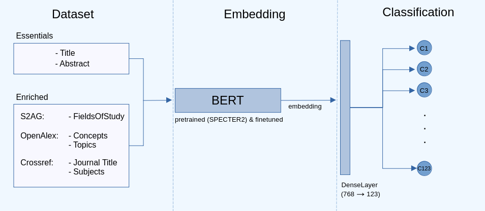
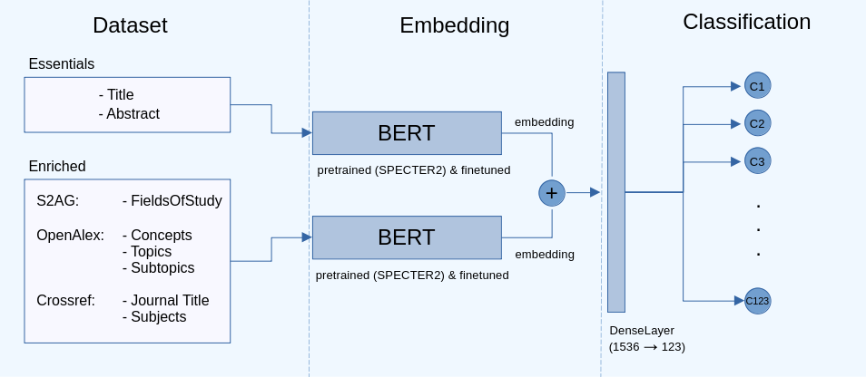

# BERT嵌入的丰富化助力学术出版物精准分类

发布时间：2024年05月07日

`Agent

这篇论文主要关注的是开发一个自动化的分类器，用于根据特定的研究领域对学术文章进行分类。这个分类器可以被视为一个智能代理（Agent），因为它能够自动执行任务（即文章分类），并且在这个过程中利用了预训练语言模型（如BERT、SciBERT、SciNCL和SPECTER2）进行转移学习和数据增强。这个代理的目标是提高分类的准确性，减轻研究人员的工作负担，并帮助他们更高效地获取相关资源。因此，这篇论文的内容与Agent的定义相符，即一个能够感知环境、做出决策并执行动作以达到特定目标的系统。` `学术出版物分类`

> Enriched BERT Embeddings for Scholarly Publication Classification

# 摘要

> 随着学术文献的激增，研究人员在处理大量文章的手动分类和标注工作上遇到了难题。NSLP 2024 FoRC共享任务I正是为了解决这一挑战而设立的竞赛。我们的目标是开发一个能够根据ORKG的123个研究领域分类，为文章自动分类的分类器。本文展示了我们的研究成果。首先，我们对数据集进行扩充，然后利用BERT等预训练语言模型进行转移学习。我们的实验涵盖了多种科学任务优化的PLMs，如SciBERT、SciNCL和SPECTER2，并进行了超参数调优和数据增强。结果显示，微调预训练模型显著提升了分类准确性，其中SPECTER2表现最佳。通过整合S2AG、OpenAlex和Crossref的信息，我们进一步提高了分类效果。我们的最佳方法达到了0.7415的加权F1分数。总体而言，我们的研究为学术出版物分类的自动化提供了有力支持，减轻了研究人员的工作负担，使他们能够更高效地获取相关资源。

> With the rapid expansion of academic literature and the proliferation of preprints, researchers face growing challenges in manually organizing and labeling large volumes of articles. The NSLP 2024 FoRC Shared Task I addresses this challenge organized as a competition. The goal is to develop a classifier capable of predicting one of 123 predefined classes from the Open Research Knowledge Graph (ORKG) taxonomy of research fields for a given article.This paper presents our results. Initially, we enrich the dataset (containing English scholarly articles sourced from ORKG and arXiv), then leverage different pre-trained language Models (PLMs), specifically BERT, and explore their efficacy in transfer learning for this downstream task. Our experiments encompass feature-based and fine-tuned transfer learning approaches using diverse PLMs, optimized for scientific tasks, including SciBERT, SciNCL, and SPECTER2. We conduct hyperparameter tuning and investigate the impact of data augmentation from bibliographic databases such as OpenAlex, Semantic Scholar, and Crossref. Our results demonstrate that fine-tuning pre-trained models substantially enhances classification performance, with SPECTER2 emerging as the most accurate model. Moreover, enriching the dataset with additional metadata improves classification outcomes significantly, especially when integrating information from S2AG, OpenAlex and Crossref. Our best-performing approach achieves a weighted F1-score of 0.7415. Overall, our study contributes to the advancement of reliable automated systems for scholarly publication categorization, offering a potential solution to the laborious manual curation process, thereby facilitating researchers in efficiently locating relevant resources.

[Arxiv](https://arxiv.org/abs/2405.04136)