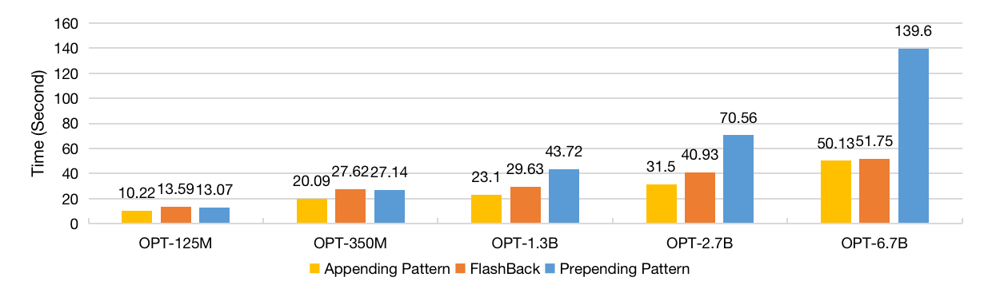

# 闪回技术：提升长篇推理中语言建模效率的检索增强方法

发布时间：2024年05月07日

`RAG

这篇论文介绍了一种名为\textsc{FlashBack}的检索增强语言建模方法，它通过在上下文末尾附加检索文档来提高推理效率，同时保持了大型语言模型（LLM）的知识完整性。这种方法与检索增强生成（RAG）的概念紧密相关，因为它涉及将LLM与外部文档结合以生成信息。因此，这篇论文应归类于RAG。` `机器学习`

> FlashBack:Efficient Retrieval-Augmented Language Modeling for Long Context Inference

# 摘要

> 检索增强语言建模（RALM）通过结合LLM与外部文档，使模型能够超越预训练范围生成信息。以往的方法将检索内容前置于输入，导致运行时效率低下，未能充分利用KV缓存。本文提出的\textsc{FlashBack}是一种模块化RALM，它通过在上下文末尾附加检索文档，有效提升了推理效率，同时通过微调保持了LLM的知识完整性。实验显示，\textsc{FlashBack}在7B LLM（Llama 2）上的推理速度比前置方法快4倍，显著降低了推理成本。我们即将公开相关代码。

> Retrieval-Augmented Language Modeling (RALM) by integrating large language models (LLM) with relevant documents from an external corpus is a proven method for enabling the LLM to generate information beyond the scope of its pre-training corpus. Previous work using utilizing retrieved content by simply prepending retrieved contents to the input poses a high runtime issue, which degrades the inference efficiency of the LLMs because they fail to use the Key-Value (KV) cache efficiently. In this paper, we propose \textsc{FlashBack}, a modular RALM designed to improve the inference efficiency of RALM with appending context pattern while maintaining decent performance after specific fine-tuning without heavily destruct the knowledge integrity of the LLM. \textsc{FlashBack} appends retrieved documents at the end of the context for efficiently utilizing the KV cache instead of prepending them. Our experiment shows that the inference speed of \textsc{FlashBack} is up to $4\times$ faster than the prepending method on a 7B LLM (Llama 2). Via bypassing unnecessary re-computation, it demonstrates an advancement by achieving significantly faster inference speed, and this heightened efficiency will substantially reduce inferential cost. Our code will be publicly available.

[Arxiv](https://arxiv.org/abs/2405.04065)