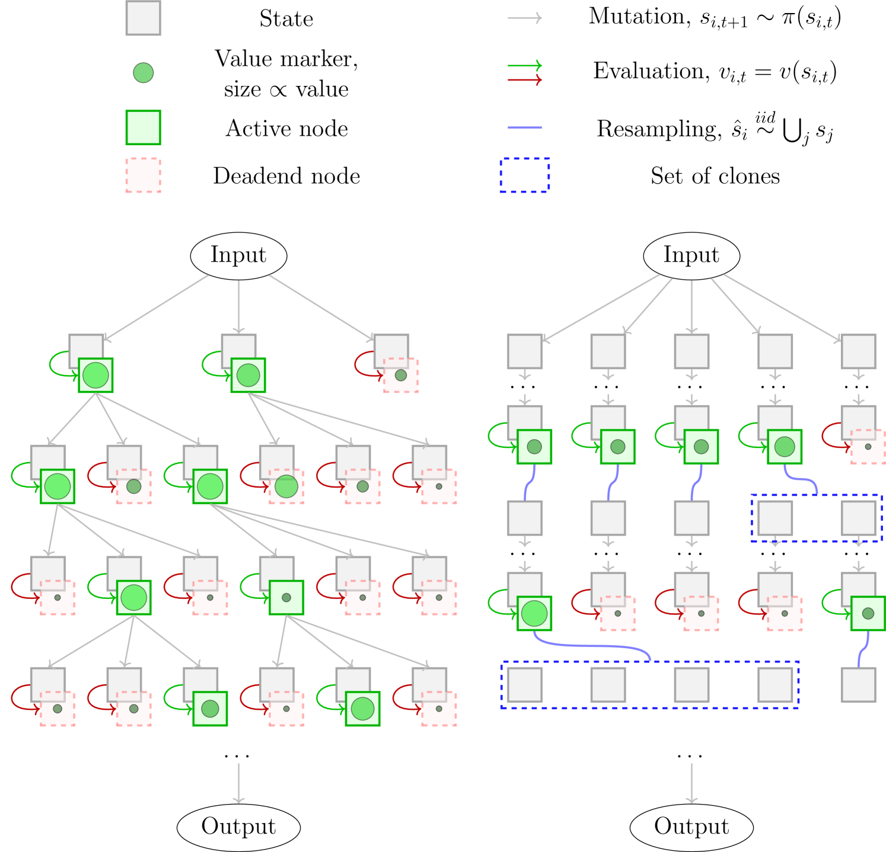

# 遗传粒子滤波驱动的大型语言模型代理舰队：协同解决复杂问题的新策略

发布时间：2024年05月07日

`Agent

这篇论文介绍了一个名为“Agent舰队（FoA）”的创新框架，该框架利用大型语言模型（LLMs）作为智能体，在动态树搜索中应用遗传式粒子滤波策略。这个框架通过启发式值函数的选择阶段进行重采样，平衡探索与利用，并赋予智能体动态分支能力。论文通过基准测试验证了FoA的效能和效率，表明其在减少计算开支的同时，能够保持同等或更卓越的准确性。因此，这篇论文更符合Agent分类，因为它主要关注的是将LLMs作为智能体在特定框架中的应用。` `人工智能` `游戏开发`

> Fleet of Agents: Coordinated Problem Solving with Large Language Models using Genetic Particle Filtering

# 摘要

> 大型语言模型（LLMs）已从简单输出跃升至复杂推理，并从单打独斗融入至更宏大的框架。本文揭晓“Agent舰队（FoA）”，一项创新框架，以LLMs为智能体，在动态树搜索中航行，运用遗传式粒子滤波策略。FoA孕育众多自主探索的智能体，随后通过启发式值函数的选择阶段进行重采样，巧妙平衡探索与利用。此机制赋予动态分支能力，根据发现调整探索策略。我们通过“24点游戏”与“迷你填字游戏”两项基准测试验证FoA，其效能与效率均超越“思维树”方法：大幅削减计算开支（减少值函数调用频率），同时保持同等或更卓越的准确性。

> Large language models (LLMs) have significantly evolved, moving from simple output generation to complex reasoning and from stand-alone usage to being embedded into broader frameworks. In this paper, we introduce \emph{Fleet of Agents (FoA)}, a novel framework utilizing LLMs as agents to navigate through dynamic tree searches, employing a genetic-type particle filtering approach. FoA spawns a multitude of agents, each exploring autonomously, followed by a selection phase where resampling based on a heuristic value function optimizes the balance between exploration and exploitation. This mechanism enables dynamic branching, adapting the exploration strategy based on discovered solutions. We experimentally validate FoA using two benchmark tasks, "Game of 24" and "Mini-Crosswords". FoA outperforms the previously proposed Tree-of-Thoughts method in terms of efficacy and efficiency: it significantly decreases computational costs (by calling the value function less frequently) while preserving comparable or even superior accuracy.

[Arxiv](https://arxiv.org/abs/2405.06691)