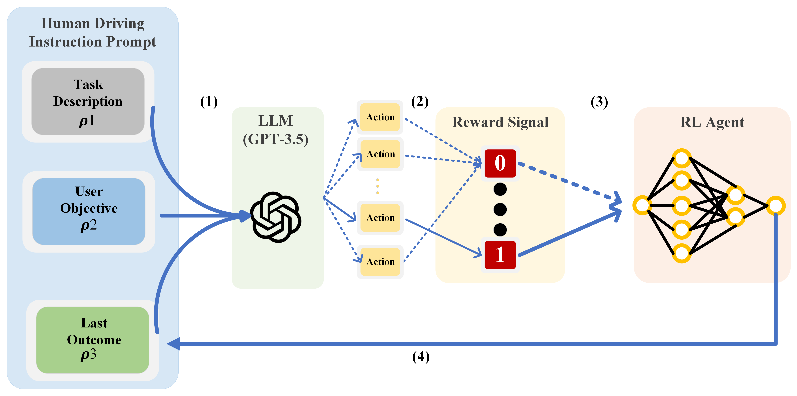
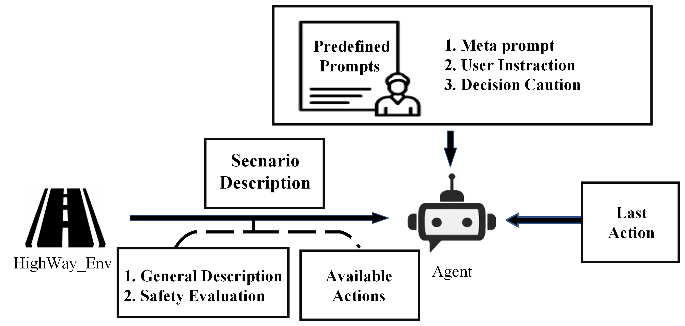
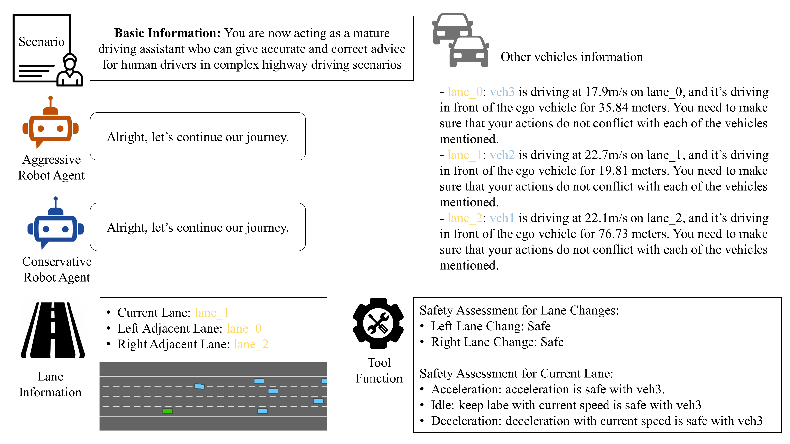
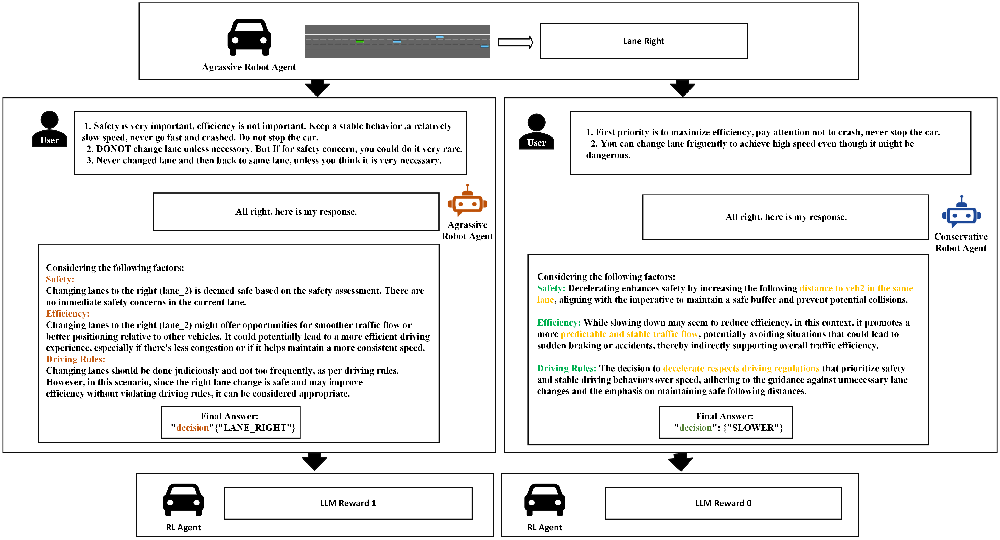
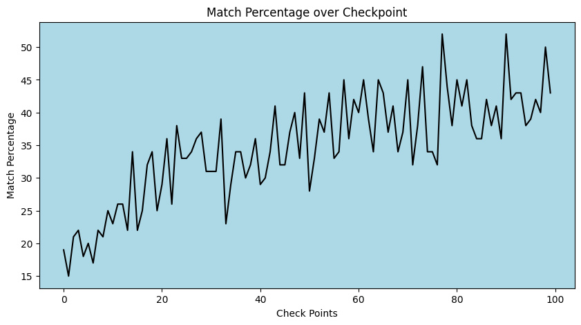
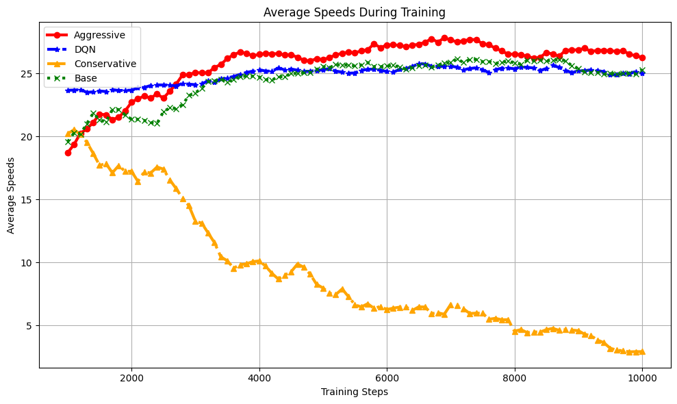

# 自动驾驶场景中的上下文学习（ICL），为智能驾驶系统提供了新的学习范式。

发布时间：2024年05月07日

`Agent

这篇论文主要探讨了在自动驾驶领域中，如何利用大型语言模型来优化强化学习代理的奖励函数，以使其行为更接近人类驾驶行为。这种方法涉及构建一个框架，其中语言模型被用来辅助生成奖励，从而引导学习代理的行为。因此，这篇论文更符合Agent分类，因为它专注于使用语言模型来改进代理（Agent）的行为，特别是在自动驾驶这一特定应用场景中。` `自动驾驶`

> In-context Learning for Automated Driving Scenarios

# 摘要

> 在自动驾驶领域，如何让基于强化学习的代理以低成本展现出灵活、精准且类似人类的行为，一直是挑战。本文提出了一种新颖方法，通过大型语言模型来优化强化学习奖励函数，使其更贴近人类驾驶行为。我们构建了一个框架，将指令和环境动态输入到语言模型中，由其辅助生成奖励，引导学习代理的行为更接近人类驾驶模式。实验证明，这种方法不仅让代理行为更人性化，性能也得到提升。同时，我们还探讨了不同的奖励设计和塑造策略，发现提示设计对车辆行为有着显著影响。这些成果为开发更先进的自动驾驶系统指明了方向。实验数据和源代码已公开分享。

> One of the key challenges in current Reinforcement Learning (RL)-based Automated Driving (AD) agents is achieving flexible, precise, and human-like behavior cost-effectively. This paper introduces an innovative approach utilizing Large Language Models (LLMs) to intuitively and effectively optimize RL reward functions in a human-centric way. We developed a framework where instructions and dynamic environment descriptions are input into the LLM. The LLM then utilizes this information to assist in generating rewards, thereby steering the behavior of RL agents towards patterns that more closely resemble human driving. The experimental results demonstrate that this approach not only makes RL agents more anthropomorphic but also reaches better performance. Additionally, various strategies for reward-proxy and reward-shaping are investigated, revealing the significant impact of prompt design on shaping an AD vehicle's behavior. These findings offer a promising direction for the development of more advanced and human-like automated driving systems. Our experimental data and source code can be found here.

[Arxiv](https://arxiv.org/abs/2405.04135)