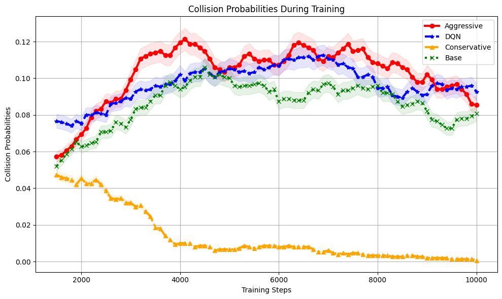

# 自动驾驶场景中的上下文学习探索在自动驾驶领域，上下文学习正逐渐成为提升系统性能的关键技术。它通过模拟真实驾驶环境中的复杂交互，使自动驾驶系统能够更好地理解和预测交通参与者的行为，从而做出更加精准的决策。尽管这一技术前景广阔，但其实现和优化仍面临诸多挑战，需要深入研究以确保安全性和可靠性。

发布时间：2024年05月07日

`Agent

这篇论文主要关注的是在自动驾驶领域中，如何通过大型语言模型（LLM）优化强化学习代理的行为，使其更加灵活、精准，并且模仿人类驾驶行为。这种方法涉及构建一个框架，利用LLM生成奖励函数，以引导代理的行为。因此，这篇论文更符合Agent分类，因为它主要讨论的是如何改进和优化代理（Agent）的行为，特别是在自动驾驶这一特定应用场景中。` `自动驾驶`

> In-context Learning for Automated Driving Scenarios

# 摘要

> 在自动驾驶领域，如何让基于强化学习的代理既灵活又精准，同时成本效益高，模仿人类驾驶行为，一直是挑战。本文提出了一种新颖方法，通过大型语言模型优化强化学习奖励函数，以人类为中心进行优化。我们构建了一个框架，将指令和环境动态输入LLM，由其辅助生成奖励，引导代理行为更贴近人类驾驶。实验证明，这种方法不仅增强了代理的人性化，还提升了性能。同时，我们探讨了奖励代理和塑造的不同策略，发现提示设计对车辆行为塑造有显著影响。这些成果为开发更先进的自动驾驶系统指明了方向。实验数据和源代码已公开。

> One of the key challenges in current Reinforcement Learning (RL)-based Automated Driving (AD) agents is achieving flexible, precise, and human-like behavior cost-effectively. This paper introduces an innovative approach utilizing Large Language Models (LLMs) to intuitively and effectively optimize RL reward functions in a human-centric way. We developed a framework where instructions and dynamic environment descriptions are input into the LLM. The LLM then utilizes this information to assist in generating rewards, thereby steering the behavior of RL agents towards patterns that more closely resemble human driving. The experimental results demonstrate that this approach not only makes RL agents more anthropomorphic but also reaches better performance. Additionally, various strategies for reward-proxy and reward-shaping are investigated, revealing the significant impact of prompt design on shaping an AD vehicle's behavior. These findings offer a promising direction for the development of more advanced and human-like automated driving systems. Our experimental data and source code can be found here.

[Arxiv](https://arxiv.org/abs/2405.04135)