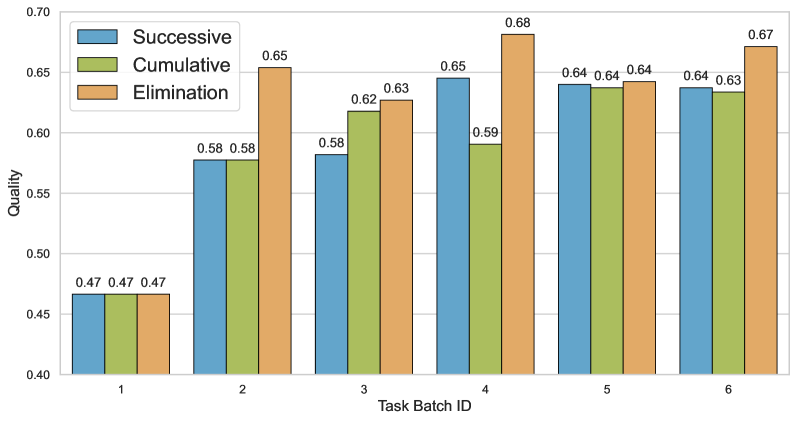

# 软件开发代理通过迭代精炼经验在

发布时间：2024年05月07日

`Agent

这篇论文主要探讨了大型语言模型（LLMs）驱动的自主代理在软件开发等场景中的应用，并提出了一种迭代经验优化框架来提升代理的适应能力和效率。这与“Agent”分类下的研究内容相符，因为该分类通常关注的是智能代理的设计、优化和应用，特别是在自主性和适应性方面的研究。而“RAG”（Retrieval-Augmented Generation）通常指的是一种结合检索和生成的模型架构，“LLM应用”则更侧重于LLM在特定领域的应用案例，“LLM理论”则关注LLM的理论基础和模型架构。因此，这篇论文更适合归类在“Agent”分类下。` `软件开发` `人工智能`

> Iterative Experience Refinement of Software-Developing Agents

# 摘要

> 大型语言模型（LLMs）驱动的自主代理在软件开发等场景中展现出实现高度自主性的巨大潜力。研究表明，这些代理能够借鉴过往经验，减少错误，提升效率。然而，传统的静态经验模式，依赖于固定的经验集合，缺乏迭代优化，限制了代理的适应能力。本文提出了一种迭代经验优化框架，允许LLM代理在执行任务时不断精炼经验。我们提出了两种优化模式：连续模式，基于任务批次内最近的经验进行优化；累积模式，整合所有先前任务批次的经验。结合启发式经验筛选，我们的方法优先考虑高质量且常用的经验，有效管理经验库，提升效率。实验结果显示，连续模式可能带来更佳效果，而累积模式则提供更稳定的性能。此外，经验筛选机制使得我们能够仅用高质量子集的11.54%就能获得更好的性能表现。

> Autonomous agents powered by large language models (LLMs) show significant potential for achieving high autonomy in various scenarios such as software development. Recent research has shown that LLM agents can leverage past experiences to reduce errors and enhance efficiency. However, the static experience paradigm, reliant on a fixed collection of past experiences acquired heuristically, lacks iterative refinement and thus hampers agents' adaptability. In this paper, we introduce the Iterative Experience Refinement framework, enabling LLM agents to refine experiences iteratively during task execution. We propose two fundamental patterns: the successive pattern, refining based on nearest experiences within a task batch, and the cumulative pattern, acquiring experiences across all previous task batches. Augmented with our heuristic experience elimination, the method prioritizes high-quality and frequently-used experiences, effectively managing the experience space and enhancing efficiency. Extensive experiments show that while the successive pattern may yield superior results, the cumulative pattern provides more stable performance. Moreover, experience elimination facilitates achieving better performance using just 11.54% of a high-quality subset.

[Arxiv](https://arxiv.org/abs/2405.04219)