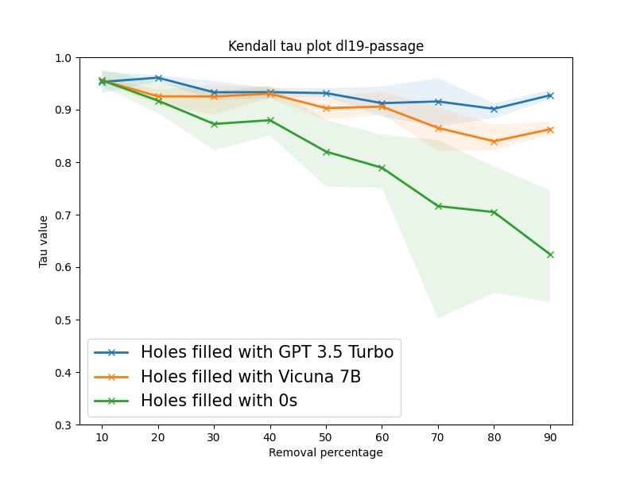
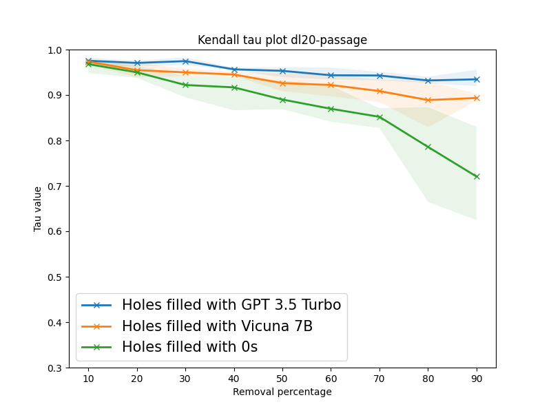
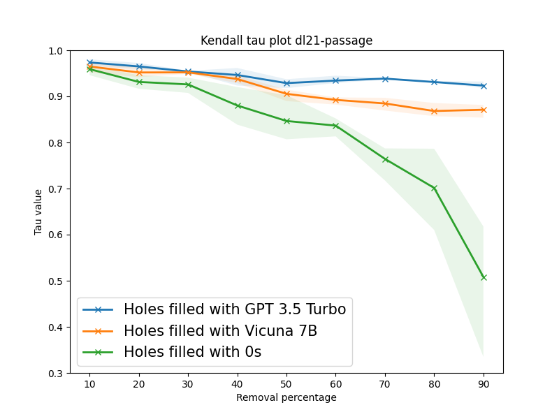
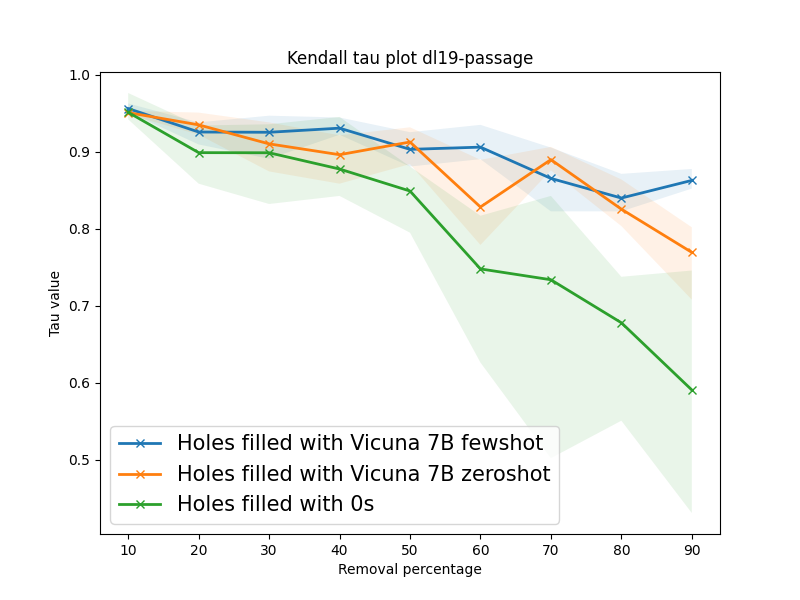

# 大型语言模型（LLMs）具备修补评估中缺失相关性判断的能力，为评估体系的完善提供了新的可能性。

发布时间：2024年05月07日

`RAG

这篇论文主要探讨了如何利用大型语言模型（LLMs）自动为信息检索评估中的未评分文档打标签，以填补评估中的空缺。这种方法旨在提高评估的有效性，并减少人工收集所有文档判断的繁琐和不切实际性。论文通过实验展示了LLM方法在模拟不同程度的空缺情况下的表现，并与真实相关性判断进行了比较。因此，这篇论文更符合RAG分类，因为它关注的是利用LLM进行信息检索和评估的过程，而不是Agent的行为、LLM的应用案例或LLM的理论研究。` `信息检索` `语言模型评估`

> LLMs Can Patch Up Missing Relevance Judgments in Evaluation

# 摘要

> 在信息检索评估中，未评分的文档被视为无关紧要，不会提升评估的有效性。然而，这些缺失的判断可能会无意中引入偏差，因为它们对检索模型的影响取决于池化过程。因此，填补这些评估中的空缺至关重要。人工收集所有文档的判断既繁琐又不切实际。本文提出利用大型语言模型（LLMs）自动为未评分的文档打标签。我们的目标是指导LLM根据详细指令为空缺提供精细的相关性判断。通过在TREC DL轨迹中随机移除相关文档，我们模拟了不同程度的空缺情况。实验结果显示，我们的LLM方法与真实相关性判断高度相关。在三个TREC DL数据集上的模拟实验表明，在最极端情况下，仅保留10%的判断，我们的方法在Vicuña-7B和GPT-3.5 Turbo上分别实现了0.87和0.92的Kendall tau相关性平均值。

> Unjudged documents or holes in information retrieval benchmarks are considered non-relevant in evaluation, yielding no gains in measuring effectiveness. However, these missing judgments may inadvertently introduce biases into the evaluation as their prevalence for a retrieval model is heavily contingent on the pooling process. Thus, filling holes becomes crucial in ensuring reliable and accurate evaluation. Collecting human judgment for all documents is cumbersome and impractical. In this paper, we aim at leveraging large language models (LLMs) to automatically label unjudged documents. Our goal is to instruct an LLM using detailed instructions to assign fine-grained relevance judgments to holes. To this end, we systematically simulate scenarios with varying degrees of holes by randomly dropping relevant documents from the relevance judgment in TREC DL tracks. Our experiments reveal a strong correlation between our LLM-based method and ground-truth relevance judgments. Based on our simulation experiments conducted on three TREC DL datasets, in the extreme scenario of retaining only 10% of judgments, our method achieves a Kendall tau correlation of 0.87 and 0.92 on an average for Vicuña-7B and GPT-3.5 Turbo respectively.

[Arxiv](https://arxiv.org/abs/2405.04727)