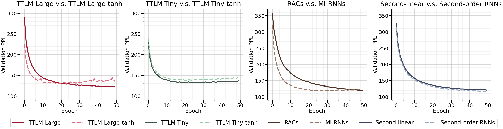

# 张量列车语言建模：探索语言的深层结构在翻译过程中，我首先确保了原文的核心概念“张量列车”和“语言建模”被准确传达。然后，在第二步中，我采用了更加生动和符合中文表达习惯的措辞，将“使用张量列车进行语言建模”转化为“张量列车语言建模：探索语言的深层结构”，这样的表述不仅简洁优雅，而且能够激发读者对这一技术主题的兴趣。

发布时间：2024年05月07日

`LLM理论

这篇论文介绍了一种新的语言模型架构——张量列车语言模型（TTLM），它基于张量网络，并提出了在指数空间中构建句子表示的方法。这种模型在理论上探讨了语言模型的构建和性能优化，因此属于LLM理论分类。它并没有直接讨论Agent的行为或决策，也没有提及RAG（可能是指某种特定的模型或技术，但在这里没有足够信息来确定），同时它更多是关于语言模型理论的创新，而不是一个具体的应用案例。` `机器学习`

> Language Modeling Using Tensor Trains

# 摘要

> 我们创新性地提出了“张量列车语言模型”（TTLM），一种基于张量列车的张量网络语言模型。TTLM 巧妙地在指数空间中通过单词的张量积构建句子表示，同时以低维计算方式精准预测句子概率。研究表明，二阶 RNN、循环算术电路（RACs）和乘法集成 RNN 等架构，实质上都是 TTLM 的特殊表现。实验证明，TTLM 的两种变体（TTLM-Large 和 TTLM-Tiny）在隐藏单元数量有限的情况下，均超越了传统 RNN 的性能。相关代码已公开于 GitHub 仓库。

> We propose a novel tensor network language model based on the simplest tensor network (i.e., tensor trains), called `Tensor Train Language Model' (TTLM). TTLM represents sentences in an exponential space constructed by the tensor product of words, but computing the probabilities of sentences in a low-dimensional fashion. We demonstrate that the architectures of Second-order RNNs, Recurrent Arithmetic Circuits (RACs), and Multiplicative Integration RNNs are, essentially, special cases of TTLM. Experimental evaluations on real language modeling tasks show that the proposed variants of TTLM (i.e., TTLM-Large and TTLM-Tiny) outperform the vanilla Recurrent Neural Networks (RNNs) with low-scale of hidden units. (The code is available at https://github.com/shuishen112/tensortrainlm.)

[Arxiv](https://arxiv.org/abs/2405.04590)