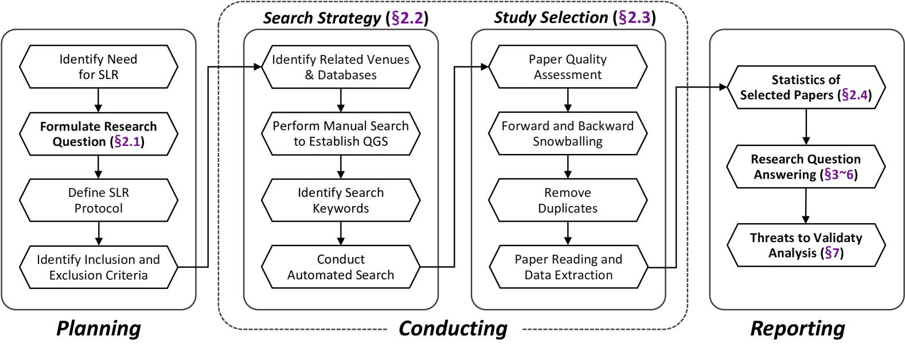
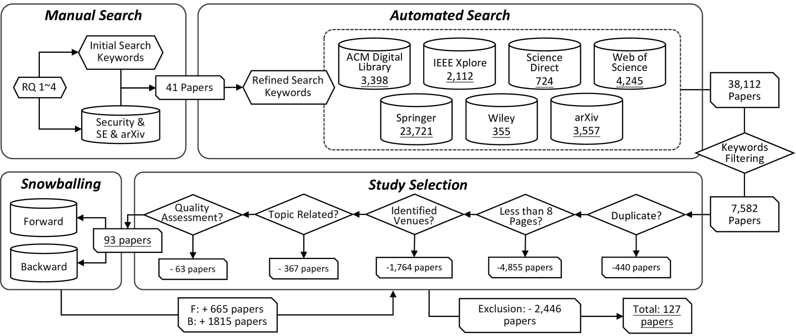
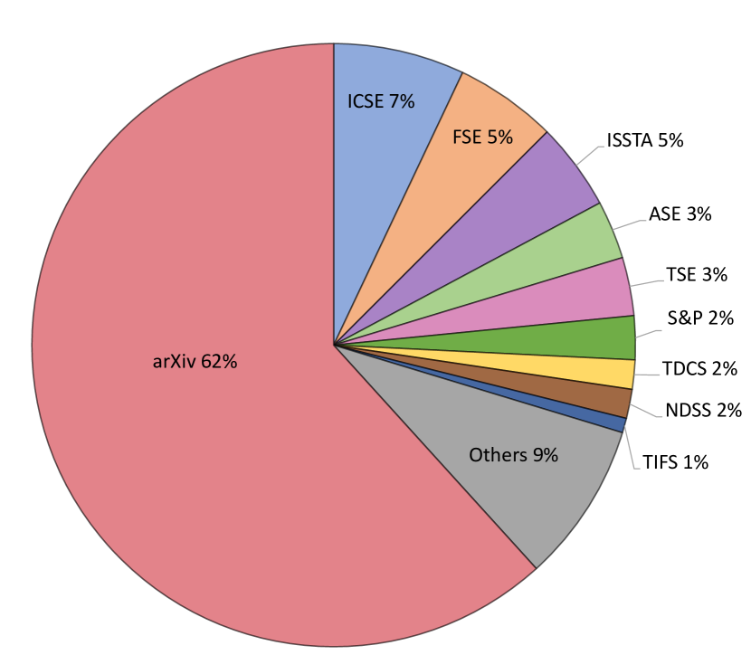
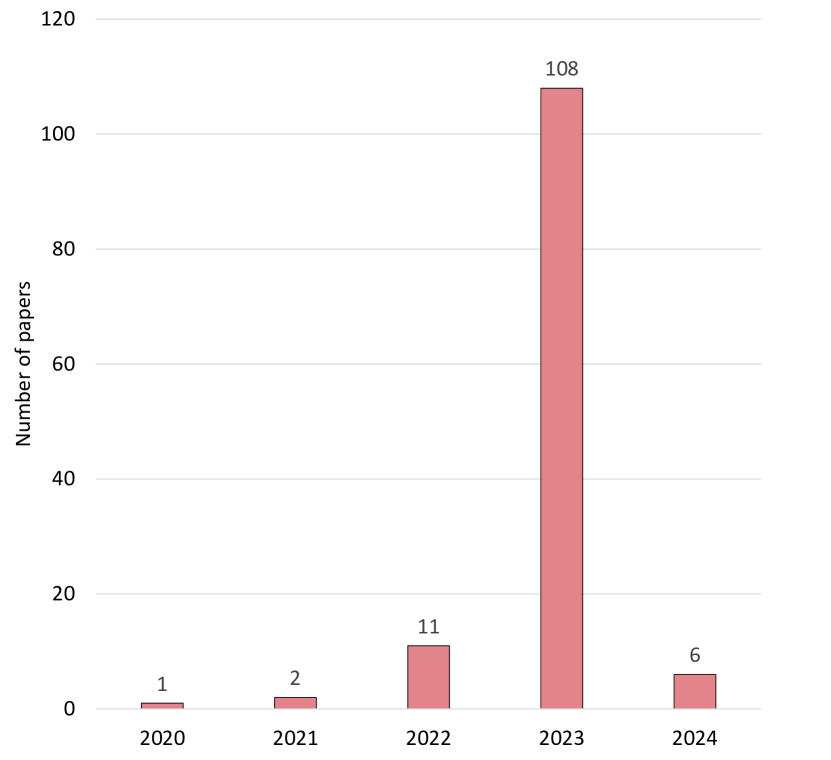
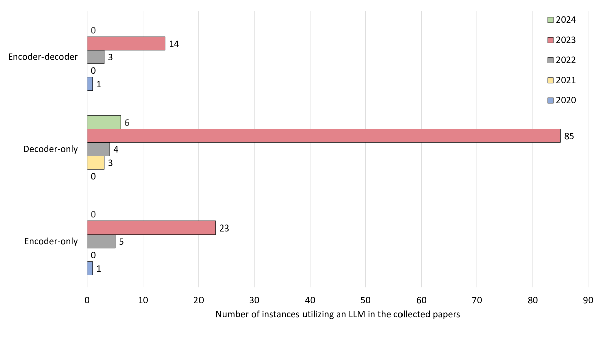
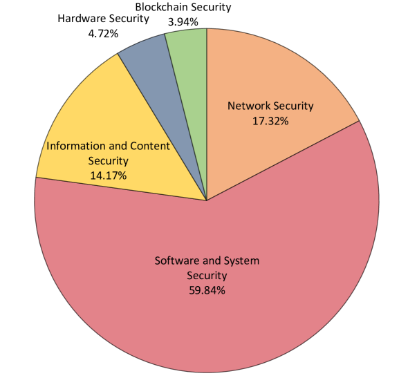
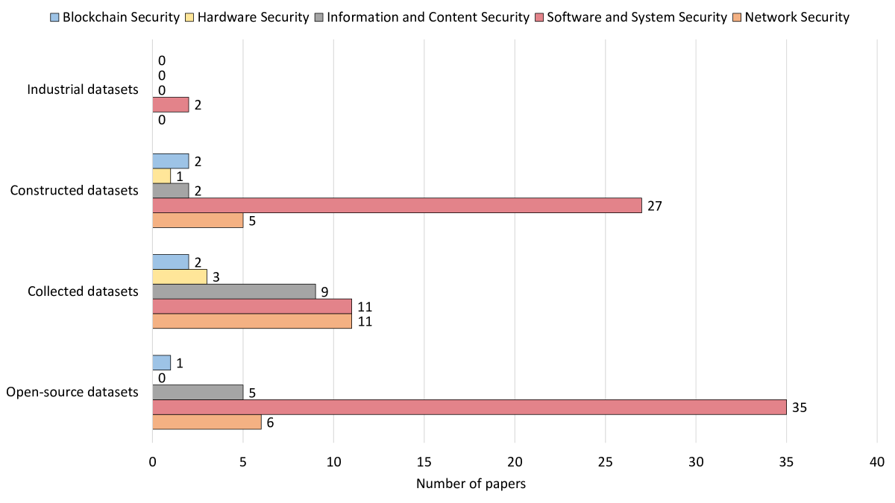

# 网络安全领域的大型语言模型：系统性文献综述探索在本次系统性文献综述中，我们将深入探讨大型语言模型在网络安全领域的应用，分析其在识别威胁、预测攻击模式以及自动化响应策略等方面的潜力与挑战。通过对现有文献的综合梳理，我们旨在揭示这些先进技术如何助力网络安全专家构筑更为坚固的数字防线。

发布时间：2024年05月07日

`LLM应用

这篇论文摘要讨论了大型语言模型（LLMs）在网络安全领域的应用，包括漏洞检测、恶意软件分析、网络入侵检测和钓鱼检测等任务。它强调了构建更全面、更具代表性数据集的必要性，并探讨了将LLMs适应到特定网络安全领域的技术，如微调、迁移学习和领域特定预训练。此外，它还讨论了未来研究的挑战和机遇，包括可解释模型的必要性、数据隐私和安全问题的解决，以及利用LLMs进行主动防御和威胁狩猎的潜力。这些内容与LLM应用领域紧密相关，因此将其分类为LLM应用。` `网络安全` `人工智能`

> Large Language Models for Cyber Security: A Systematic Literature Review

# 摘要

> 大型语言模型（LLMs）的迅猛发展为网络安全等领域的人工智能应用开辟了新天地。随着网络威胁日益增多，智能系统的需求也随之增长，这些系统能够自动识别漏洞、剖析恶意软件并迅速应对攻击。本综述深入探讨了LLMs在网络安全（LLM4Security）中的应用，通过梳理超过3万篇相关论文，并精选127篇顶级安全和软件工程领域的论文进行系统分析，我们旨在为读者呈现LLMs在网络安全领域解决多样问题的全景图。我们的研究发现，LLMs正广泛应用于漏洞检测、恶意软件分析、网络入侵检测和钓鱼检测等任务。然而，用于训练和评估LLMs的数据集往往规模有限、多样性不足，这凸显了构建更全面、更具代表性数据集的迫切性。我们还发现了适应LLMs到特定网络安全领域的几种潜在技术，包括微调、迁移学习和领域特定预训练。最后，我们探讨了LLM4Security未来研究的主要挑战和机遇，强调了可解释模型的必要性、数据隐私和安全问题的解决，以及利用LLMs进行主动防御和威胁狩猎的潜力。总之，我们的综述不仅概述了LLM4Security的当前状态，还指出了未来研究的多个有前景的方向。

> The rapid advancement of Large Language Models (LLMs) has opened up new opportunities for leveraging artificial intelligence in various domains, including cybersecurity. As the volume and sophistication of cyber threats continue to grow, there is an increasing need for intelligent systems that can automatically detect vulnerabilities, analyze malware, and respond to attacks. In this survey, we conduct a comprehensive review of the literature on the application of LLMs in cybersecurity (LLM4Security). By comprehensively collecting over 30K relevant papers and systematically analyzing 127 papers from top security and software engineering venues, we aim to provide a holistic view of how LLMs are being used to solve diverse problems across the cybersecurity domain. Through our analysis, we identify several key findings. First, we observe that LLMs are being applied to a wide range of cybersecurity tasks, including vulnerability detection, malware analysis, network intrusion detection, and phishing detection. Second, we find that the datasets used for training and evaluating LLMs in these tasks are often limited in size and diversity, highlighting the need for more comprehensive and representative datasets. Third, we identify several promising techniques for adapting LLMs to specific cybersecurity domains, such as fine-tuning, transfer learning, and domain-specific pre-training. Finally, we discuss the main challenges and opportunities for future research in LLM4Security, including the need for more interpretable and explainable models, the importance of addressing data privacy and security concerns, and the potential for leveraging LLMs for proactive defense and threat hunting. Overall, our survey provides a comprehensive overview of the current state-of-the-art in LLM4Security and identifies several promising directions for future research.

[Arxiv](https://arxiv.org/abs/2405.04760)