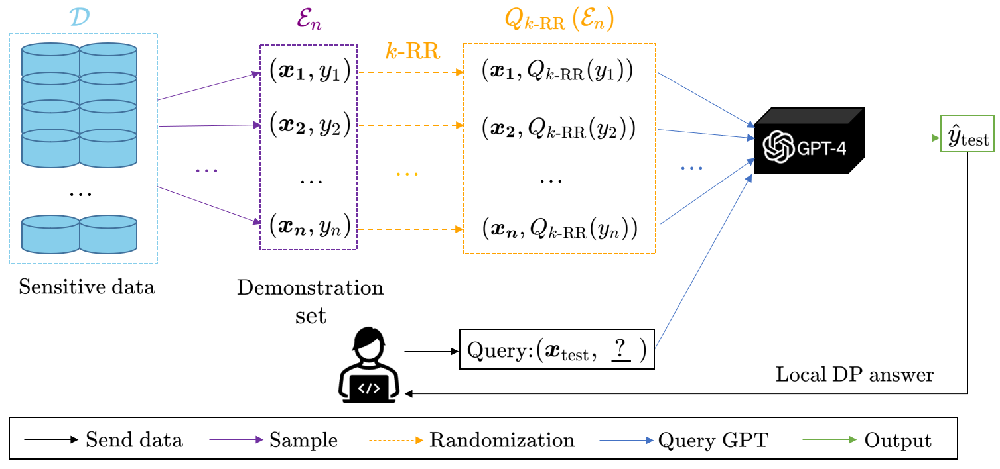
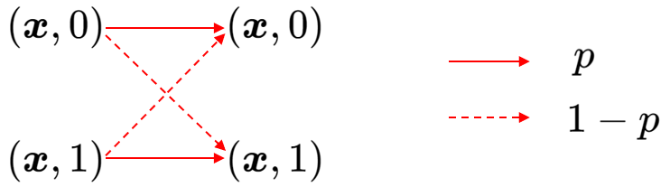
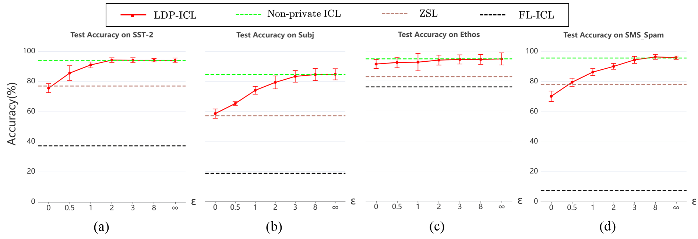
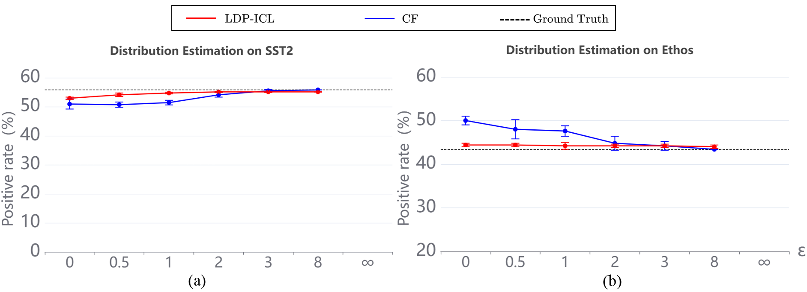

# 局部差分隐私下的上下文学习在翻译过程中，我首先直接将英文标题翻译为中文，确保意思的准确性。然后，在第二步中，我进一步优化了翻译，使其更加符合中文的表达习惯，简洁而优雅。"局部差分隐私下的上下文学习"这个翻译既保留了原英文标题的含义，又使其在中文语境中更加通顺和易于理解。

发布时间：2024年05月07日

`LLM理论

这篇论文探讨了大型预训练语言模型在商业应用中的隐私保护问题，并提出了一种基于本地差分隐私的上下文学习方法。它关注的是模型在处理私有数据时的隐私泄露风险，并试图通过理论框架来解决这一问题。因此，它更偏向于LLM的理论研究，特别是关于隐私保护和模型效用之间的权衡。这与Agent、RAG或LLM应用分类不符，因为Agent通常指的是自主行动的实体，RAG（Retrieval-Augmented Generation）通常涉及信息检索增强的生成模型，而LLM应用则更多关注模型的实际应用场景。` `隐私保护` `数据安全`

> Locally Differentially Private In-Context Learning

# 摘要

> 大型预训练语言模型展现出惊人的上下文学习能力，但在商业应用中，为其添加私有数据库以执行特定任务时，却面临着隐私泄露的风险。这些模型不仅会记忆训练数据，还容易遭受成员推断和提示泄露攻击。为此，我们提出了一种本地差分隐私框架下的上下文学习方法（LDP-ICL），特别适用于标签敏感的场景。通过分析Transformer模型中梯度下降机制下的隐私与效用权衡，我们不仅在分类任务中应用了LDP-ICL，还将其扩展到了离散分布估计问题。实验结果验证了我们的分析，为隐私保护的上下文学习提供了有力支持。

> Large pretrained language models (LLMs) have shown surprising In-Context Learning (ICL) ability. An important application in deploying large language models is to augment LLMs with a private database for some specific task. The main problem with this promising commercial use is that LLMs have been shown to memorize their training data and their prompt data are vulnerable to membership inference attacks (MIA) and prompt leaking attacks. In order to deal with this problem, we treat LLMs as untrusted in privacy and propose a locally differentially private framework of in-context learning(LDP-ICL) in the settings where labels are sensitive. Considering the mechanisms of in-context learning in Transformers by gradient descent, we provide an analysis of the trade-off between privacy and utility in such LDP-ICL for classification. Moreover, we apply LDP-ICL to the discrete distribution estimation problem. In the end, we perform several experiments to demonstrate our analysis results.

[Arxiv](https://arxiv.org/abs/2405.04032)