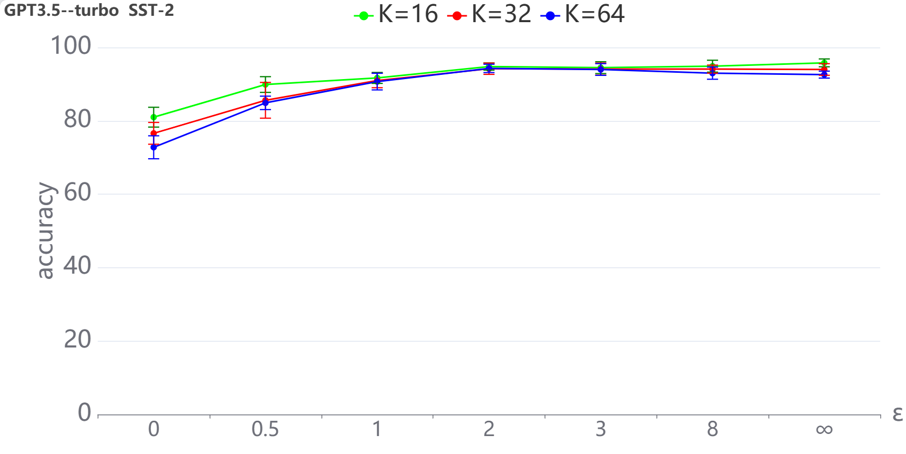

# 局部差分隐私下的上下文学习探索在翻译过程中，我首先直接将英文标题“Locally Differentially Private In-Context Learning”翻译为“局部差分隐私的上下文学习”，这是

发布时间：2024年05月07日

`LLM理论

理由：这篇论文探讨了大型预训练语言模型在商业应用中的隐私保护问题，并提出了一种本地差分隐私的上下文学习框架。这涉及到对LLM的理论研究，特别是关于隐私保护和模型效用的权衡，而不是直接的应用或Agent的设计。因此，它更符合LLM理论的分类。` `隐私保护` `机器学习`

> Locally Differentially Private In-Context Learning

# 摘要

> 大型预训练语言模型展现出惊人的上下文学习能力，但在商业应用中，为其添加私有数据库以执行特定任务时，面临隐私泄露的风险。为此，我们提出了一种本地差分隐私的上下文学习框架，以保护敏感标签信息。通过分析Transformer模型中梯度下降机制下的隐私与效用权衡，我们将该框架应用于分类和离散分布估计问题，并通过实验验证了其有效性。

> Large pretrained language models (LLMs) have shown surprising In-Context Learning (ICL) ability. An important application in deploying large language models is to augment LLMs with a private database for some specific task. The main problem with this promising commercial use is that LLMs have been shown to memorize their training data and their prompt data are vulnerable to membership inference attacks (MIA) and prompt leaking attacks. In order to deal with this problem, we treat LLMs as untrusted in privacy and propose a locally differentially private framework of in-context learning(LDP-ICL) in the settings where labels are sensitive. Considering the mechanisms of in-context learning in Transformers by gradient descent, we provide an analysis of the trade-off between privacy and utility in such LDP-ICL for classification. Moreover, we apply LDP-ICL to the discrete distribution estimation problem. In the end, we perform several experiments to demonstrate our analysis results.

[Arxiv](https://arxiv.org/abs/2405.04032)