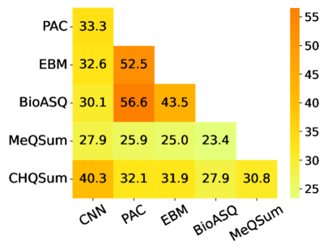

# MEDVOC：医学文本摘要中预训练语言模型的词汇微调适应在这项研究中，我们提出了MEDVOC，一种专门为医学文本摘要任务设计的词汇适应方法。通过微调预训练语言模型，MEDVOC旨在提高模型对医学领域特定术语和概念的理解，从而生成更准确、更具信息量的摘要。我们的方法结合了领域知识与先进的自然语言处理技术，为医学文献的自动化摘要提供了新的可能性。

发布时间：2024年05月07日

`LLM应用

这篇论文介绍了一种针对医学文本摘要的动态词汇适应策略MEDVOC，它通过微调预训练语言模型来提高医学文本摘要的质量。这种方法特别关注于优化预训练语言模型（PLM）的词汇，以适应特定的下游任务，即医学文本摘要。MEDVOC的创新之处在于其能够显著减少微调时间，并提高在零-shot场景下的性能。此外，它还展示了在跨多个PLM部署时的有效性，以及在人类评估中的高忠实度。这些特点表明，该研究是针对大型语言模型（LLM）在特定应用场景（医学文本摘要）中的优化和改进，因此属于LLM应用分类。` `医学文本摘要`

> MEDVOC: Vocabulary Adaptation for Fine-tuning Pre-trained Language Models on Medical Text Summarization

# 摘要

> 本研究介绍了一种名为MEDVOC的动态词汇适应策略，旨在通过微调预训练语言模型（如BertSumAbs、BART和PEGASUS）来提升医学文本摘要的质量。MEDVOC独特之处在于将词汇视为可优化元素，并根据下游任务的参考摘要优化PLM词汇，这与传统领域适应方法有所区别。我们的创新在于，通过基于片段得分的超参数搜索，将原本需要450天的微调时间大幅缩减至不到2天。MEDVOC不仅适用于单一PLM，还能跨多个PLM部署，有效弥合了生物医学文献与PLM之间的词汇鸿沟。在零-shot场景下，MEDVOC在Rouge-L指标上超越基线15.74%，并在高OOV浓度下提升了17.29%。人类评估进一步证实，MEDVOC生成的医学摘要忠实度高达88%，远超基线的59%。我们已将相关代码公开在https://github.com/gb-kgp/MEDVOC。

> This work presents a dynamic vocabulary adaptation strategy, MEDVOC, for fine-tuning pre-trained language models (PLMs) like BertSumAbs, BART, and PEGASUS for improved medical text summarization. In contrast to existing domain adaptation approaches in summarization, MEDVOC treats vocabulary as an optimizable parameter and optimizes the PLM vocabulary based on fragment score conditioned only on the downstream task's reference summaries. Unlike previous works on vocabulary adaptation (limited only to classification tasks), optimizing vocabulary based on summarization tasks requires an extremely costly intermediate fine-tuning step on large summarization datasets. To that end, our novel fragment score-based hyperparameter search very significantly reduces this fine-tuning time -- from 450 days to less than 2 days on average. Furthermore, while previous works on vocabulary adaptation are often primarily tied to single PLMs, MEDVOC is designed to be deployable across multiple PLMs (with varying model vocabulary sizes, pre-training objectives, and model sizes) -- bridging the limited vocabulary overlap between the biomedical literature domain and PLMs. MEDVOC outperforms baselines by 15.74% in terms of Rouge-L in zero-shot setting and shows gains of 17.29% in high Out-Of-Vocabulary (OOV) concentrations. Our human evaluation shows MEDVOC generates more faithful medical summaries (88% compared to 59% in baselines). We make the codebase publicly available at https://github.com/gb-kgp/MEDVOC.

[Arxiv](https://arxiv.org/abs/2405.04163)