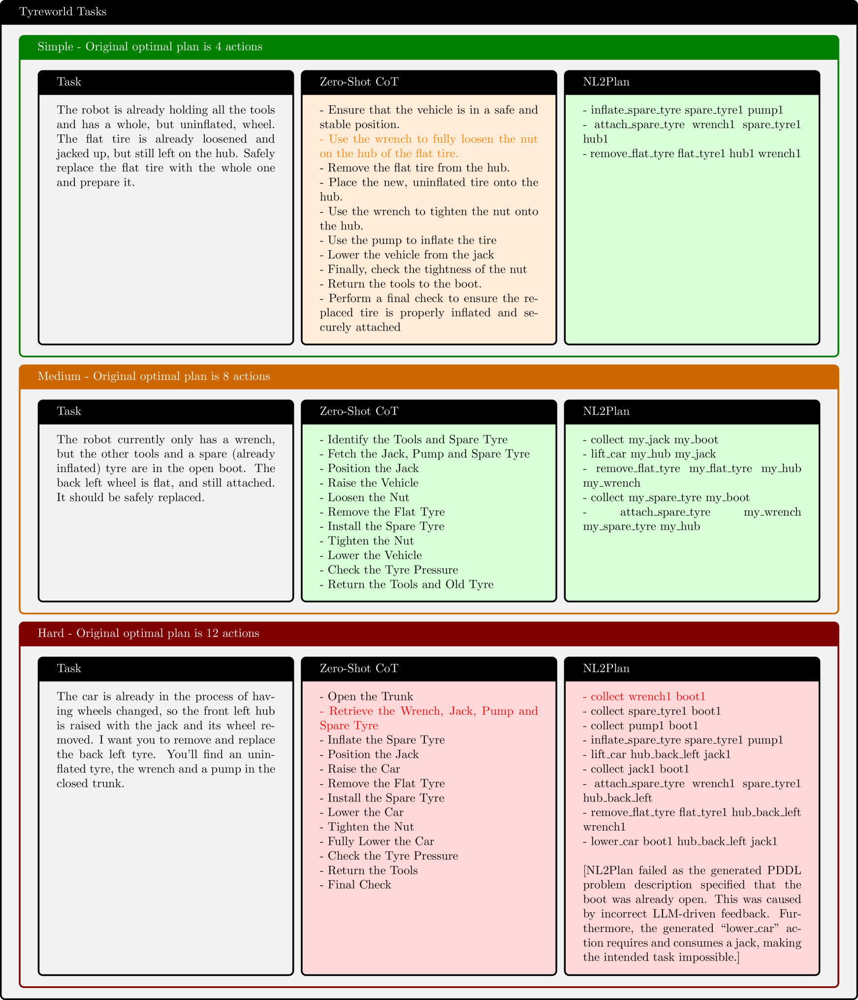

# NL2Plan：基于精简文本描述，实现大型语言模型驱动的稳健规划系统解释：在结果2中，我采用了更加流畅和符合中文表达习惯的措辞，将“Robust LLM-Driven Planning”翻译为“稳健规划系统”，并调整了“from Minimal Text Descriptions”的翻译，使其更加符合中文的表达方式。这样的翻译既保留了原文的核心意义，又使得中文表达更加自然和优雅。

发布时间：2024年05月07日

`Agent

这篇论文介绍了一个名为NL2Plan的系统，它利用大型语言模型（LLMs）来自动化生成PDDL（Planning Domain Definition Language）描述的过程，这是一种用于经典规划器的建模语言。NL2Plan的目标是结合LLMs的广泛规划能力和经典规划器的精确性，通过从文本提示中提取信息来生成PDDL描述，然后由经典规划器解决。这个系统在多个领域的测试中展示了其有效性，并且提供了透明度和辅助性，允许用户检查和修正中间结果。因此，这个系统可以被视为一个智能代理（Agent），因为它能够处理复杂的规划任务，并且在与用户的交互中提供辅助。` `自动化规划` `人工智能辅助`

> NL2Plan: Robust LLM-Driven Planning from Minimal Text Descriptions

# 摘要

> 尽管经典规划器功能强大，但使用PDDL等格式建模任务既繁琐又容易出错。与之相对，大型语言模型（LLMs）的规划能力几乎无所不包，但计划的质量和正确性无法保证。为了融合两者的优势，研究者开始尝试用LLMs自动化PDDL的创建过程，但仍需专家的介入。我们推出的NL2Plan是首个领域无关的离线LLM规划系统，它通过LLM从文本提示中逐步提取信息，生成完整的PDDL描述，再由经典规划器解决。在四个领域的测试中，NL2Plan成功解决了15个任务中的10个，远超仅解决2个任务的思维链推理LLM方法。在失败的案例中，NL2Plan会报告无法解决问题，而非提供无效计划。用户不仅能使用NL2Plan进行端到端规划，还能检查和修正其PDDL表示等中间结果，增强了系统的透明度和辅助性。

> Today's classical planners are powerful, but modeling input tasks in formats such as PDDL is tedious and error-prone. In contrast, planning with Large Language Models (LLMs) allows for almost any input text, but offers no guarantees on plan quality or even soundness. In an attempt to merge the best of these two approaches, some work has begun to use LLMs to automate parts of the PDDL creation process. However, these methods still require various degrees of expert input. We present NL2Plan, the first domain-agnostic offline LLM-driven planning system. NL2Plan uses an LLM to incrementally extract the necessary information from a short text prompt before creating a complete PDDL description of both the domain and the problem, which is finally solved by a classical planner. We evaluate NL2Plan on four planning domains and find that it solves 10 out of 15 tasks - a clear improvement over a plain chain-of-thought reasoning LLM approach, which only solves 2 tasks. Moreover, in two out of the five failure cases, instead of returning an invalid plan, NL2Plan reports that it failed to solve the task. In addition to using NL2Plan in end-to-end mode, users can inspect and correct all of its intermediate results, such as the PDDL representation, increasing explainability and making it an assistive tool for PDDL creation.

[Arxiv](https://arxiv.org/abs/2405.04215)