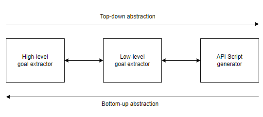
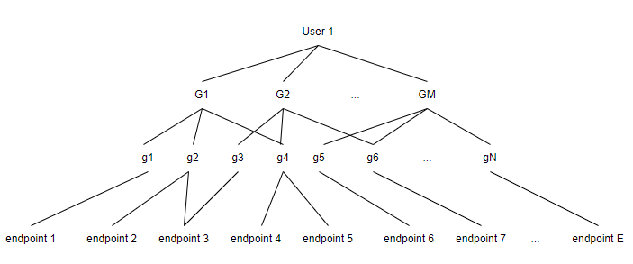

# 语义API匹配：构建高级用户目标与API之间的桥梁

发布时间：2024年05月07日

`Agent

这篇论文探讨了大型语言模型（LLMs）在软件开发自动化和辅助中的应用，特别是通过提出的语义API对齐（SEAL）方法，实现用户目标与API功能的智能匹配。论文中构想的由LLM驱动的代理系统，能够自动编程并在需要时提供指导，这表明了LLMs在软件开发中的代理角色。因此，这篇论文更符合Agent分类，因为它强调了LLMs作为智能代理在软件开发过程中的作用。` `软件开发` `自动化编程`

> Semantic API Alignment: Linking High-level User Goals to APIs

# 摘要

> 大型语言模型（LLMs）正成为软件开发自动化和辅助的关键，从需求工程到编码无所不包。我们提出的语义API对齐（SEAL）方法，旨在将用户的高层次目标与API的具体功能无缝对接。在这篇论文中，我们构想了一个由LLM驱动的代理系统，它们能够智能匹配目标与API调用，既可自动编程，也能在需要时提供指导。我们通过一个GitHub统计API的案例研究，展示了LLMs如何通过子目标分析在面向目标的需求工程（GORE）中发挥作用，与REST API规范精准对齐。我们的研究不仅揭示了LLMs在复杂软件开发任务中的巨大潜力，也为未来的研究方向绘制了蓝图。

> Large Language Models (LLMs) are becoming key in automating and assisting various software development tasks, including text-based tasks in requirements engineering but also in coding. Typically, these models are used to automate small portions of existing tasks, but we present a broader vision to span multiple steps from requirements engineering to implementation using existing libraries. This approach, which we call Semantic API Alignment (SEAL), aims to bridge the gap between a user's high-level goals and the specific functions of one or more APIs.
  In this position paper, we propose a system architecture where a set of LLM-powered ``agents'' match such high-level objectives with appropriate API calls. This system could facilitate automated programming by finding matching links or, alternatively, explaining mismatches to guide manual intervention or further development.
  As an initial pilot, our paper demonstrates this concept by applying LLMs to Goal-Oriented Requirements Engineering (GORE), via sub-goal analysis, for aligning with REST API specifications, specifically through a case study involving a GitHub statistics API. We discuss the potential of our approach to enhance complex tasks in software development and requirements engineering and outline future directions for research.

[Arxiv](https://arxiv.org/abs/2405.04236)