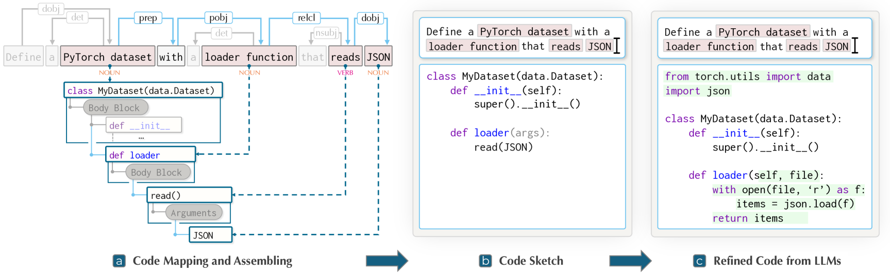
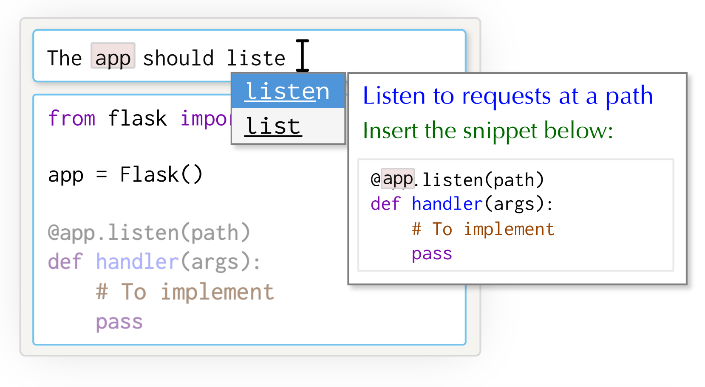
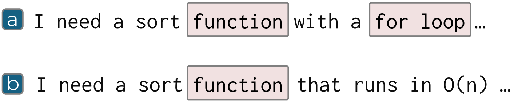

# 草绘启程，代码随行：借助语言导向的代码草图，我们不仅提供渐进式用户反馈，更巧妙地引导大型语言模型，使其代码生成之旅更加精准与高效。

发布时间：2024年05月07日

`Agent

理由：这篇论文提出了一种交互式方法，即“语言导向的代码草绘”，用于改善人与大型语言模型（LLM）之间的互动，特别是在代码生成或编辑方面。这种方法可以被视为一个智能代理（Agent），因为它通过提供即时的、逐步的反馈来辅助用户，并利用自然语言处理技术来生成代码草图。这种方法的目的是优化用户与LLM的协作过程，因此它更符合Agent的分类，而不是RAG（检索增强生成）、LLM应用或LLM理论。RAG通常指的是一种结合检索和生成的技术，而这里并没有提到检索过程；LLM应用通常指的是LLM在特定任务或领域中的应用，而这里的方法是关于如何与LLM交互，而不是LLM在某个特定应用中的使用；LLM理论则通常涉及LLM的基础理论研究，而这里的方法是实践性的，旨在改善交互体验。` `软件开发`

> Sketch Then Generate: Providing Incremental User Feedback and Guiding LLM Code Generation through Language-Oriented Code Sketches

# 摘要

> 在 LLMs 中打造有效的代码生成或编辑提示并非易事，尤其是在缺乏即时反馈的情况下，用户只能凭空想象代码的可能形态。为此，我们提出了“语言导向的代码草绘”，一种交互式方法，它通过代码草图（即代码轮廓的雏形）提供即时的、逐步的反馈。这种方法利用提示中的语言结构，结合自然语言处理技术，将提示转化为代码草图，作为中间媒介，既预览了代码结构，又引导 LLM 生成所需代码，从而优化了人与 LLM 的互动。最后，我们探讨了这种方法的应用前景和未来发展方向。

> Crafting effective prompts for code generation or editing with Large Language Models (LLMs) is not an easy task. Particularly, the absence of immediate, stable feedback during prompt crafting hinders effective interaction, as users are left to mentally imagine possible outcomes until the code is generated. In response, we introduce Language-Oriented Code Sketching, an interactive approach that provides instant, incremental feedback in the form of code sketches (i.e., incomplete code outlines) during prompt crafting. This approach converts a prompt into a code sketch by leveraging the inherent linguistic structures within the prompt and applying classic natural language processing techniques. The sketch then serves as an intermediate placeholder that not only previews the intended code structure but also guides the LLM towards the desired code, thereby enhancing human-LLM interaction. We conclude by discussing the approach's applicability and future plans.

[Arxiv](https://arxiv.org/abs/2405.03998)