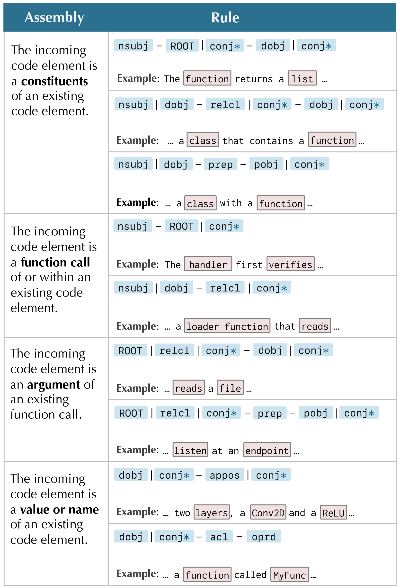

# 草绘启程，代码随行：借助语言导向的代码草图，我们逐步收集用户反馈，巧妙引导大型语言模型，使其代码生成更加精准。

发布时间：2024年05月07日

`Agent

理由：这篇论文提出了一种交互式方法，即面向语言的代码草图绘制，用于优化人机交互，帮助用户预览代码结构并引导大型语言模型（LLM）生成所需代码。这种方法涉及用户与模型之间的交互，可以被视为一种智能代理（Agent）的行为，因为它涉及代理与环境（用户）的互动，以实现特定目标（生成代码）。因此，这篇论文更符合Agent分类，而不是RAG、LLM应用或LLM理论。` `软件开发` `人机交互`

> Sketch Then Generate: Providing Incremental User Feedback and Guiding LLM Code Generation through Language-Oriented Code Sketches

# 摘要

> 在 LLMs 中制作代码提示并非易事，尤其是在缺乏即时反馈的情况下，用户只能猜测代码生成的结果。为此，我们提出了面向语言的代码草图绘制，一种交互式方法，它通过代码草图提供即时反馈，帮助用户预览代码结构并引导 LLM 生成所需代码，从而优化了人机交互。我们探讨了这种方法的潜力，并展望了未来的发展方向。

> Crafting effective prompts for code generation or editing with Large Language Models (LLMs) is not an easy task. Particularly, the absence of immediate, stable feedback during prompt crafting hinders effective interaction, as users are left to mentally imagine possible outcomes until the code is generated. In response, we introduce Language-Oriented Code Sketching, an interactive approach that provides instant, incremental feedback in the form of code sketches (i.e., incomplete code outlines) during prompt crafting. This approach converts a prompt into a code sketch by leveraging the inherent linguistic structures within the prompt and applying classic natural language processing techniques. The sketch then serves as an intermediate placeholder that not only previews the intended code structure but also guides the LLM towards the desired code, thereby enhancing human-LLM interaction. We conclude by discussing the approach's applicability and future plans.

[Arxiv](https://arxiv.org/abs/2405.03998)