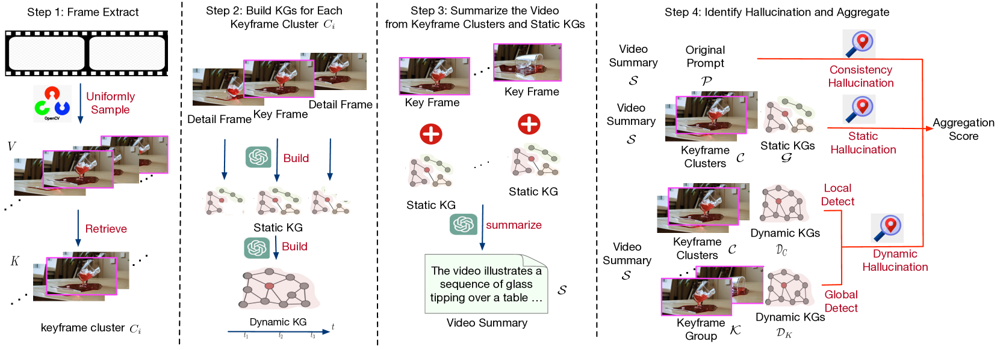

# Sora检测器：大型文本至视频模型幻觉现象的统一检测利器

发布时间：2024年05月07日

`Agent

理由：这篇论文介绍了一个名为 SoraDetector 的框架，它专门用于检测大型文本到视频（T2V）模型中的幻觉现象。特别值得注意的是，论文提到了 SoraDetector Agent，这是一个自动完成幻觉检测并生成视频质量报告的组件。这个 Agent 的存在表明该论文与Agent分类相关，因为它涉及到了一个具体的、能够执行特定任务的智能体。此外，论文还提到了多模态大型语言模型和元评估基准 T2VHaluBench，这些都是为了支持 Agent 的工作，而不是专注于 LLM 的理论研究或 RAG（检索增强生成）技术。因此，这篇论文更适合归类到Agent分类中。` `视频生成` `内容检测`

> Sora Detector: A Unified Hallucination Detection for Large Text-to-Video Models

# 摘要

> 文本到视频生成技术的飞速进步，让我们能够根据文字描述创造出栩栩如生的视频。然而，这些模型有时会“幻想”出与文本不符的内容，这影响了它们的实用性和可靠性。为此，我们推出了SoraDetector，一个创新的框架，专门用于检测包括尖端Sora模型在内的多种大型T2V模型中的幻觉现象。我们的框架深入分析了幻觉的多种表现，并据此进行分类。借助先进的帧提取技术和多模态大型语言模型，SoraDetector首先检查视频摘要与文本提示的匹配度，然后构建静态和动态知识图谱，以识别单帧和连续帧中的幻觉。Sora Detector不仅提供了一个强有力的量化指标来衡量幻觉，还推出了Sora Detector Agent，自动完成幻觉检测并生成详尽的视频质量报告。此外，我们还精心打造了T2VHaluBench，一个元评估基准，旨在推动T2V幻觉检测技术的发展。通过在Sora及其他大型T2V模型生成的视频上进行的大量实验，我们展示了SoraDetector在精准捕捉幻觉方面的卓越能力。相关代码和数据集已上传至GitHub，供大家探索。

> The rapid advancement in text-to-video (T2V) generative models has enabled the synthesis of high-fidelity video content guided by textual descriptions. Despite this significant progress, these models are often susceptible to hallucination, generating contents that contradict the input text, which poses a challenge to their reliability and practical deployment. To address this critical issue, we introduce the SoraDetector, a novel unified framework designed to detect hallucinations across diverse large T2V models, including the cutting-edge Sora model. Our framework is built upon a comprehensive analysis of hallucination phenomena, categorizing them based on their manifestation in the video content. Leveraging the state-of-the-art keyframe extraction techniques and multimodal large language models, SoraDetector first evaluates the consistency between extracted video content summary and textual prompts, then constructs static and dynamic knowledge graphs (KGs) from frames to detect hallucination both in single frames and across frames. Sora Detector provides a robust and quantifiable measure of consistency, static and dynamic hallucination. In addition, we have developed the Sora Detector Agent to automate the hallucination detection process and generate a complete video quality report for each input video. Lastly, we present a novel meta-evaluation benchmark, T2VHaluBench, meticulously crafted to facilitate the evaluation of advancements in T2V hallucination detection. Through extensive experiments on videos generated by Sora and other large T2V models, we demonstrate the efficacy of our approach in accurately detecting hallucinations. The code and dataset can be accessed via GitHub.

[Arxiv](https://arxiv.org/abs/2405.04180)