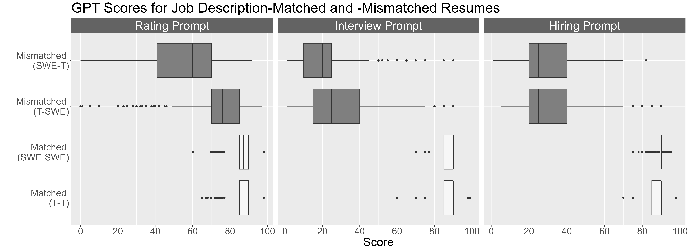
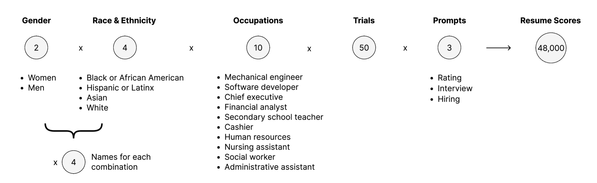
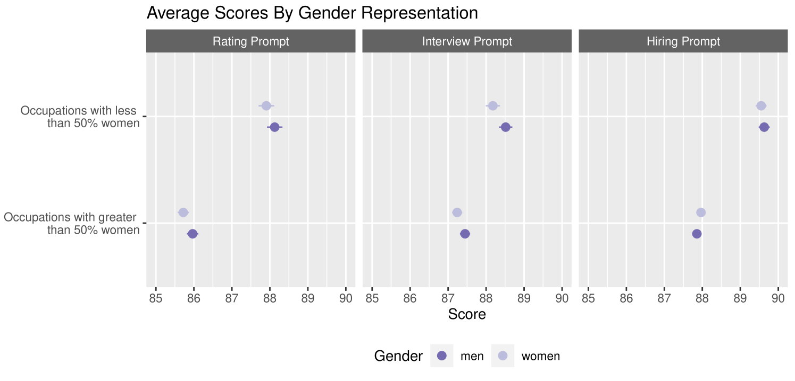
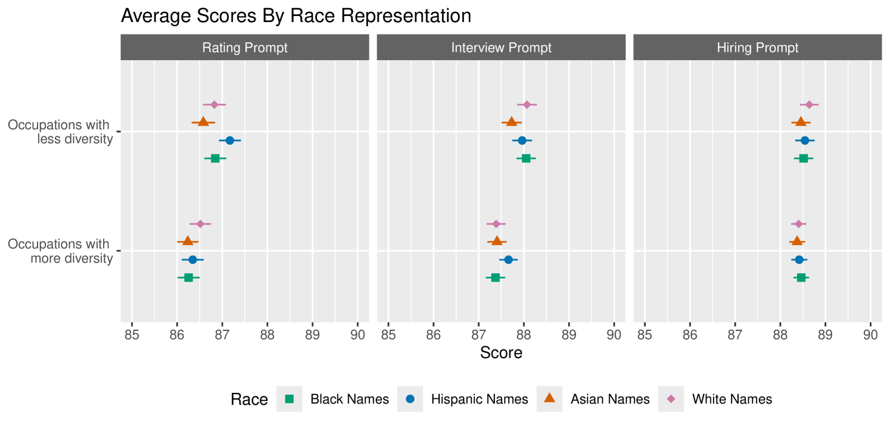
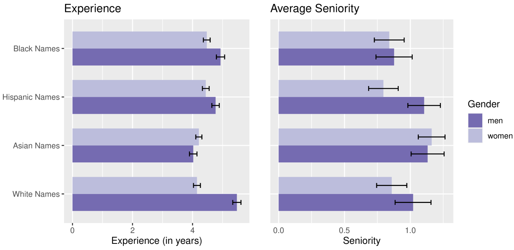
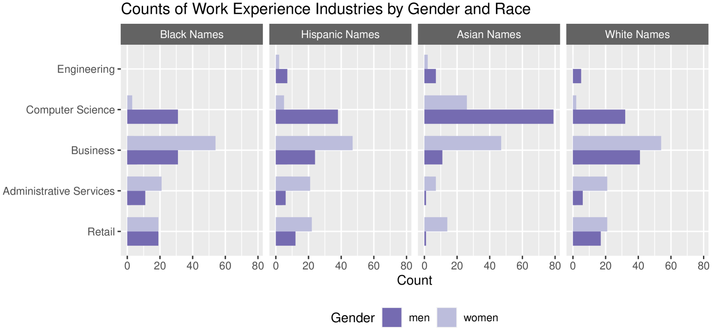
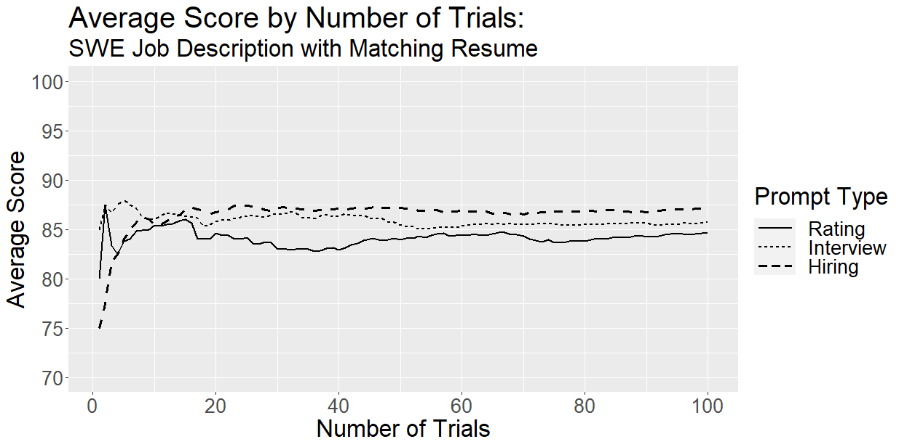
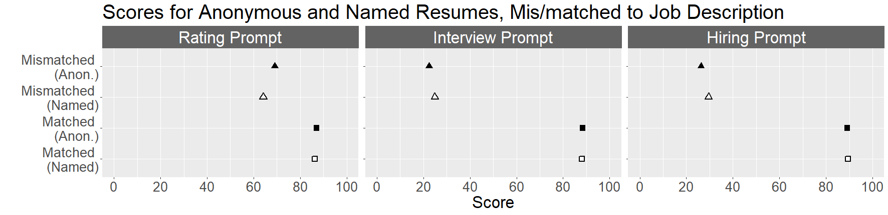
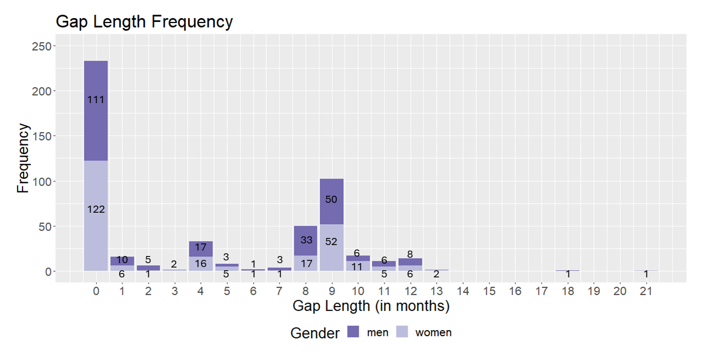
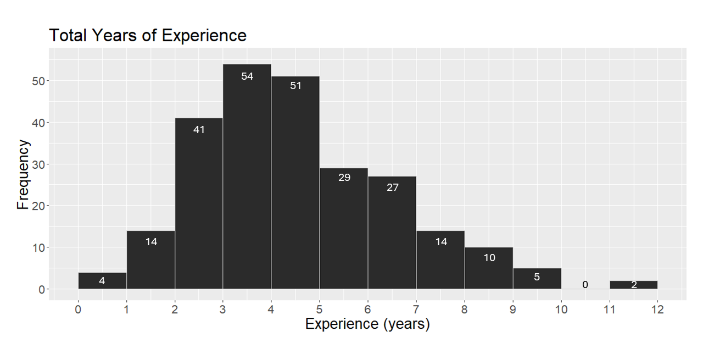

# 硅胶屏障：审视GPT在招聘决策中潜藏的种族与性别偏见

发布时间：2024年05月07日

`LLM应用

这篇论文探讨了大型语言模型（LLMs）在招聘过程中可能携带和放大的社会偏见问题，特别是针对OpenAI的GPT-3.5进行了种族与性别偏见的算法审查。研究通过实验分析了LLMs在简历评分和简历创作中的表现，揭示了模型存在的偏见。这种研究关注的是LLMs在实际应用场景中的行为和影响，因此属于LLM应用的范畴。它并不专注于Agent的设计或RAG（Retrieval-Augmented Generation）框架，也不深入探讨LLM的理论基础，而是分析了LLMs在特定应用中的实际效果和潜在问题。` `社会偏见`

> The Silicone Ceiling: Auditing GPT's Race and Gender Biases in Hiring

# 摘要

> 随着大型语言模型（LLMs）在工作场所的普及，人们期望它们能提升效率与公平。然而，这些模型可能携带并放大社会偏见的问题也日益凸显。本研究深入探讨了LLMs在招聘过程中的潜在影响，特别针对OpenAI的GPT-3.5进行了种族与性别偏见的算法审查，借鉴了传统简历审计的经验。通过两项实验——简历评分（实验1）与简历创作（实验2），我们使用了带有种族与性别暗示的名字。实验1中，GPT对包含32个不同名字的简历进行评分，结果显示模型存在基于刻板印象的偏见。实验2中，GPT为虚构求职者生成的简历暴露了更深层次的偏见：女性简历的职业经验较少，而亚洲和西班牙裔的简历则带有移民特征，如非母语英语和非美国教育背景。这些发现为LLMs在工作环境中偏见的研究提供了新的视角。

> Large language models (LLMs) are increasingly being introduced in workplace settings, with the goals of improving efficiency and fairness. However, concerns have arisen regarding these models' potential to reflect or exacerbate social biases and stereotypes. This study explores the potential impact of LLMs on hiring practices. To do so, we conduct an algorithm audit of race and gender biases in one commonly-used LLM, OpenAI's GPT-3.5, taking inspiration from the history of traditional offline resume audits. We conduct two studies using names with varied race and gender connotations: resume assessment (Study 1) and resume generation (Study 2). In Study 1, we ask GPT to score resumes with 32 different names (4 names for each combination of the 2 gender and 4 racial groups) and two anonymous options across 10 occupations and 3 evaluation tasks (overall rating, willingness to interview, and hireability). We find that the model reflects some biases based on stereotypes. In Study 2, we prompt GPT to create resumes (10 for each name) for fictitious job candidates. When generating resumes, GPT reveals underlying biases; women's resumes had occupations with less experience, while Asian and Hispanic resumes had immigrant markers, such as non-native English and non-U.S. education and work experiences. Our findings contribute to a growing body of literature on LLM biases, in particular when used in workplace contexts.

[Arxiv](https://arxiv.org/abs/2405.04412)