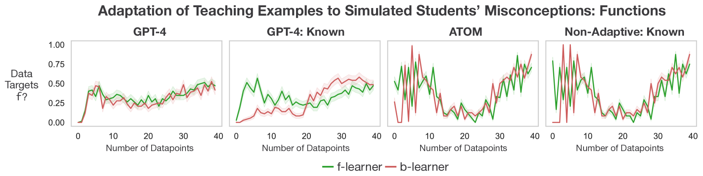

# 迈向情境化教学：量身定制示例，以纠正学生的认知误区

发布时间：2024年05月07日

`Agent

这篇论文主要探讨了大型语言模型（LLM）在教学领域的应用，特别是作为适应性教学的代理（Agent）。论文提出了一个名为AdapT的系统，它包括模拟贝叶斯学生模型和人类学生评估平台，以及一个名为AToM的新型适应性教学概率模型。这些模型和方法旨在推断学生的知识背景并优化其学习路径，展示了LLM在适应性教学方面的潜力。因此，这篇论文更符合Agent分类，因为它关注的是LLM作为教学代理的应用和适应性教学模型的开发。` `教育技术` `人工智能教育`

> Toward In-Context Teaching: Adapting Examples to Students' Misconceptions

# 摘要

> 教师提供的学习范例需富含信息，引领学生从现有水平迈向目标概念或技能。优秀教师需洞察学生所知，并随其知识增长，调整教学策略。计算模型，尤其是大型语言模型，正成为教学新宠。作为学习者，语言模型在少量范例引导下，展现出了惊人的适应新任务的能力。然而，作为教师，这些模型对不同学生的适应性如何？为此，我们推出了AdapT，一套模型与评估方法。AdapT包含两部分：(1) 一组模拟贝叶斯学生模型，用于自动教学方法的评估；(2) 一个人类学生评估平台，以验证这些方法的实际效果。此外，我们提出了AToM，一种新的适应性教学概率模型，它不仅能推断学生的知识背景，还能优化其未来的学习路径。在模拟学生跨越三个领域的学习（分数算术、英语形态学、函数学习）中，AToM显著优于LLM和传统贝叶斯教学模型。在人类学生实验中，AToM和LLMs均超越了非适应性的随机范例选择。我们的研究揭示了适应性教学的挑战，同时也展现了学习适应性模型在这一领域的巨大潜力。

> When a teacher provides examples for a student to study, these examples must be informative, enabling a student to progress from their current state toward a target concept or skill. Good teachers must therefore simultaneously infer what students already know and adapt their teaching to students' changing state of knowledge. There is increasing interest in using computational models, particularly large language models, as pedagogical tools. As students, language models in particular have shown a remarkable ability to adapt to new tasks given small numbers of examples. But how effectively can these models adapt as teachers to students of different types? To study this question, we introduce a suite of models and evaluation methods we call AdapT. AdapT has two components: (1) a collection of simulated Bayesian student models that can be used for evaluation of automated teaching methods; (2) a platform for evaluation with human students, to characterize the real-world effectiveness of these methods. We additionally introduce (3) AToM, a new probabilistic model for adaptive teaching that jointly infers students' past beliefs and optimizes for the correctness of future beliefs. In evaluations of simulated students across three learning domains (fraction arithmetic, English morphology, function learning), AToM systematically outperforms LLM-based and standard Bayesian teaching models. In human experiments, both AToM and LLMs outperform non-adaptive random example selection. Our results highlight both the difficulty of the adaptive teaching task and the potential of learned adaptive models for solving it.

[Arxiv](https://arxiv.org/abs/2405.04495)