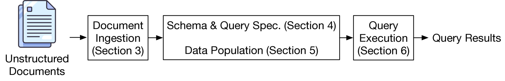
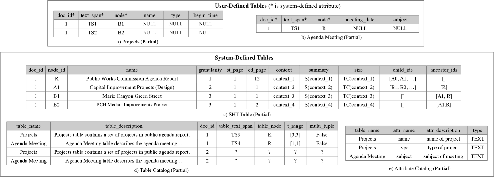
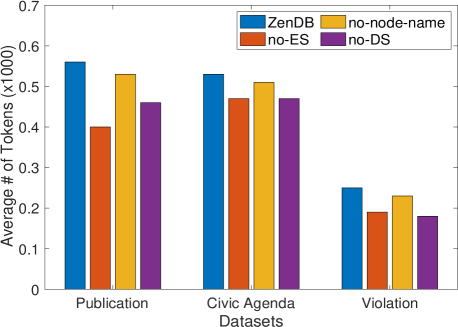
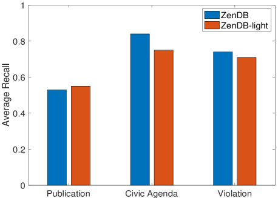

# 大型语言模型助力精准高效文档分析

发布时间：2024年05月07日

`RAG

这篇论文介绍了一种名为ZenDB的系统，它利用语义结构与大型语言模型（LLMs）结合，以SQL查询形式解答文档集合的即席查询。ZenDB专注于提高从非结构化数据中提取价值的效率和准确性，特别是在处理遵循相似模板的文档时。它通过创新的查询引擎设计，实现了成本效益和查询准确性的提升。这与RAG（检索增强生成）的概念相关，因为它涉及使用LLMs来增强文档检索和生成过程，以提供更精确的查询结果。因此，这篇论文应归类于RAG。` `数据管理` `语义分析`

> Towards Accurate and Efficient Document Analytics with Large Language Models

# 摘要

> 非结构化数据占据了数据存储的绝大部分，但从中提取价值依旧困难重重。现有的文档管理方法无法支持对文档集合的灵活分析查询。大型语言模型（LLMs）即便通过检索增强生成（RAG）处理文档片段，也难以提供精确的查询结果，且成本高昂。鉴于许多文档遵循相似模板，我们推出了ZenDB，这一系统利用语义结构与LLMs结合，以SQL查询形式解答文档集合的即席查询。ZenDB能高效提取模板文档的语义层次，并创新性地设计了查询引擎，确保查询既准确又经济。用户可为文档定义模式，并通过SQL进行查询。在三个真实数据集上的实验显示，ZenDB相比LLM基线节省了高达30%的成本，同时提升了准确性，且在成本略增的情况下，精确度和召回率分别提高了61%和80%，超越了RAG基线。

> Unstructured data formats account for over 80% of the data currently stored, and extracting value from such formats remains a considerable challenge. In particular, current approaches for managing unstructured documents do not support ad-hoc analytical queries on document collections. Moreover, Large Language Models (LLMs) directly applied to the documents themselves, or on portions of documents through a process of Retrieval-Augmented Generation (RAG), fail to provide high accuracy query results, and in the LLM-only case, additionally incur high costs. Since many unstructured documents in a collection often follow similar templates that impart a common semantic structure, we introduce ZenDB, a document analytics system that leverages this semantic structure, coupled with LLMs, to answer ad-hoc SQL queries on document collections. ZenDB efficiently extracts semantic hierarchical structures from such templatized documents, and introduces a novel query engine that leverages these structures for accurate and cost-effective query execution. Users can impose a schema on their documents, and query it, all via SQL. Extensive experiments on three real-world document collections demonstrate ZenDB's benefits, achieving up to 30% cost savings compared to LLM-based baselines, while maintaining or improving accuracy, and surpassing RAG-based baselines by up to 61% in precision and 80% in recall, at a marginally higher cost.

[Arxiv](https://arxiv.org/abs/2405.04674)