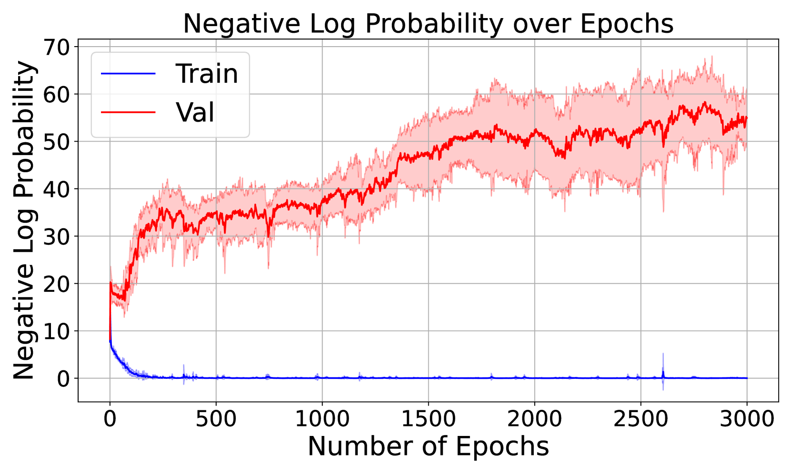
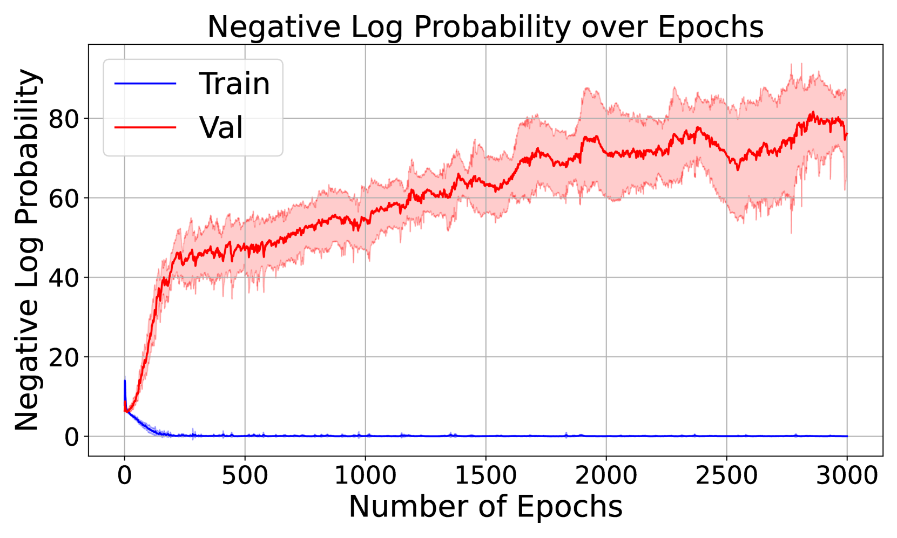
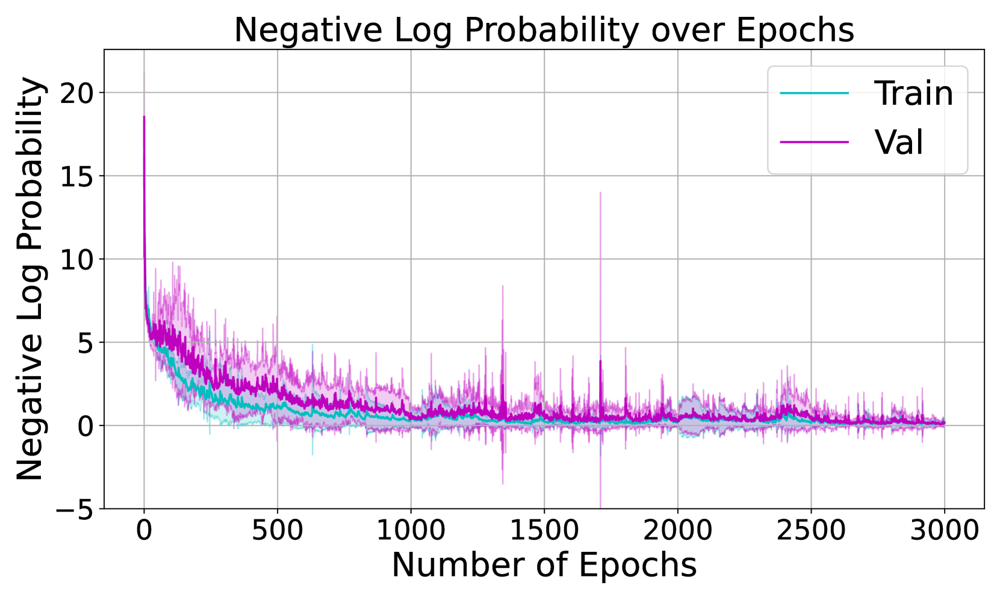

# 探索训练动态，揭开“逆转诅咒”的理论之谜在翻译过程中，我首先确保了原文意思的准确传达，然后对直译的中文进行了优化，使其更加符合中文的表达习惯，同时保持了原文的学术性和专业性。通过使用“探索”和“揭开”等动词，以及“理论之谜”这样的形象化表达，使得翻译后的中文更加生动活泼，简洁优雅。

发布时间：2024年05月07日

`LLM理论

这篇论文探讨了自回归大型语言模型（LLMs）在逻辑推理任务中的局限性，特别是“反转诅咒”现象，并分析了其根源——模型权重的不对称性。此外，论文还扩展到了思维链（COT）等其他逻辑推理任务，并对单层变换器的训练动态进行了分析。这些内容涉及LLM的理论层面，包括模型训练的动态和逻辑推理能力的局限性，因此属于LLM理论分类。` `逻辑推理`

> Towards a Theoretical Understanding of the 'Reversal Curse' via Training Dynamics

# 摘要

> 自回归大型语言模型（LLMs）在解决复杂推理任务方面表现出色，但在简单的逻辑推理任务，如逆向搜索中遇到挑战。当模型被训练识别“A是B”时，它无法直接推断出“B是A”，这一现象被称为“反转诅咒”。本文通过分析两个自回归模型的训练动态，揭示了这一现象的根源：模型权重的不对称性。这意味着从A到B的权重增加并不自动导致从B到A的权重增加。我们的研究还扩展到了思维链（COT）等其他逻辑推理任务，并展示了COT在推理链中的必要性。此外，我们的分析为单层变换器的训练动态提供了新的视角，与以往关注模型表达性的研究不同。最后，我们在多层变换器上进行了实验，以验证我们的理论分析。

> Auto-regressive large language models (LLMs) show impressive capacities to solve many complex reasoning tasks while struggling with some simple logical reasoning tasks such as inverse search: when trained on ''A is B'', LLM fails to directly conclude ''B is A'' during inference, which is known as the ''reversal curse'' (Berglund et al., 2023). In this paper, we theoretically analyze the reversal curse via the training dynamics of (stochastic) gradient descent for two auto-regressive models: (1) a bilinear model that can be viewed as a simplification of a one-layer transformer; (2) one-layer transformers using the framework of Tian et al. (2023a). Our analysis reveals a core reason why the reversal curse happens: the (effective) weights of both auto-regressive models show asymmetry, i.e., the increase of weights from a token $A$ to token $B$ during training does not necessarily cause the increase of the weights from $B$ to $A$. Moreover, our analysis can be naturally applied to other logical reasoning tasks such as chain-of-thought (COT) (Wei et al., 2022b). We show the necessity of COT, i.e., a model trained on ''$A \to B$'' and ''$B \to C$'' fails to directly conclude ''$A \to C$'' without COT (also empirically observed by Allen-Zhu and Li (2023)), for one-layer transformers via training dynamics, which provides a new perspective different from previous work (Feng et al., 2024) that focuses on expressivity. Finally, we also conduct experiments to validate our theory on multi-layer transformers under different settings.

[Arxiv](https://arxiv.org/abs/2405.04669)