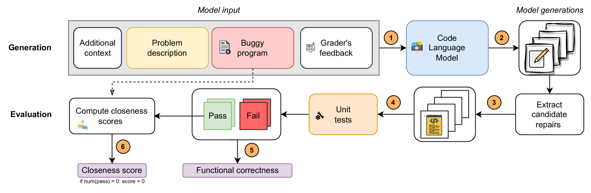

# 教育程序修复的基准评估在这篇文章中，我们将探讨如何通过基准测试来评估和改进教育程序的修复策略。我们将分析不同的修复方法，并探讨它们在提高教育软件质量和效率方面的潜力。通过这一过程，我们旨在为教育技术领域的专业人士提供有价值的见解，帮助他们更好地理解和优化教育程序的修复工作。

发布时间：2024年05月08日

`LLM应用

这篇论文探讨了大型语言模型（LLMs）在编程教育中的应用，特别是在程序修复任务中的潜力。它提出了一项新的教育程序修复基准，并引入了新的评估指标，旨在标准化和评估LLMs在教育领域的应用。这与LLM的理论研究不同，因为它关注的是实际应用和评估方法，而不是模型本身的理论基础。同时，它也不属于Agent或RAG分类，因为这些通常指的是特定类型的智能代理或检索增强生成模型，而本文的重点是LLM在教育中的应用。` `编程教育` `教育技术`

> Benchmarking Educational Program Repair

# 摘要

> 大型语言模型（LLMs）因其广泛的教育应用潜力而备受瞩目。在编程教育中，LLMs已被用于创造学习材料、优化错误提示和提供代码指导。然而，研究中使用的定制数据集和评估标准不一，导致研究成果难以直接对比。因此，我们急需标准化和评估基准，以便公平地比较不同方法。LLMs在程序修复任务中展现出巨大潜力，可为学生提供调试帮助和学习提示。本文提出了一项创新的教育程序修复基准，精选了两个公开的高质量编程数据集，并引入了一种新的评估指标rouge@k来衡量修复质量，同时评估了五种近期模型以确立性能基线。

> The emergence of large language models (LLMs) has sparked enormous interest due to their potential application across a range of educational tasks. For example, recent work in programming education has used LLMs to generate learning resources, improve error messages, and provide feedback on code. However, one factor that limits progress within the field is that much of the research uses bespoke datasets and different evaluation metrics, making direct comparisons between results unreliable. Thus, there is a pressing need for standardization and benchmarks that facilitate the equitable comparison of competing approaches. One task where LLMs show great promise is program repair, which can be used to provide debugging support and next-step hints to students. In this article, we propose a novel educational program repair benchmark. We curate two high-quality publicly available programming datasets, present a unified evaluation procedure introducing a novel evaluation metric rouge@k for approximating the quality of repairs, and evaluate a set of five recent models to establish baseline performance.

[Arxiv](https://arxiv.org/abs/2405.05347)