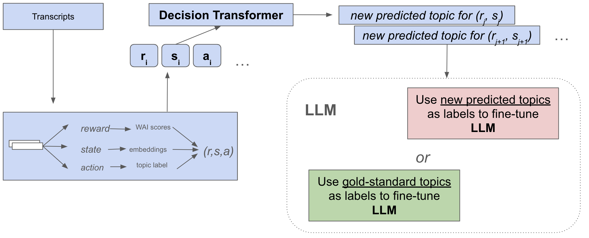
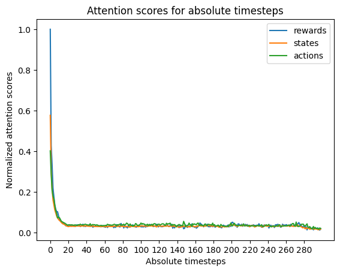
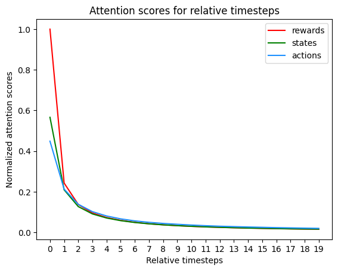

# 运用决策转换器与大型语言模型，为咨询与心理治疗中的对话提供精准主题推荐在咨询与心理治疗领域，对话主题的推荐对于引导会话、深化理解至关重要。本研究采用决策转换器与大型语言模型相结合的先进技术，旨在为专业人士提供精准、个性化的对话主题推荐，以促进更有效的沟通与治疗进程。通过分析患者的语言模式与情感状态，系统能够智能生成符合治疗目标的对话主题，为心理健康服务带来创新与效率的提升。

发布时间：2024年05月08日

`Agent

这篇论文探讨了将大型语言模型（LLM）应用于心理健康支持领域，特别是通过决策转换器架构来推荐对话话题。这种方法涉及使用离线强化学习来训练模型，以便从过往对话中提取信息。此外，论文还提出了一种新方法，即将模型输出用作微调大型语言模型的合成标签。这种应用可以被视为一个智能代理（Agent），因为它旨在自动化地提供心理咨询服务，通过理解和响应用户的需求来辅助心理健康支持。因此，这篇论文属于Agent分类。` `心理健康` `对话系统`

> Conversational Topic Recommendation in Counseling and Psychotherapy with Decision Transformer and Large Language Models

# 摘要

> 随着心理健康支持需求的攀升，AI，尤其是大型语言模型，有望融入自动化临床系统。我们采用决策转换器架构，为心理咨询中的对话推荐话题，通过离线强化学习，从过往对话中提取信息训练模型。与传统方法相比，我们的模型表现更佳，并提出了一种新方法：将模型输出作为微调大型语言模型的合成标签。虽然基于 LLaMA-2 7B 的模型表现不一，但未来研究可在此基础上继续探索。

> Given the increasing demand for mental health assistance, artificial intelligence (AI), particularly large language models (LLMs), may be valuable for integration into automated clinical support systems. In this work, we leverage a decision transformer architecture for topic recommendation in counseling conversations between patients and mental health professionals. The architecture is utilized for offline reinforcement learning, and we extract states (dialogue turn embeddings), actions (conversation topics), and rewards (scores measuring the alignment between patient and therapist) from previous turns within a conversation to train a decision transformer model. We demonstrate an improvement over baseline reinforcement learning methods, and propose a novel system of utilizing our model's output as synthetic labels for fine-tuning a large language model for the same task. Although our implementation based on LLaMA-2 7B has mixed results, future work can undoubtedly build on the design.

[Arxiv](https://arxiv.org/abs/2405.05060)