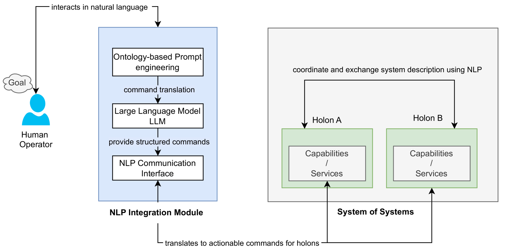
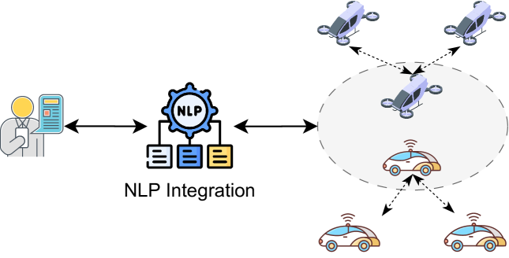
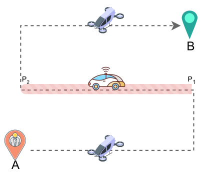

# 借助自然语言处理，我们优化了整体架构，以提升系统之系统的协同效率。

发布时间：2024年05月08日

`Agent

这篇论文探讨了如何通过对话生成智能（CGI）技术，特别是大型语言模型（LLMs），来增强系统之系统中各部分（holons）的沟通能力，以实现更高效的协同工作和直观的互动。这种方法旨在提升系统的适应性、可用性和效率，并且为未来的研究和开发提供了方向。因此，它属于Agent分类，因为它关注的是如何通过智能技术提升系统中代理（Agent）的交互和协作能力。` `系统工程` `人机交互`

> Enhancing Holonic Architecture with Natural Language Processing for System of Systems

# 摘要

> 系统之系统的复杂多变，要求我们建立高效的沟通桥梁，确保各部分（我们称之为holons）能够协同工作，无缝对接。本文提出了一种新颖的方法，通过融合对话生成智能（CGI）技术，来提升这些holons在系统之系统中的沟通能力。我们借助CGI的最新进展，尤其是大型语言模型（LLMs），让holons能够理解并执行自然语言指令，从而实现人与holons之间更加直观的互动，提升社会智能，最终促进不同系统间的协调合作。本文构建了一个概念框架，探讨了CGI增强holon交互对系统之系统适应性、可用性和效率的潜在影响，并为未来的研究和原型开发指明了方向。

> The complexity and dynamic nature of System of Systems (SoS) necessitate efficient communication mechanisms to ensure interoperability and collaborative functioning among constituent systems, termed holons. This paper proposes an innovative approach to enhance holon communication within SoS through the integration of Conversational Generative Intelligence (CGI) techniques. Our approach leverages advancements in CGI, specifically Large Language Models (LLMs), to enable holons to understand and act on natural language instructions. This fosters more intuitive human-holon interactions, improving social intelligence and ultimately leading to better coordination among diverse systems. This position paper outlines a conceptual framework for CGI-enhanced holon interaction, discusses the potential impact on SoS adaptability, usability and efficiency, and sets the stage for future exploration and prototype implementation.

[Arxiv](https://arxiv.org/abs/2405.05365)