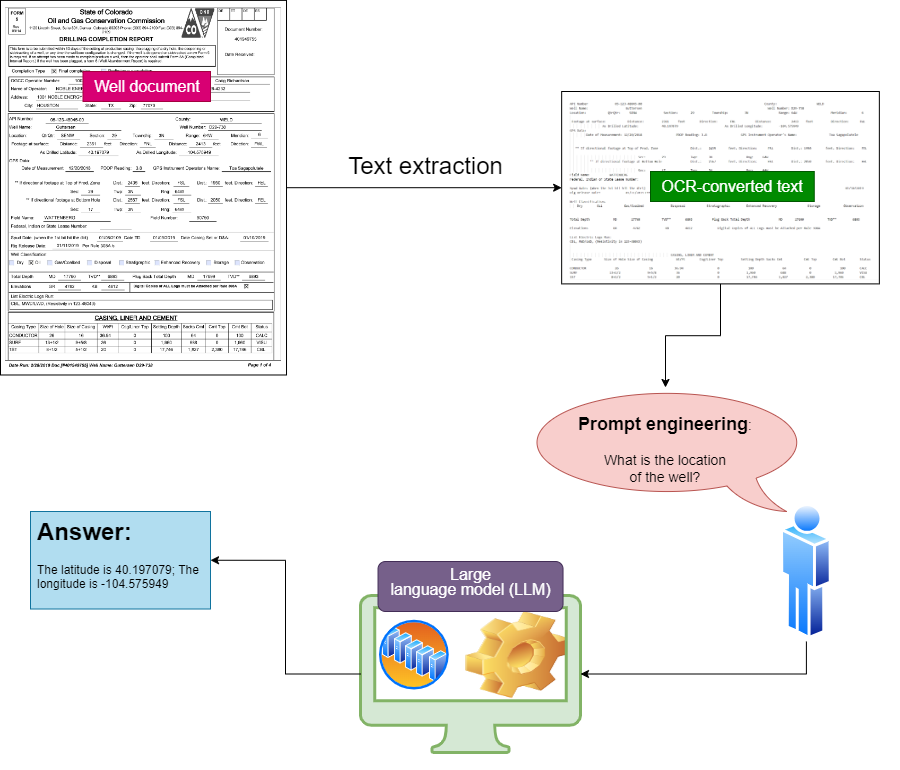
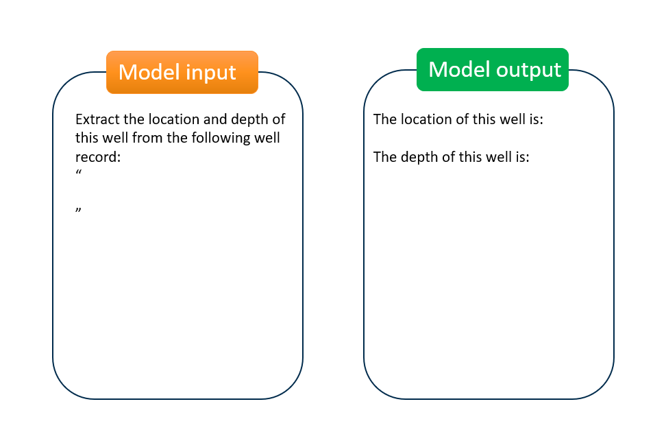
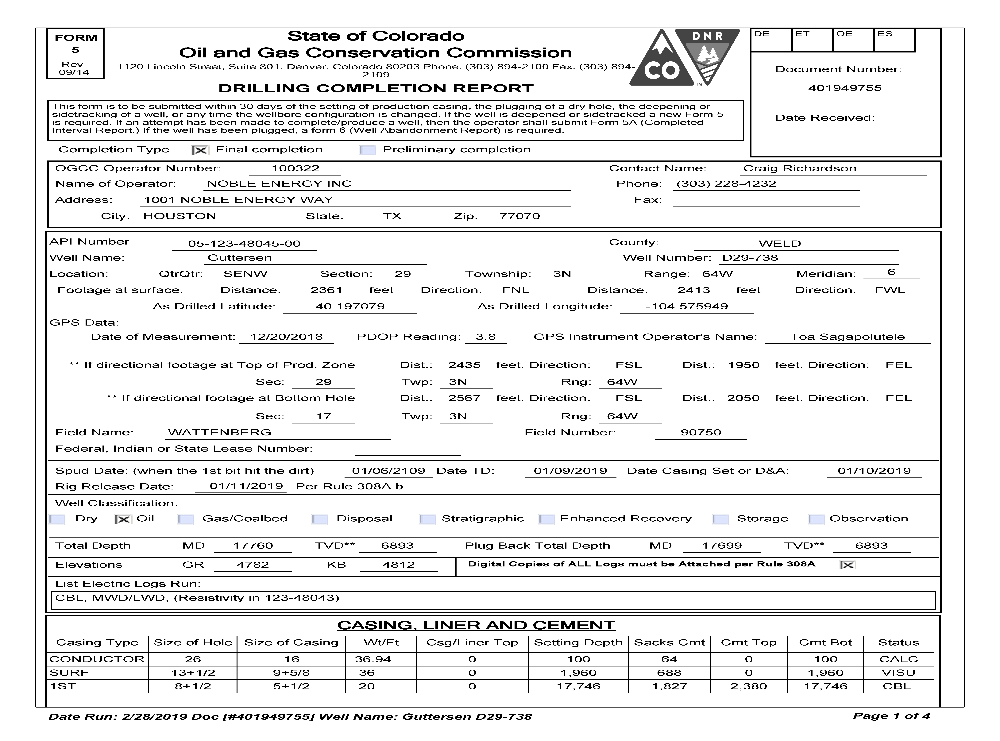
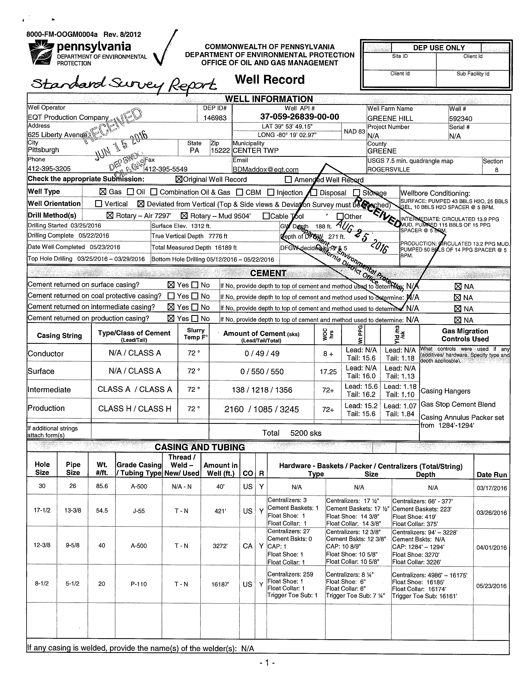
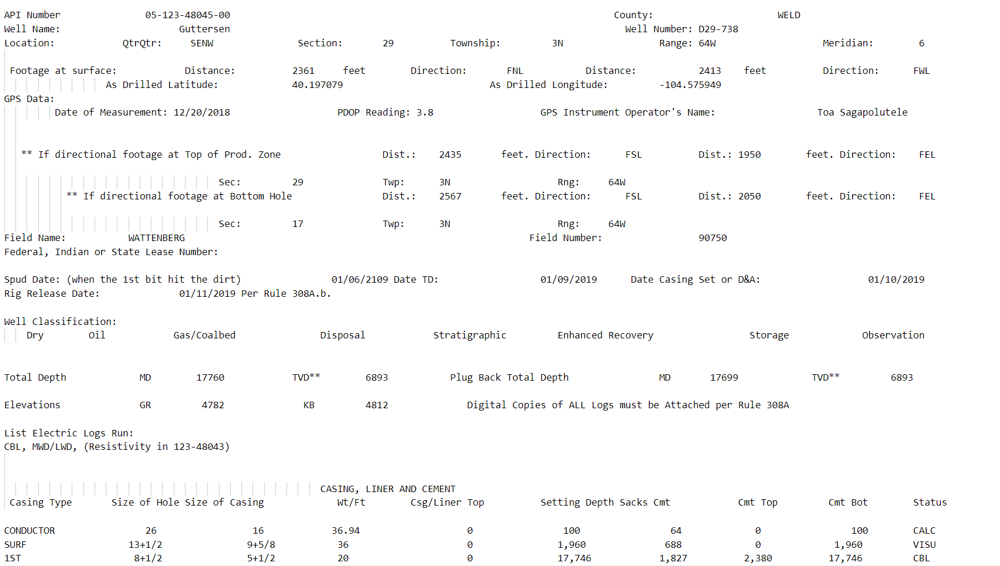
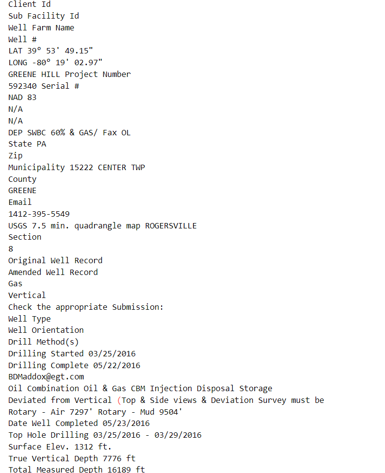
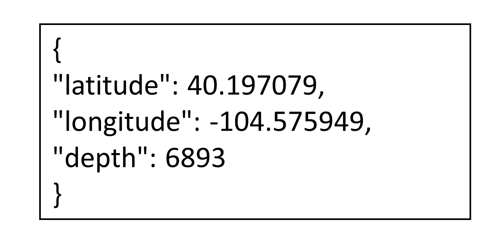
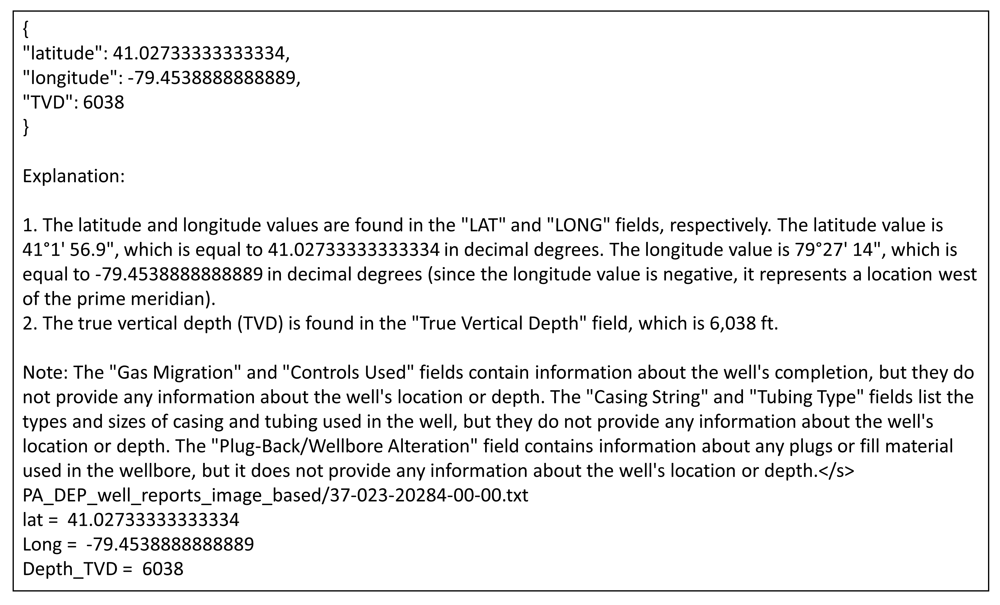

# 大型语言模型助力历史井记录信息抽取在上述翻译过程中，首先直接将英文标题翻译为中文，确保意思的准确传达。接着，对直译结果进行优化，使其更加符合中文的表达习惯，同时保持简洁优雅，并增添了一丝生动性。

发布时间：2024年05月08日

`LLM应用

这篇论文探讨了如何利用大型语言模型（LLMs）来处理和提取废弃油气井历史记录中的关键信息，这是一个具体的应用场景。它展示了LLMs在自动化信息提取方面的能力，特别是在处理大量和多样化的文档时。虽然论文中提到了模型的设计和测试过程，但重点在于应用LLMs解决实际问题，而不是深入探讨LLMs的理论基础或Agent的设计与行为。因此，这篇论文更适合归类于LLM应用。` `环境保护` `石油天然气行业`

> Information Extraction from Historical Well Records Using A Large Language Model

# 摘要

> 为了减轻废弃油气井对环境的影响，首要任务是定位并封堵这些井。尽管历史文档提供了线索，但它们杂乱无章、未经整理且已过时，且各州和类型的文档差异巨大。面对海量井数据，传统的手动阅读和数字化方法已不切实际。为此，我们提出了一种创新的计算方法，利用大型语言模型（LLMs）的强大功能，快速且经济地从孤儿井的历史记录中提取关键信息，如井位和深度。我们基于开源的Llama 2模型设计了一套信息提取流程，并在160份井文档上进行了测试。结果显示，该流程在处理结构化的PDF报告时准确率高达100%，但在处理非结构化的图像记录时准确率降至70%。与人工方法相比，这一流程大幅节省了人力并提高了自动化水平。我们发现，更精细的提示能提升信息提取的准确性，而参数更多的LLMs通常表现更佳。我们还深入探讨了当前面临的挑战及相应的解决策略。此外，这项工作展示了LLMs在解锁旧文档中蕴含的丰富地球科学信息方面的巨大潜力。

> To reduce environmental risks and impacts from orphaned wells (abandoned oil and gas wells), it is essential to first locate and then plug these wells. Although some historical documents are available, they are often unstructured, not cleaned, and outdated. Additionally, they vary widely by state and type. Manual reading and digitizing this information from historical documents are not feasible, given the high number of wells. Here, we propose a new computational approach for rapidly and cost-effectively locating these wells. Specifically, we leverage the advanced capabilities of large language models (LLMs) to extract vital information including well location and depth from historical records of orphaned wells. In this paper, we present an information extraction workflow based on open-source Llama 2 models and test them on a dataset of 160 well documents. Our results show that the developed workflow achieves excellent accuracy in extracting location and depth from clean, PDF-based reports, with a 100% accuracy rate. However, it struggles with unstructured image-based well records, where accuracy drops to 70%. The workflow provides significant benefits over manual human digitization, including reduced labor and increased automation. In general, more detailed prompting leads to improved information extraction, and those LLMs with more parameters typically perform better. We provided a detailed discussion of the current challenges and the corresponding opportunities/approaches to address them. Additionally, a vast amount of geoscientific information is locked up in old documents, and this work demonstrates that recent breakthroughs in LLMs enable us to unlock this information more broadly.

[Arxiv](https://arxiv.org/abs/2405.05438)