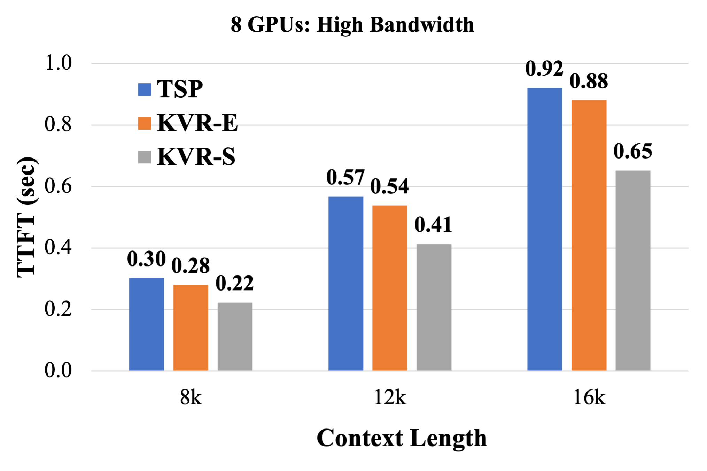
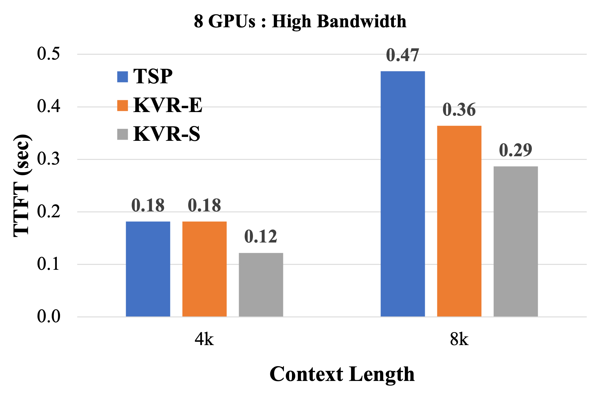

# KV-Runahead：并行生成键值缓存，解锁因果LLM推理的扩展潜能在这项研究中，我们提出了KV-Runahead方法，这是一种新颖的技术，通过并行生成键值缓存来提高大型语言模型（LLM）的因果推理效率。我们的方法解决了传统推理方法中的瓶颈问题，实现了更快的推理速度和更好的可扩展性。通过实验验证，KV-Runahead在保持推理质量的同时，显著提升了LLM的性能。

发布时间：2024年05月08日

`LLM理论

这篇论文主要探讨了大型语言模型（LLM）推理过程中的优化技术，特别是提出了KV-Runahead并行化方案来加速提示阶段，即首个令牌的生成时间。这种优化方法涉及对模型内部机制的深入理解和改进，属于对LLM理论层面的研究。因此，它更适合归类于LLM理论这一分类。` `高性能计算`

> KV-Runahead: Scalable Causal LLM Inference by Parallel Key-Value Cache Generation

# 摘要

> 大型语言模型推理分为提示阶段和扩展阶段，前者输出首个令牌，后者生成后续令牌。我们提出的KV-Runahead并行化方案，通过多进程协同填充键值缓存，显著加速了提示阶段，缩短了首个令牌的生成时间。该方案巧妙利用了因果注意力图，减少了计算量，且易于实施。我们还引入了上下文级负载均衡，以应对因果注意力导致的缓存生成不均，进一步优化了首个令牌的生成时间。与传统并行化方法相比，KV-Runahead在Llama 7B和Falcon 7B模型上分别实现了1.4倍和1.6倍的速度提升，展现了其高效性。

> Large Language Model or LLM inference has two phases, the prompt (or prefill) phase to output the first token and the extension (or decoding) phase to the generate subsequent tokens. In this work, we propose an efficient parallelization scheme, KV-Runahead to accelerate the prompt phase. The key observation is that the extension phase generates tokens faster than the prompt phase because of key-value cache (KV-cache). Hence, KV-Runahead parallelizes the prompt phase by orchestrating multiple processes to populate the KV-cache and minimizes the time-to-first-token (TTFT). Dual-purposing the KV-cache scheme has two main benefits. Fist, since KV-cache is designed to leverage the causal attention map, we minimize computation and computation automatically. Second, since it already exists for the exten- sion phase, KV-Runahead is easy to implement. We further propose context-level load-balancing to handle uneven KV-cache generation (due to the causal attention) and to optimize TTFT. Compared with an existing parallelization scheme such as tensor or sequential parallelization where keys and values are locally generated and exchanged via all-gather collectives, our experimental results demonstrate that KV-Runahead can offer over 1.4x and 1.6x speedups for Llama 7B and Falcon 7B respectively.

[Arxiv](https://arxiv.org/abs/2405.05329)