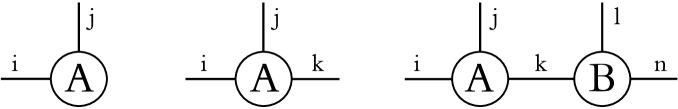
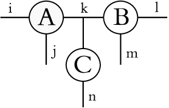
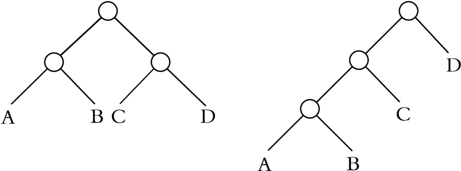
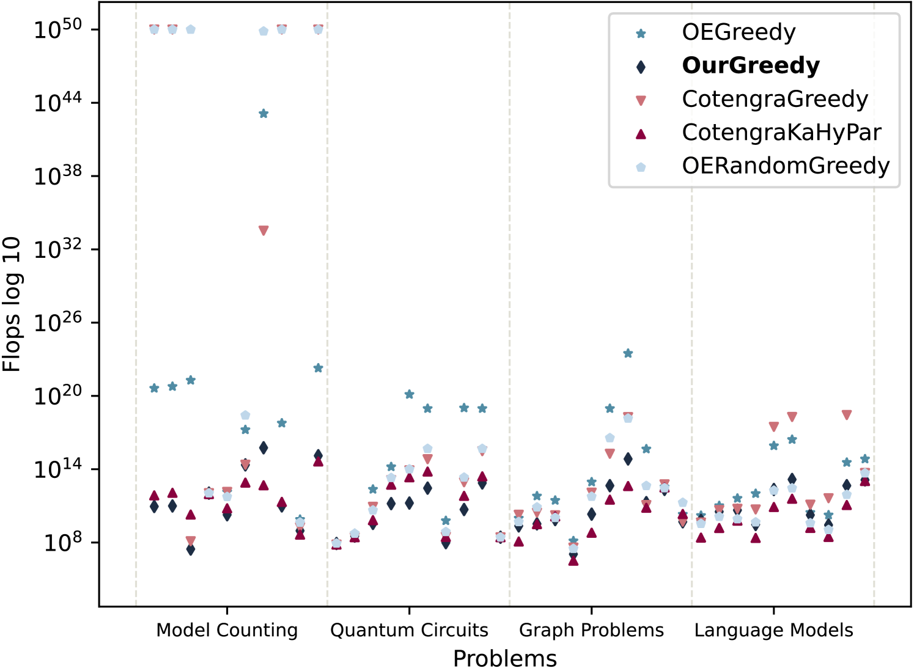
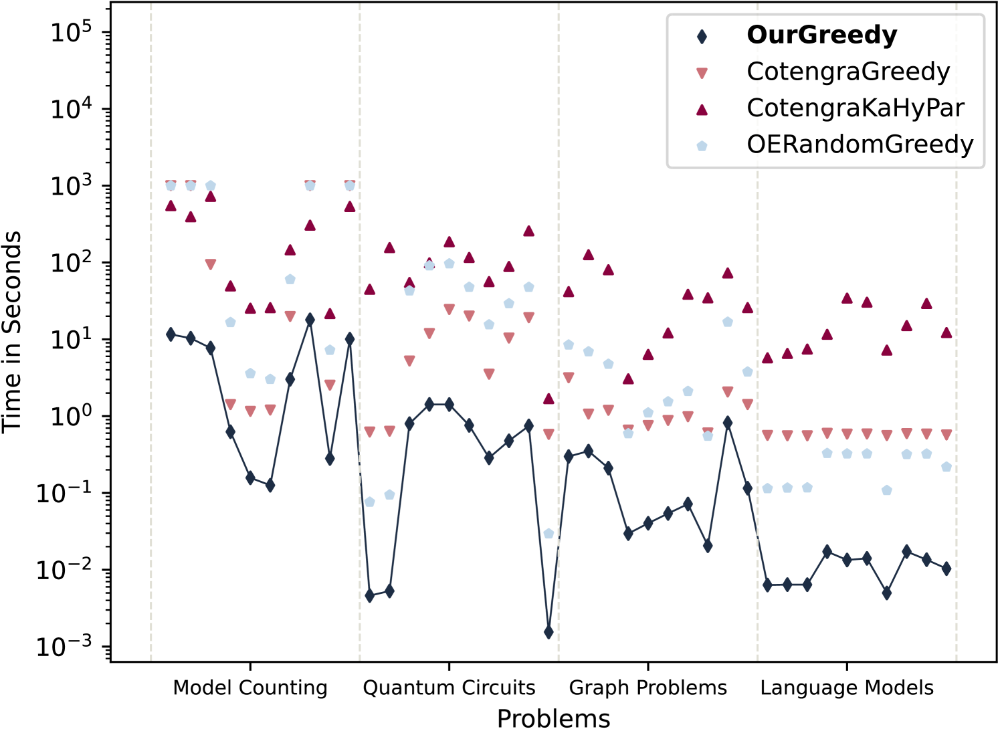
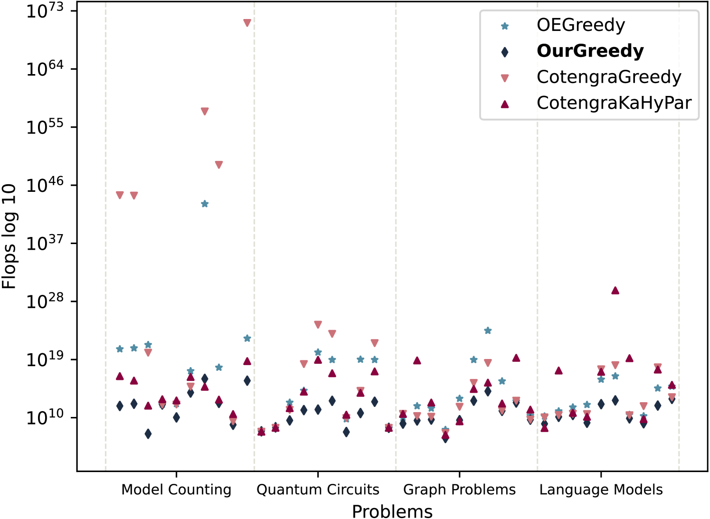

# 张量收缩路径优化：贪婪算法结合精进成本函数的新途径在这项研究中，我们提出了一种基于贪婪算法的优化方法，旨在寻找张量收缩操作的最优路径。通过引入一系列改进的成本函数，我们的方法能够在计算复杂度与性能之间找到平衡点，从而在处理大规模张量网络时提高效率。这种方法不仅适用于量子计算和机器学习领域，也为其他需要高效张量操作的科学计算问题提供了新的解决方案。

发布时间：2024年05月08日

`LLM理论

理由：这篇论文探讨了在语言模型等领域中寻找高效的张量收缩路径的问题，并提出了一种新的方法。虽然它没有直接讨论Agent或RAG，但它关注的是语言模型（LLM）的理论和算法层面的问题，因此属于LLM理论分类。它不涉及具体的LLM应用案例或服务，也不专注于Agent的设计或RAG（如果RAG指的是某种特定的技术或框架），因此这些分类不适用。` `量子计算` `机器学习`

> Optimizing Tensor Contraction Paths: A Greedy Algorithm Approach With Improved Cost Functions

# 摘要

> 在模型计数、量子电路、图问题和语言模型等领域，寻找高效的张量收缩路径至关重要。尽管已有贪婪算法和超图划分等方法，但它们耗时耗力。本文提出了一种基于opt_einsum贪婪算法的新方法，它能在更短的时间内找到高效路径，甚至能解决现代算法无法应对的大型问题。

> Finding efficient tensor contraction paths is essential for a wide range of problems, including model counting, quantum circuits, graph problems, and language models. There exist several approaches to find efficient paths, such as the greedy and random greedy algorithm by Optimized Einsum (opt_einsum), and the greedy algorithm and hypergraph partitioning approach employed in cotengra. However, these algorithms require a lot of computational time and resources to find efficient contraction paths. In this paper, we introduce a novel approach based on the greedy algorithm by opt_einsum that computes efficient contraction paths in less time. Moreover, with our approach, we are even able to compute paths for large problems where modern algorithms fail.

[Arxiv](https://arxiv.org/abs/2405.09644)